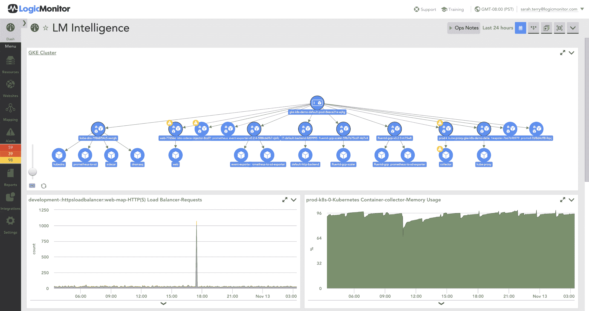

# LogicMonitor 拥抱 AIOps

> 原文：<https://devops.com/logicmonitor-embraces-aiops/>

LogicMonitor 今天宣布 [LM Intelligence](https://www.logicmonitor.com/press/logicmonitor-announces-innovative-enhancements-to-aiops-solution/) 正式上市，这是其监控平台的扩展，利用机器学习算法来识别指示重大即将发生的停机的潜在问题。

LogicMonitor 的产品管理经理 Sarah Terry 表示，与其收购一个单独的 AIOps 平台，不如在一个工具的背景下使用机器学习算法更有意义， [DevOps 团队已经在使用](https://devops.com/building-hybrid-and-multi-cloud-architectures-for-analytics-and-ai/)来监控他们的 it 环境。Terry 指出，监控平台收集了训练这些算法所需的大量数据，但独立的 AIOps 平台必须找到收集这些数据的方法。

LogicMonitor 创建的 LM Intelligence 模块提供了根本原因分析(RCA)功能，可自动发现云和内部 IT 环境中的基础架构拓扑。一旦发现问题，LM Intelligence 会将生成的所有警报汇总到一个通知中，该通知与任何潜在问题的根本原因相关。Terry 说，这种能力将大大减少警报疲劳的数量，如今这种疲劳导致 IT 团队经常忽视本来可以避免系统故障的关键警报。

开发运维团队还可以利用 LM Intelligence 根据历史趋势定义 IT 资源的预期性能范围。超出这些范围的任何异常都会生成通知。

随着 it 环境变得越来越复杂，部分是由于基于容器的多云计算和基于微服务的应用程序的兴起，普通 IT 团队在没有帮助的情况下识别所有可能影响 IT 环境的相关事件是不可行的。需要跟踪的参数实在太多了。诸如 LM Intelligence 之类的工具并不能取代对 IT 运营专业知识的需求，但它们可以增强团队管理复杂 IT 环境的能力和专业知识，在复杂的 IT 环境中，系统之间存在大量的依赖关系。Terry 说，实际上，LM Intelligence 等工具将使 DevOps 团队能够识别 IT 环境中产生的所有噪音中的信号。

随着 IT 管理工具的不断发展，DevOps 团队应该会看到对机器学习算法的依赖变得更加普遍。AIOps 不是一个独立的平台，它正在迅速演变成一种特性，这种特性将成为嵌入到各种工具中的一种能力。

当然，每个 DevOps 团队都需要决定他们希望在何种程度上信任任何形式的人工智能。然而，算法收集和分析数据的时间越长，它们往往会变得越准确。这并不意味着 DevOps 团队应该根据人工智能引擎的建议自动化流程；可能有一些人工智能引擎没有考虑到的参数会产生负面影响。然而，拥有一个提供及时建议的数字助理可能很快就会被证明是不可或缺的。

— [迈克·维扎德](https://devops.com/author/mike-vizard/)