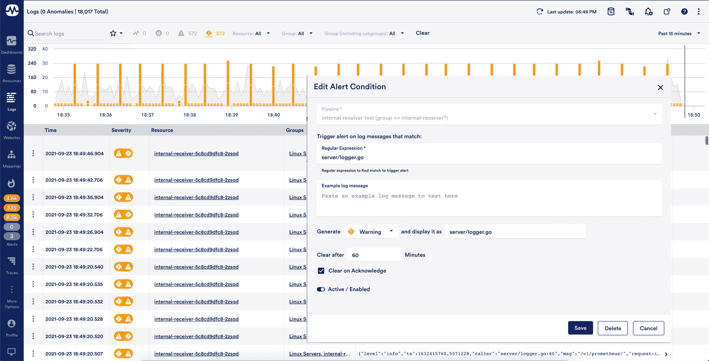

# LogicMonitor 引入了无限制的日志数据保留

> 原文：<https://devops.com/logicmonitor-introduces-unlimited-log-data-retention/>

LogicMonitor 今天宣布，它将提供一个选项，允许 it 组织在其软件即服务(SaaS)平台上保留无限量的日志数据。

LogicMonitor 的首席产品官 Tej Redkar 说，阻碍可观察性发展的问题之一是存储日志数据的成本。Redkar 说，LogicMonitor 已经决定通过允许 IT 团队在其 LM Logs 服务上存储日志数据，只要他们需要，就可以解决这个问题。

他指出，这些数据也将始终作为热存储随时可用，无需等待离线存储的数据被重新水合。Redkar 说，相反，这些数据与 LogicMonitor 收集的指标和分布式跟踪数据一起很容易访问。

总的来说，LogicMonitor 正在通过一个注入了机器学习算法的 SaaS 平台来集中整个 IT 组织的可观察性，该平台基于通过日志数据捕获的数百万个事件来自动实时显示异常。雷德卡说，许多组织今天遇到的问题是分散的可观测性数据孤岛，维护起来更加复杂，同时以更高的总成本提供更少的可见性。

他指出，相比之下，LogicMonitor 平台的设计目的是让网络运营团队和 DevOps 团队同样可以访问。

并非每个组织都需要永远存储日志数据，但 Redkar 表示，随着 IT 管理的不断发展，越来越多的组织正在转向将指标、跟踪和日志存储更长时间。开源代理软件的兴起也降低了组织获取数据的成本。

目前还不清楚其他可观察性平台提供商将在多大程度上提供无限制的数据保留，但随着在云端存储数据的成本不断下降，很明显，向 It 组织收取存储成本的做法越来越站不住脚。总会有一些与存储相关的成本，但收取超出服务核心成本的额外费用是不够的。通过对存储单独计费实现的唯一事情是，阻止 IT 团队存储获得可观察性和更好地训练发现异常的机器学习算法所需的数据。

以这样或那样的形式，可观察性多年来一直是 DevOps 最佳实践的核心原则。最初，DevOps 团队将持续监控作为主动管理应用环境的最有效方式。注入了机器学习算法的可观察性平台使关联事件成为可能，以便分析工具可以更容易地实时识别异常行为。有了这些见解，it 团队更快地解决问题就变得简单多了。

事实上，甚至可能有一天，不再需要召开所谓的“作战室”会议来通过艰苦的排除过程确定 IT 问题的原因。然而，与此同时，即使 IT 环境变得更加复杂，实际导致中断的 IT 事件总数也应该会稳步下降。