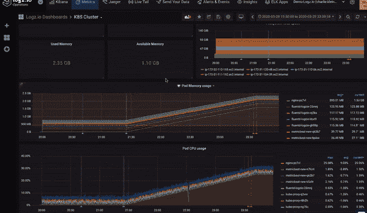

# Logz.io 将 Prometheus 服务添加到可观测性产品组合中

> 原文：<https://devops.com/logz-io-adds-prometheus-service-to-observability-portfolio/>

Logz.io 今天宣布了一项基于 Prometheus 的云服务的全面可用性，该服务可以与其现有的日志管理服务一起收集和分析指标。

Logz.io 首席技术官 Jonah Kowall 表示， [Prometheus 即服务](https://logz.io/blog/prometheus-as-a-service-launch/)的目标是为 IT 团队提供一种集中的方法来分析从运行在本地服务器和集群上的 Prometheus 实例中收集的数据。虽然 Prometheus 相对容易部署，但它不是为横向扩展而设计的，这意味着 it 团队必须在一组集群和服务器上部署多个 Prometheus 实例。Kowall 说，Logz.io 服务使收集和分析普罗米修斯实例收集的所有数据变得更加容易。Kowall 说，这种方法不仅卸载了这些指标的存储，还提供了一个将这些数据与 Logz.io 已经收集的日志和跟踪相关联的机会。

作为这项工作的一部分，Logz.io 还可以将 Grafana 仪表板上传到 Logz.io，该仪表板通常用于将 Prometheus 数据可视化为 JSON 文件，然后 Logz.io 会将 Grafana 仪表板转换为基于 logz . io 用户界面的仪表板。

当 Prometheus 与 Kubernetes 紧密联系在一起时，IT 团队开始更广泛地部署开源监控工具来收集指标。Gartner 最近的一份报告预测，到 2025 年，一半的新云原生应用程序监控部署将依赖某种形式的开源软件来管理应用程序。Kowall 指出，作为这一转变的一部分，普罗米修斯已经成为事实上的标准。

Kowall 说，主要的焦点，至少在最初，仍然是监控 IT 平台，但随着 IT 团队开始将指标、日志和跟踪关联起来，他们开始受益于额外的上下文，[也称为可观察性](https://devops.com/?s=observability)。

当然，可观察性一直是 DevOps 的核心原则。然而，随着越来越多的应用程序使用开源工具和代理软件，实现这一目标的成本越来越低。DevOps 团队仍然需要检测每个应用程序，但是与收集指标和其他数据相关的成本在持续下降。大多数监控工具和可观测性平台的提供商正朝着增加对开源工具和代理的支持的方向发展，以便在他们已经提供的专有工具和代理软件的同时收集数据。将由每个 DevOps 团队来决定是依赖开源工具还是继续依赖专有软件，这些软件可能能够提供更深入的见解，或者只是更容易部署。

无论选择哪种方式，基于微服务的应用程序的兴起都带来了可观测性问题。基于微服务的应用程序可能不会像整体应用程序那样频繁崩溃，因为在理想情况下，它们被设计为在没有单点故障的情况下适度降级。挑战在于，一旦它们真的降级了，就很难确定问题的来源；这可能会导致应用程序长时间运行不佳。

好消息是，DevOps 团队现在应该拥有所需的工具，可以在任何最终用户注意到之前很久就诊断和解决这些问题。