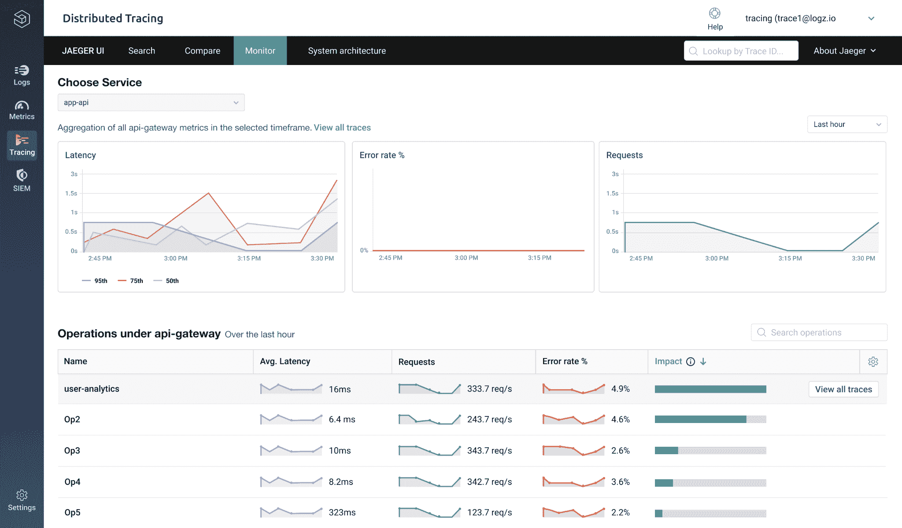

# Logz.io 扩展了开源可观测性平台

> 原文：<https://devops.com/logz-io-extends-open-source-observability-platform/>

Logz.io 增强了其可观察性平台,包括统一的仪表板和对分布式跟踪的支持，以监控由开源 Jaeger agent 软件实现的服务性能，该软件是在云本地计算基金会(CNCF)的支持下开发的。

与此同时，Logz.io 正在提供一个异常检测功能的预览，该功能利用机器学习算法来建立一个人工智能(AI)模型来监控数据。

该公司还增加了对 OpenSearch 的支持，open search 是开源软件项目 ElasticSearch 的一个分支，不再通过 Apache 许可证提供。OpenSearch 是由亚马逊网络服务(AWS)和 Logz.io 创建的一个替代搜索引擎。

最后，Logz.io 增加了安全事件管理功能，在发现网络攻击时，可以更轻松地对其进行分类、优先排序和协作缓解。

Logz.io 可观测性平台完全基于开源软件。此外，该公司还为增强 Jaeger 和 OpenTelemetry 项目做出了贡献，包括贡献了一个 OTEL Span Metrics 处理器，使其更容易汇总指标。

Logz.io 首席执行官 Tomer Levy 说，总的来说，就可观测性而言，现在还为时尚早。作为一个概念，可观测性可以追溯到线性动态系统。最基本的可观测性衡量系统的内部状态可以从其外部输出的知识中推断出来的程度。总体目标是使查询机器数据变得更加容易，使 DevOps 团队能够在问题造成进一步破坏之前主动发现问题的根本原因。与通常仅提供预定义指标来确定特定平台或应用程序何时在预期范围内运行的监控平台相比，这是一项重大进步。然而，问题是大多数 IT 团队真的不知道该问什么问题来充分利用可观察性平台，Levy 说。

然而，随着越来越多的组织接触到可观测性平台，随着越来越多的平台继续利用人工智能来提供补救能力，并根据通过这些平台收集的大量数据来自动化流程，发展 DevOps 和 DevSecOps 将变得更加容易，Levy 说。他补充说，如果没有使用可观察性数据训练的人工智能模型的帮助，普通 IT 团队根本不可能管理分散在分布式计算环境中的所有微服务。

随着 DevOps 的不断发展，最优秀的 DevOps 工程师很可能不会愿意为没有投资于某种形式的可观察性的组织工作。随着 IT 环境变得越来越复杂，作为开发运维工程师持续成功的几率急剧下降。

从好的方面来看，随着应用程序工具化的整体水平的提高，管理这些复杂的环境并在不需要开发人员的情况下做到这一点，应该很快就会变得容易得多。