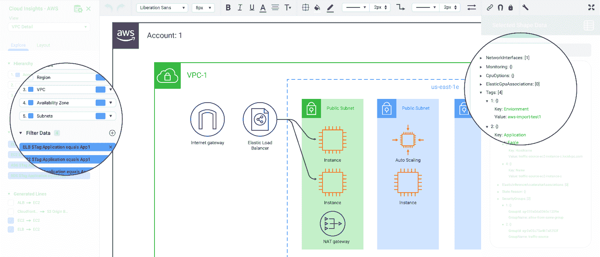

# Lucidchart 推出工具来可视化 AWS 云环境

> 原文：<https://devops.com/lucidchart-launches-tool-to-visualize-aws-cloud-environments/>

Lucidchart 今天添加了一个可视化工具，可以生成 IT 组织的 Amazon Web Services (AWS)环境的交互式图表。

Lucidchart 产品高级副总裁 Dan Lawyer 表示, [Lucidchart Cloud Insights](https://www.prnewswire.com/news-releases/announcing-lucidchart-cloud-insights-for-amazon-web-services----a-new-way-to-visualize-understand-and-optimize-the-cloud-301061589.html) 可以自动可视化一个组织从云服务提供商那里消费的所有服务，并计划支持其他云平台。

他说，当今组织经常遇到的最大挑战之一是，他们了解正在消费哪些服务的唯一方法是分析云服务提供商提供的每月账单。

律师说，Lucidchart Cloud Insights 旨在使实时确定正在消费的服务变得容易，并指出 it 团队也可以可视化云治理数据，并应用过滤器和保存视图。

有了这些信息，IT 组织就可以更好地控制云服务的支出，这些云服务在成本方面往往差异很大。例如，开发人员并不总是密切关注哪些服务层能够为特定类别的工作负载提供最佳的成本水平。律师指出，一种将服务如何被消费可视化的高保真方法提供了一种进行这种对话的有效手段。

他补充说，一旦出现问题，它可以更快地得到解决，因为参与的每个人都能够直观地检查同时发生的同一组交互。

Lucidchart 已经在云中提供了可视化工作区，结合了图表、数据可视化和协作工具，使团队更容易协作。律师说，Lucidchart Cloud Insight 现在将这种能力扩展到 IT 运营中，并指出 IT 团队传统上依赖于微软 Powerpoint 等工具来尝试和可视化消费模式。

Lucidchart Cloud Insight 的发布正值新冠肺炎疫情之后更多的工作负载转移到公共云。鉴于 IT 人员何时能够访问内部 IT 环境的不确定性，许多组织正在加快应用程序工作负载在云中的部署速度。

IT 组织面临的挑战是，将应用程序迁移到云中并不总能带来持续的成本节约。IT 团队需要不断监控 IT 基础架构资源的消耗情况，以控制 IT 预算。问题是，开发者经常在没有告诉 IT 部门任何人的情况下启动云服务，直到账单出现。更糟糕的是，许多开发人员经常忘记取消配置他们不再使用的虚拟机和其他云资源。

当然，随着更多的云平台被调用，管理问题只会变得更加复杂。今后，IT 团队将希望直观地比较和对比跨多个云消费服务的方式。无论动机是什么，作为静态账单的一部分呈现的云服务比作为始终更新的交互式图表的一部分呈现的云服务更容易被忽视。