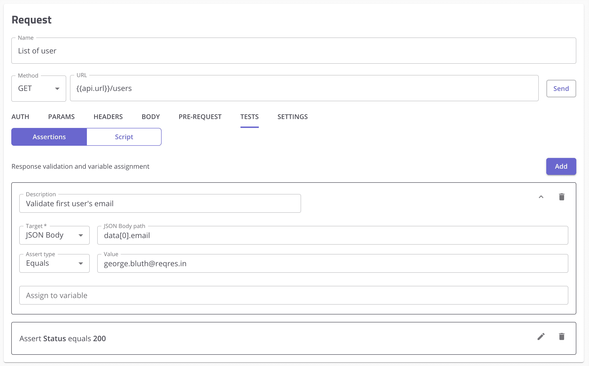

# Mabl 增加了桌面连续测试工具的测试版

> 原文：<https://devops.com/mabl-adds-beta-of-desktop-continuous-testing-tool/>

Mabl 今天宣布推出桌面工具的测试版[,该测试版使用](https://www.prnewswire.com/news-releases/mabl-introduces-native-desktop-application-with-api-and-mobile-test-automation-capabilities-301234196.html)[低代码](https://devops.com/?s=low-code)工具创建可应用于浏览器和应用编程接口(API)的测试。

Mabl 的联合创始人丹·贝尔彻(Dan Belcher)表示，随着应用质量保证(QA)的责任在 DevOps 工作流的背景下继续左移，目标是简化测试流程。

Mabl 提供了一个测试桌面和移动浏览器应用程序的低代码工具，以及它们调用的 API，使用一个电子工具来生成测试，以消除编写脚本的需要。此前只能通过软件即服务(SaaS)平台获得，Belcher 表示，桌面平台将使开发人员在本地机器上开发代码时更容易测试代码。

Belcher 说，使用桌面工具的开发人员现在也可以通过命令行界面即时管理和运行测试，而不是必须完全退出项目才能调用单独的测试工具。

Mabl 测试工具已经与多个持续集成/持续交付(CI/CD)平台集成，如 Bitbucket 和 Bamboo，以及 GitHub 存储库。

从长远来看，Belcher 说，很明显，随着应用程序的构建和部署速度不断提高，组织需要让更多的开发人员参与 QA 测试。Belcher 指出，测试团队自己已经跟不上变化的速度了。

贝尔彻补充说，挑战在于以尽可能减少摩擦的方式实现这一目标。Belcher 说，Mabl 平台和桌面应用程序使得开发人员可以测试 web 和移动应用程序，而无需花费太多时间开发应用程序代码。

测试已经成为 DevOps 的一个主要问题，因为当开发人员在生产环境中部署应用程序后，他们对应用程序承担了更多的责任，他们自然希望更彻底地审查应用程序。应用程序部署后出现的问题只会导致编写新代码的时间减少。总会有需要解决的问题，但是作为集成到 DevOps 工作流中的 QA 流程的一部分，解决的问题越多，应用程序开发团队的生产力就越高。

不幸的是，测试经常受到冷遇；它主要发生在应用程序开发生命周期的后端。开发人员通常会落后于计划，因此有一种自然的趋势，即减少分配给测试的时间，希望在应用程序交付截止日期前完成。随之而来的恶性循环是，在应用程序部署后，不可避免地会有更多的 bug 需要修复，这仅仅是因为在最初的开发周期中没有进行足够的测试。

当然，一些开发团队已经习惯于将修复 bug 作为敏捷开发过程的一部分，这常常鼓励他们将已知的问题推到下一个 sprint。问题是，在没有持续测试的情况下，不久所有已知的错误就会堆积起来。应用程序中充满了开发团队试图一次解决的错误，这种情况并不罕见。这些问题解决得越早，相关各方的压力就越小。