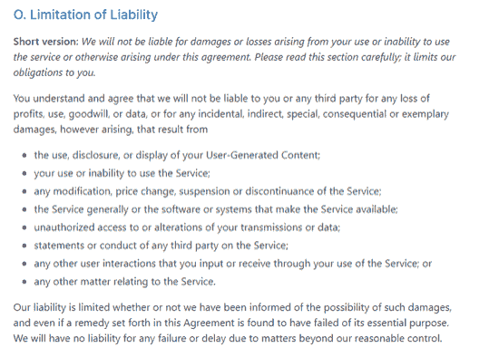

# 让 GitHub 备份成为你开发过程的一部分

> 原文：<https://devops.com/make-github-backups-part-of-your-development-process/>

GitHub 的平台是世界上最大的源代码主机，托管超过 1.9 亿个存储库。我们每天依赖的许多代码都托管在那里。你很可能正在使用它。但是如果有一天，GitHub 为你存储的所有项目代码都消失了，你会怎么办？

就像所有其他云服务一样，GitHub 遵循一个名为“共享责任”的云计算原则来保护数据和安全。它本质上意味着云平台的用户和所述平台的提供商分担保护数据的责任。换句话说，用户和 GitHub 一样有责任减轻他们这边的风险。这些都在 GitHub 的[条款和条件](https://docs.github.com/en/github/site-policy/github-terms-of-service)中有所规定:

考虑到这一点，有一些事情会影响您在 GitHub 中访问数据的能力。以下是一些例子:

## 账户妥协

2019 年 7 月，Ubuntu Security 报告称，一个公司所有的 GitHub 帐户[的凭据遭到破坏](https://twitter.com/ubuntu_sec/status/1147675201632473088)。这些泄露的凭据被用来创建存储库、问题等等。

在这种情况下，关键基础设施与 GitHub 分离，并且不允许违规行为扩散。然而，Ubuntu 必须将各种存储库和问题跟踪器恢复到它们以前的状态。当从像这样的帐户危害中回滚时，备份是非常有用的，因为它们为您提供了一个以前的良好状态来与当前状态进行比较。

此外，攻击者通常会在受损的代码库中留下后门。这可以让他们在初始发现和补救流程完成后获得更深入的访问。如果您只有受感染的代码库，那么发现所有受感染的文件或识别未来攻击的可能载体可能是一项挑战。恢复到先前版本的代码可以消除这种威胁。

## 勒索软件攻击

勒索软件是一种控制数据并对其加密的行为，只有攻击者才能解锁。攻击者通常会索要赎金来解锁文件；否则，他们可能会删除数据。

2019 年 5 月， [ZDNet 报道了](https://www.zdnet.com/article/a-hacker-is-wiping-git-repositories-and-asking-for-a-ransom/)一起勒索软件攻击事件，在该事件中，一名黑客以收取费用的方式劫持了多个存储库。黑客修改了 git 的历史记录，以至于存储库无法使用，他们要求在 10 天内付款以撤销这些更改。

这些攻击会造成运营的严重中断。开发人员将无法提交代码，导致新功能开发完全停止。Bug 修复甚至支持票(如果通过 GitHub 管理)也可能受到影响。但是，从备份中恢复将允许业务继续运行。

## 服务停机时间

依赖第三方总是会带来一些风险，GitHub 也不例外。没有任何服务可以提供 100%的正常运行时间，但是当您的整个业务(或代码库)依赖于 GitHub 的可用性时，您可能希望通过拥有自己的备份来降低风险。

例如，2020 年 6 月，GitHub 经历了一次长达数小时的大停电，之后才恢复稳定。因此，如果你所有的工作都存储在 GitHub 中，你将不得不等待访问恢复。如果发生在关键的发射窗口，这种停机时间可能是毁灭性的。

这只是三个例子，它们发生的频率比你想象的要高。Oracle 和 KPMG 最近的一份报告发现，49%的 IT 专业人员可能将最近的数据丢失归咎于他们未能保护数据。这和抛硬币的几率基本相同。持续接触你所有的工作不应该靠运气。这就是为什么你需要一个[备份](https://devops.com/?s=backup)策略。

## GitHub 中的数据备份策略

1.  **管理您自己的备份:**这意味着您要对创建备份的所有基础架构、业务流程和持续维修成本负责。您可能认为这是一个更具成本效益的选择，但持续的人工和维护费用往往会迅速增加。这也意味着你的团队可能会在核心业务之外的事情上耗尽周期。你在控制中弥补的，你在时间和花费的资源上损失了。
2.  **使用第三方管理您的备份:**有时称为备份即服务(BaaS)，这涉及将备份管理职责外包给一家独立的公司。它解除了你的企业的责任，但它可能看起来更昂贵。大多数情况下，选择了提供商之后就没什么可做的了。他们管理整个过程，从摇篮到坟墓。这包括任何 API 更新(这可能经常发生)、实现和持续维护。缺点是你失去了控制。服务条款可能会改变，或者备份的数据可能会改变。而且，并不是所有的 BaaS 解决方案在它们做什么以及它们如何访问数据方面都是透明的。

## 那么，什么是“正确”的选择呢？

对于大多数企业来说，构建和维护备份软件所需的大量工作是不可能的。开发周期太有价值了，不能与不直接支持业务产品路线图的工作捆绑在一起。你可能会觉得增加这种能力是有意义的；然而，甚至一些大型跨国公司也使用某种形式的 BaaS。

确保你做了调查。阅读评论，与他们的销售或开发团队交谈，并确认他们知道自己在说什么。你需要确定他们是否已经建立了一个可信的产品。对于许多 PaaS 和 SaaS 工具来说，第三方备份应用程序是由没有跟踪记录的匿名公司构建的。考虑到他们对您的数据的访问级别，您需要确保他们信誉良好，拥有成功构建备份软件的历史记录。

无论您选择哪种方法，制定备份策略都是至关重要的。鉴于 GitHub 工作的本质以及您的代码库对您的业务的重要性，您越早做好准备越好。