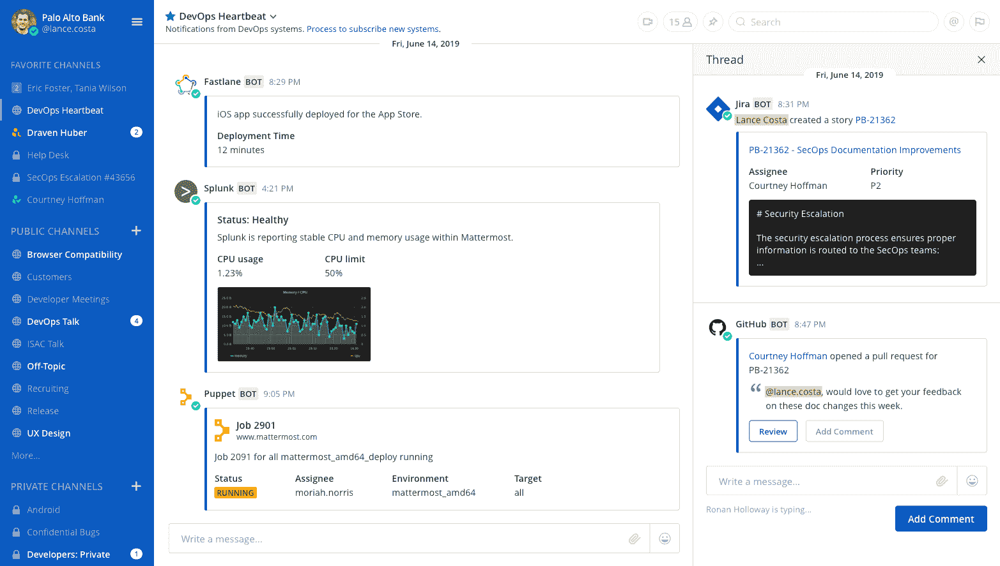

# Mattermost 在云中提供 DevOps 命令中心

> 原文：<https://devops.com/mattermost-offers-devops-command-center-in-the-cloud/>

Mattermost 今天发布了 [Mattermost Cloud](https://www.globenewswire.com/news-release/2020/11/11/2124775/0/en/Mattermost-Launches-New-SaaS-Platform-to-Optimize-DevOps-Collaboration.html) ，这是一个软件即服务(SaaS)平台，使用预构建的剧本来管理[开发工作流](https://devops.com/?s=DevOps%20workflows)，该剧本集成了各种第三方开发工具。

Mattermost 的执行副总裁兼首席产品官 Chandar Venkataraman 表示，Mattermost 云使 IT 团队能够利用单租户 DevOps 平台，他们不必以迫使开发人员放弃他们首选工具的方式来维护该平台。

他说，相比之下，其他作为服务管理的 DevOps 平台要求开发人员利用平台供应商提供的少量工具。

构建在 Kubernetes 实例之上的单租户功能还确保了存储在平台上的任何数据或工件都是私有的。matter most Cloud Professional edition 现已上市，提供全套协作和 DevOps 功能，而目前处于测试阶段的 matter most Cloud Enterprise edition 增加了专用的单租户云基础架构、企业级安全网络拓扑和严格的数据驻留选项。

他指出，通过在 Kubernetes 上构建平台，按需扩展 Mattermost 云平台变得更加容易。

Mattermost Cloud 本质上是一个 DevOps 命令中心，它提供单一平台的预构建工作流，可解决最常见的 DevOps 流程。Venkataraman 说，随着他们的 DevOps 流程成熟，IT 团队可以添加他们自己的定制工作流，并指出吉拉、Opsgenie、PagerDuty、GitLab、GitHub 和 Jenkins 的插件已经可用。

他补充说，云平台还包括一个预构建的最佳实践事件管理剧本，使开发运维团队能够在问题出现时解决问题，而不是试图使用传统的基于票证的 IT 服务管理方法(ITSM)来解决问题。

文卡塔拉曼指出，Mattermost 并不认为 DevOps 流程会取代现有的基于 ITIL 框架的 ITSM 平台。然而，许多 DevOps 团队正在寻找解决其现有工作流中的事件的方法，例如，使用消息平台而不是为 IT 支持人员设计的工作流。

Venkataraman 说，总的来说，许多对 DevOps 相对陌生的组织不想管理底层平台。与此同时，他指出，也有许多 IT 组织希望分配更多资源来编写代码，而不是管理 DevOps 平台。

每个 IT 组织都需要决定何时建立自己的平台来管理开发运维工作流和行动手册，而不是构建和维护自己的控制平台。许多 IT 团队已经在利用通过云访问的工件库和持续集成/持续交付(CI/CD)平台，因此 DevOps 命令中心只是又一个逻辑扩展。

同样重要的是，将 DevOps command center 与其余的底层 DevOps 平台隔离开来，最终会使 it 团队更容易在他们认为最合适的时候切换工具和平台。现在的挑战可能是找到一种方法来分离与特定平台深深交织在一起的工作流。