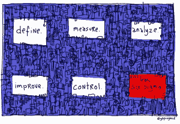

# 测量两次。自动化一次。

> 原文：<https://devops.com/measure-twice-automate/>

“交付”代码可能从开发的完成开始，但是直到操作交付过程结束后才结束。就像任何履行过程一样，运输实际上只是一个艰苦旅程的开始，最终将应用程序交付给最终用户。

## 装运它

回到过去(那时他们仍然让我写代码)，我们最喜欢的短语之一是“ship it”来表示任务的完成。当然，这是因为最终目标是将代码“交付”给用户，这样他们就可以开始做他们想用它做的任何事情。

但事实是，当然，即使我们真的准备好了把它“交付”给用户，它实际上并没有在不同的时间内把 T1 交付给用户。就像今天运输任何东西一样，这取决于运输方式。就当今的企业 IT 而言，“运输方法”实际上是部署所有基础设施——即“中间盒子”——的运营方法的隐喻，这些基础设施和服务需要向最终用户实际交付安全、快速和可用的应用程序。

我们从各种研究中知道，这需要时间。从几天到几周甚至几个月。我们知道我们不喜欢这样，我们想改善它。这就是 DevOps 的用武之地，也就是 NetOps、SDN、SDDC、SDO 或任何你想叫它的东西。

加快部署过程当然是网络运营的目标之一，但是如果没有基线，我们如何知道我们是否已经变得更快了呢？

这是我们一直忽略的 DevOps 难题的一部分——需要 **测量**部署过程 。您可能会注意到“measure”用红色加粗，这是一条视觉线索，意在强调 DevOps 的度量方面的重要性。如果您没有衡量将应用从开发交付到目的地(最终用户的生产使用)需要多长时间，那么您就不知道流程的哪些部分阻碍了您的发展。您不能有效地确定自动化可以应用于何处来缩短上市时间。你不知道首先需要解决的障碍到底在哪里。

虽然我们可以根据长期的经验和研究做出一些假设，并指出跨 IT 孤岛的切换，但现实情况是，在 ops 和网络之间可能不只有一次切换，可能有多次 IT 组内切换。例如，处理供应网络服务的网络操作人员可能不是处理负载平衡和性能服务的同一团队。但它们都在“网络”筒仓内。可能会有多次来回切换，因为除了应用程序本身所需的服务之外，各种服务还需要网络服务。

Image Credit: Gaping Void

如果没有对各个步骤所用时间的某种测量，就不可能准确确定应用部署流程中的瓶颈在您的组织中的哪个位置。我不仅能确定我为儿子生日订购的《我的世界》乐高套装现在在哪里，还能知道从流程中的每一点出发需要多长时间。我知道它在 X 天内从 A 点到 B 点，在 Y 天内从 B 点到 C 点，我知道如果有一场冬季风暴，它将导致第二步的减速(在物流术语中称为运动，如果你想知道的话。我就知道你会，不客气！)

## 测量两次。自动化一次。

着手 **衡量** 部署流程的潜在价值在于整合对流程本身的理解。这是在寻找冗余和发现子进程，这些子进程是串行运行的，但可以并行运行，以改善它们。这不一定是要预先将整个事情自动化，而是要了解流程是什么，并使其更有效——无论是通过淘汰、重组还是自动化(或三者兼有)。

你不会简单地想随意地自动化事情，而不知道它是否会有任何好处。正如我父亲教我的那样，做木材要量两次，切一次。使用 DevOps，您需要(至少)测量两次并自动化一次。否则，您可能会将周期浪费在一次性任务上，或者浪费在特定于一个应用程序的任务上，以至于自动化没有真正的价值，因为它在应用程序之间是不一样的。

关键是从定义你要测量什么开始，进行测量，然后分析它以确定你需要改进什么。

因为仅仅为了自动化而自动化最终不会比为了技术而采用技术更有成效。

*我说“随便”，是因为在我的职业生涯中，我从事过税务软件、GIS 软件、通信、运输和物流系统。终端用户可能会用“应用程序”做些什么，这方面有很大的差异。