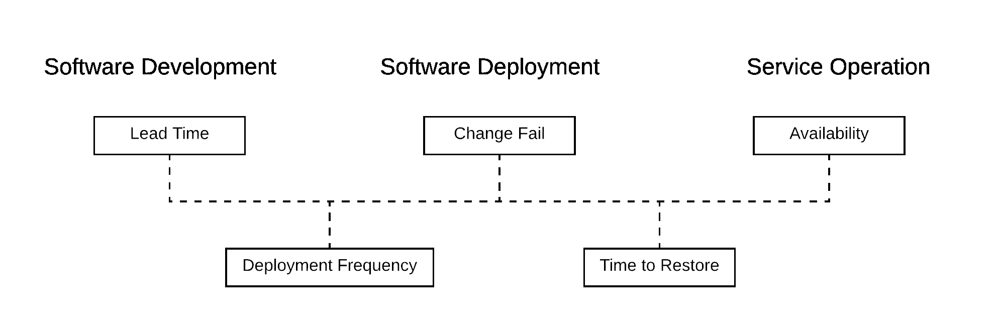

# 测量 DevOps 性能

> 原文：<https://devops.com/measuring-devops-performance/>

随着 IT 在我们的组织中变得越来越重要，提高我们高效、安全地交付创新的能力也变得越来越重要。DevOps 是一场重塑我们交付软件方式的运动，强调通过自动化和协作向最终用户交付价值。在复杂过程的复杂变化中，很容易忽略最重要的一点:我们的“改进”必须交付实际的改进。测量软件交付团队的性能是评估变更影响的基础。

[devo PS 状态报告](https://cloud.google.com/blog/products/devops-sre/the-2019-accelerate-state-of-devops-elite-performance-productivity-and-scaling) 的主要贡献之一就是年复一年地关注相同的关键指标。虽然随着时间的推移，他们调查中的问题发生了变化，并得出了新的结论，但用作基准的四个关键指标仍然存在:

1.  交付时间(从代码提交到代码部署)
2.  部署频率(到生产)
3.  更改失败百分比(针对生产部署)
4.  平均恢复时间(从生产故障中恢复)

[加速](https://itrevolution.com/book/accelerate/)这本书详细解释了这些指标，以及为什么选择它们；这些要点总结如下。

这些指标中的前两个与创新和新功能的快速发布有关。第三和第四个指标与稳定性、缺陷和停机时间的减少有关。因此，这些指标符合 DevOps 的双重目标，即“快速移动，而不是破坏事物。”

这些也符合精益管理的两个核心原则，这两个原则源自丰田生产系统:“准时生产”和“停止生产线”“及时”是最大效率来自减少工作系统中的浪费的原则；减少浪费的方法是优化系统以处理越来越小的批量，并以更快的速度交付它们。“停止生产线”意味着调整工作系统不仅是为了加快交付，而且是为了立即识别缺陷以防止它们被发布，从而提高产品质量并降低生产失败的可能性。

交付时间很重要，因为交付时间越短，就能越快地收到软件的反馈，从而能越快地发布创新和改进。《》一书揭示了衡量交付周期的一个挑战是它由两部分组成:开发一个特性的时间和交付它的时间。

开发一个特性的时间从特性被请求的那一刻开始，但是有一些合理的原因可以解释为什么一个特性可能会被取消优先级，并在产品的 backlog 中保留几个月或几年。从功能请求到功能开发所需的时间有很大的内在可变性。因此，DevOps 状态报告中的交付周期只关注于衡量开发一个特性所需要的时间。

生命周期的软件交付部分是总交付时间的重要部分，也更加一致。通过测量从代码提交到代码部署的交付时间，您可以开始尝试过程改进，这将减少等待和低效率，从而实现更快的反馈。

部署频率是指将代码或配置变更部署到生产环境中的频率。部署频率很重要，因为它与批量大小成反比。与每周部署一次的团队相比，每月部署一次产品的团队在每次部署中会部署更多的变更。并非所有的变化都是平等的。在任何一批变化中，都会有一些非常有价值的变化，而其他的变化几乎是微不足道的。

大批量意味着有价值的特性与所有其他变化一起等待，因此延迟了价值和收益的交付。大批量还会增加部署失败的风险，并且如果失败发生，会使诊断众多更改中的哪一个是负责任的变得更加困难。当部署是痛苦和乏味的时候，团队自然倾向于一起批量变更。通过测量部署频率，您可以跟踪您的团队在使部署不那么痛苦和实现更小批量的工作中的进展。

变更失败百分比衡量生产部署失败的频率。这里的失败意味着部署导致系统停机或降级，或者需要后续的修复或回滚。现代软件系统是复杂的、快速变化的系统，所以一些失败是不可避免的。传统上，人们认为在变化的频率和系统的稳定性之间有一个平衡，但是在 DevOps 报告的状态中确定的高效团队的特点是高创新率和低失败率。测量失败率允许团队跟踪和调整他们的过程，以确保他们的测试过程在大多数失败发生之前将其剔除。

平均恢复时间(MTTR)与发布功能的交付时间密切相关。实际上，能够快速发布特性的团队也能够快速发布补丁。恢复时间表示生产系统保持停机、处于降级状态或功能不工作的时间。这类事件通常是压力很大的情况，通常会涉及财务问题。快速解决此类事件是运营团队的首要任务。通过衡量这一指标，您的团队可以设定恢复时间基准，并加快解决事件的速度。

2018 年，DevOps 报告的状态增加了第五个指标，即系统正常运行时间，这与团队从故障中恢复所需的时间成反比。系统正常运行时间指标是一个重要的补充，原因有几个。首先，它符合系统管理员(运营团队)的传统优先级和关键绩效指标。系统管理员的首要目标是保持正常运行或确保系统保持可用。原因很简单:业务依赖于这些系统，当系统崩溃时，业务也会随之崩溃。停机代价高昂。

跟踪系统正常运行时间也是现场可靠性工程(SRE)学科的核心。SRE 是传统系统管理员角色的演变，扩展到 web 级或云级系统，其中一名工程师可能负责管理 10，000 台服务器。从 Google 崭露头角的 SRE，在颇具影响力的著作 [站点可靠性工程](https://landing.google.com/sre/sre-book/toc/index.html) 中分享了他们的做法。该书中分享的一项创新是错误预算的概念，即承认可靠性和创新之间存在权衡，以及存在可接受的停机时间水平。

根据 [网站可靠性工程书，第三章](https://landing.google.com/sre/sre-book/chapters/embracing-risk/) ，“简单来说，一个用户在一部 99%可靠的智能手机上无法分辨 99.99%和 99.999%的服务可靠性。考虑到这一点，站点可靠性工程不只是简单地最大化正常运行时间，而是寻求不可用性风险与快速创新和高效服务运营目标之间的平衡，从而优化用户的总体满意度(包括功能、服务和性能)。”

DevOps 报告的状态显示了这五个指标是如何相互关联的(见图 1)。当开发人员完成并将一个特性提交给版本控制时，计时器就开始计时。该特性发布的速度取决于团队的部署频率。虽然频繁部署是快速创新的关键，但它们也增加了生产失败的风险。变更失败率衡量这种风险，尽管频繁的小规模部署往往会降低任何给定变更的风险。如果变更失败，关键问题是恢复服务的平均时间。可用性的最后一个指标是生产系统的净稳定性。

Figure 1: Correlation between the five metrics.

## **五个关键软件交付和运营绩效指标如何联系在一起**

这些指标一起构成了团队的软件交付绩效。任何 DevOps 计划的目标都应该是通过战略性地开发特定的能力，例如连续交付和自动化测试的使用，来提高软件交付的性能。

你的团队如何衡量这些能力是另一个挑战。但是“””为调查的有效性做出了令人信服的论证。自动化度量可以随着时间的推移而实现，尽管实现的机制将取决于您如何进行部署。Salesforce 生产组织跟踪过去的部署，但目前无法查询这些部署，因此您需要使用用于执行部署的工具来测量部署频率(例如)。Salesforce 在 Trust 上发布他们自己的服务正常运行时间，但这并不表明客户在 Salesforce 上构建的关键定制服务是否处于工作状态。

调查为这些指标提供了一个合理的代理，尤其是当回答是由不同角色的团队成员给出的时候。管理此类调查的指导原则超出了本书的范围，但是您的团队诚实的回答是最关键的因素。避免任何可能刺激团队夸大其答案的政策。千万不要用这些调查来奖励或惩罚；它们应该简单地用于通知。允许团队跟踪他们自己的进展，为了他们自己的利益和组织的利益，挑战自我以提高。正如敏捷宣言中所说，“团队定期反思如何变得更有效，然后相应地调整和调整其行为。”

度量标准为软件交付团队的表现提供了一个可靠的长期指标。它们为您的团队打开了试验不同方法的大门，并使用通用标准评估它们的影响。这里描述的关键指标很重要，因为它们强调端到端的性能，从而激励团队专注于朝着这个共同目标的协作。 [平衡速度与可靠性至关重要](https://www.copado.com/2020/03/build-on-remote-teams/) ，因此这些指标应该放在一起考虑，以确保一个目标不会以牺牲另一个为代价。