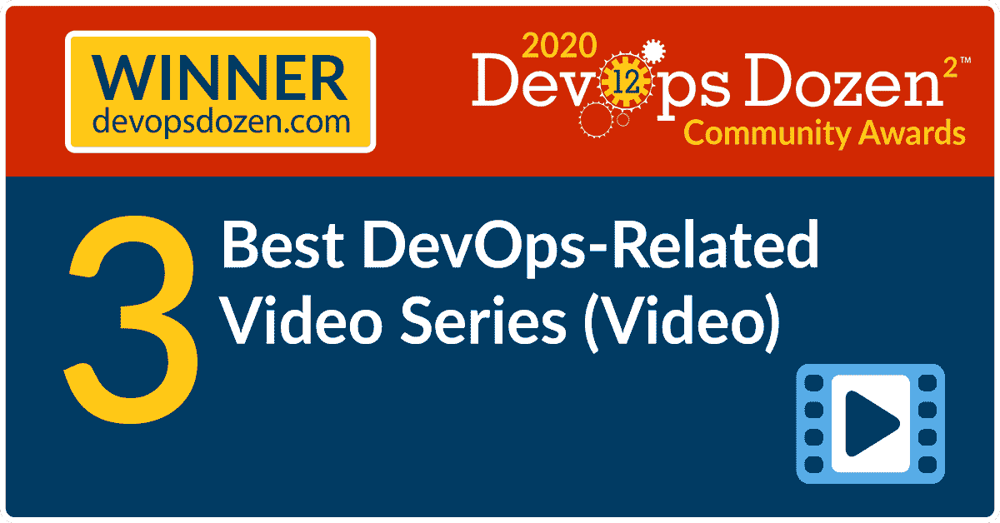
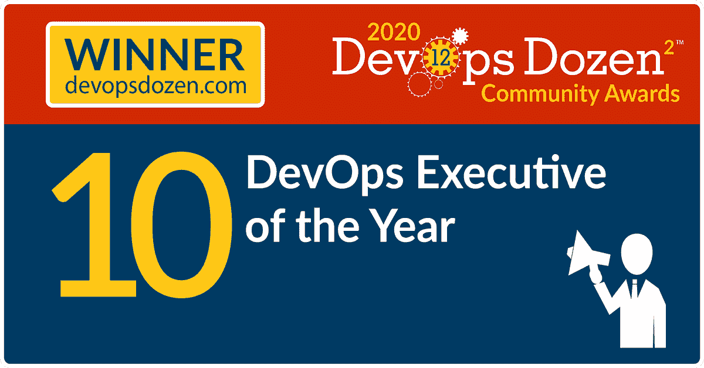

# 认识一下 2020 年 DevOps 十几大奖的获奖者

> 原文：<https://devops.com/meet-the-winners-of-the-2020-devops-dozen%c2%b2-awards/>

这是你们期待已久的时刻。是时候宣布 2020 年 DevOps 十大奖项的获奖者了，我们非常兴奋地分享 DevOps 社区中最杰出的领导者和工具的名字。尽管如此，我必须说，所有的决赛选手都通过他们的指导、服务和创新的想法在使 DevOps 社区变得更好方面做了令人惊叹的工作，每一个人都值得特别的认可。

DevOps 十二大奖表彰成熟的 devo PS 领域中的佼佼者，今年的获奖者展现了卓越的领导力以及对 2020 年社区和新冠肺炎疫情的支持。对我们所有人来说，去年无疑是艰难的一年，但这也是灵活、创新和快速数字化转型的一年。2020 年的获奖者表现出了韧性、决心、承诺和意愿，在这一年里迎接前所未有的挑战，推动他们的业务和行业向前发展。祝贺每一位获奖者。

获胜者是从决赛入围者中选出的，公众投票占最终总分的 40%,我们的评委选择占加权总分的 60%。我们的团队经过了数千次投票，选出了每个类别的获胜者，这不是一件容易的事情。非常感谢我们的评委团做出了艰难的决定，感谢所有投票和提名候选人的人。

女士们先生们，我很荣幸地向你们颁发 2020 年 DevOps 十几大奖的获奖者:

## **DevOps 十几个社区奖项**

### **最佳 DevOps 行业实施**

**英国最大的金融服务机构劳埃德银行集团** 荣获最佳 DevOps 行业实施奖。劳埃德银行集团投入巨资，推动在其业务中采用敏捷开发和 DevOps 实践，以战略性地实现其数字服务能力的现代化，并与客户期望保持一致。

### **最佳 DevOps 调查/分析/研究**

最佳 DevOps 调查/分析/研究奖授予傀儡的 ** 2020 年 DevOps 状况报告** 。该报告集中在两个领域，可以帮助组织扩展他们的 DevOps 计划:软件交付的平台方法和将 DevOps 原则应用于变更管理。这是 Puppet 连续第九年发布发展状况报告。这是业内持续时间最长、引用范围最广的 DevOps 研究。

### **最佳 DevOps 相关视频系列(视频** )

最好的 DevOps 相关视频系列是**DevOps unbounded**，这是一个关注 devo PS、自动化、CI/CD 和测试的双周视频系列。顶级的行业领导者加入这个系列，探索软件交付和 IT 团队每天面临的挑战和问题。

### **最佳 DevOps 相关播客系列(仅音频)**

**《现代大型机:构建更好的软件交付平台》** 是最好的 DevOps 相关播客系列。Modern Mainframe 是 Compuware 的一个播客，探讨大型机现代化以及如何使用 DevOps 转变大型机文化、流程和工具，以帮助您的企业在数字时代竞争。构建一个更好的软件交付平台是播客的第 9 集，由 Compuware DevOps 架构师 Rick Slade 主讲。

### **年度最佳 DevOps 图书/电子书**

杰克·马希尔和卡门·迪尔多的《站在肩膀上:数字化转型领导者指南 是今年最好的 DevOps 书籍/电子书。这份必读材料为领导者提供了关于敏捷、精益和 DevOps 主题范围的实用、可行的信息，这些主题通常是单独处理的；并解释了为什么每一个都是必要的，但单独还不足以避免您的业务的市场中断。作者重点关注如何建立一种以员工和客户为中心的文化，一种推动速度和效率的组织结构，同时利用技术来实现更快、更安全、更好和更便宜的速度价值。

### **顶尖 DevOps 福音传道者**

最高 DevOps 福音传道者奖授予了 DevOps 协会首席大使 **海伦·比尔** 。Helen 是一位著名的 DevOps 福音传道者，领导着 DevOps Institute 大使计划，致力于提供广泛的思想领导力和本地化。她是加速战略集团的分析师和 InfoQ 的编辑。最近，Helen 一直在与一组大使合作开发一个新的在线 DevOps 能力评估(DOCA)，将于 2021 年推出。在 Plutora 和 Moogsoft 担任战略顾问的角色给了她深入研究价值流思维和观察能力的机会。她是每日 DevOps 的主持人，这是一个 BrightTalk 系列，关注的主题从神经科学到 ChatOps，到 AIOps 以及与 DevOps 相关的一切。

### **最佳开发运维转型(非供应商)**

最佳 DevOps 转型奖的获得者是 **富达投资** ，这是一家金融服务公司，以创新的投资和技术解决方案支持金融机构发展业务。富达对基于云的平台的接纳带来了切实的改善，比如更好的运营弹性。

###  **年度最佳 DevOps 虚拟赛事**

**DevOps World 2020**获得年度最佳 DevOps 虚拟赛事 devo PS 十二强奖。该虚拟活动包括 100 多个业务和技术分组会议，重点关注 DevOps 如何改变软件交付世界，以及企业如何在新冠肺炎疫情期间调整他们的思维方式。顶级行业领袖讨论了 DevOps 的发展方向，以及观众如何最好地利用先进的实践在未来取得成功。

### **最具创新性的 DevOps 开源项目**

** Grafana Loki ** 被选为最具创新性的 DevOps 开源项目。Loki 是一个受 Prometheus 启发的可水平扩展、高可用的多租户日志聚合系统。

### **DevOps 年度高管**

devo PS 年度高管是 GitLab CEO 兼联合创始人 ** Sid Sijbrandij ** 。希德的职业道路绝不是传统的。他在 2007 年看到了第一个 Ruby 代码，并且非常喜欢它

他自学了如何编程。正是在他担任 Ruby 程序员期间，他第一次接触了 GitLab，并很快发现了他对开源的热情。

2012 年，他帮助 GitLab 商业化，到 2015 年，他带领公司通过了 Y-Combinator 的 2015 年冬季批次。在他的领导下，该公司在过去五年中增长了 50 倍，远程团队成员从 9 人增加到 1，300 多人，遍布 65 多个国家和地区，目前市值为 27.5 亿美元。作为开源社区的拥护者和扩展远程组织的先驱，Sid 正在改变关于 DevOps 实践的传统观念。

### **年度最佳 DevOps 演示文稿**

Broadcom 大型机软件部门首席技术官 George DeCandio 的 **在坡道上打开大型机 DevOps**是年度最佳 devo PS 演示奖的获得者。在这个主题演讲中，George DeCandio 解释了采用开放策略需要什么，以及如何与 Git 和 Jenkins 等现有 DevOps 工具集成，或者集成到现有的跨平台 CI/CD 管道中。George 讨论了 OMP 致力于大型机的第一个项目 Zowe 如何开放大型机系统命令、数据集和源代码库，以便您可以与对大型机一无所知的工具集成。

### **年度最佳 DevOps.com 文章**

斯普利特的软件工程师亨利·朱克斯(Henry Jewkes)撰写的《如何在新冠肺炎期间减少工程师的职业倦怠》是今年 DevOps.com 的最佳文章。亨利解释了如何有效地应对倦怠，因为它在新冠肺炎疫情期间变得越来越普遍。

## **DevOps 十几个工具和服务奖项**

### **最佳端到端开发运维工具/服务**

2020 年最佳端到端 DevOps 工具/服务的获得者是 ** GitLab ** 。GitLab 已被证明是 DevOps 团队协作和构建软件的最有效的解决方案。GitLab 解决方案是数以千计的社区贡献者之间合作的结果，也是超过 100，000 个组织的反馈，这些组织已经采用 GitLab 来支持他们的 DevOps 转换。GitLab 社区根据他们的现实挑战贡献代码、文档、翻译、设计和产品想法，使 GitLab 更加有用和有价值。

### **最佳 DevOps 回购/GitOps 工具/服务**

最佳 DevOps Repo/GitOps 工具/服务 DevOps 十二奖授予了最受欢迎的开源版本控制代码库**【GitHub】**。GitHub 非常适合在云端管理和维护代码，并通过自动环境设置快速为项目做出贡献。

### **最佳 CI/CD 工具**

** CircleCI ** 被大众和评委选为最佳 CI/CD 工具。CircleCI 是大规模软件创新的领先 CI/CD 解决方案。CircleCI 平台允许团队在云中或他们自己的基础设施上构建和交付软件。CircleCI 每月在 Linux、macOS 和 Windows 上管理超过 3500 万次构建。

###  **最佳价值流管理工具**

2020 年 DevOps 十几个最佳价值流管理工具得主是 ** Digital.ai 价值流平台** 。Digital.ai 通过在首个智能价值流平台中结合行业领先的企业敏捷规划、应用安全、持续测试、软件交付和人工智能驱动的分析，使全球最大的企业能够加速其数字化转型计划。Digital.ai 价值流平台通过客户体验镜头提供了软件交付生命周期的独特视图，以更好地与业务目标保持一致，并扩展敏捷和 DevOps 流程。

digital . AI 价值流平台具有端到端连接性、人工智能驱动的分析可见性、持续测试和质量、发布管理和流程优化，以及通过量化指标可衡量的结果。该平台允许组织根据市场需求设定业务目标，交付产品和技术以实现这些目标，测量和分析结果，并进行调整以不断改进。

### **最佳可观测性解决方案**

最佳可观察性解决方案奖授予**Splunk Observability Suite**，这是一套全面的解决方案组合，旨在帮助 IT 和 DevOps 团队应对其他工具无法有效应对的新监控挑战。Observability Suite 帮助用户保持最高水平的业务性能和适应性，提高发布质量和速度，提高开发人员的效率，最大限度地减少停机时间，并提供世界一流的数字体验。

### **最佳开发团队解决方案**

** JFrog Xray ** 被评为 2020 年最佳 DevSecOps 解决方案。JFrog Xray 是一个通用的影响分析产品，增强了整个 DevSecOps 管道中的工件安全性、容器安全性和 OSS 许可证合规性。JFrog Xray 扫描您的工件，为正在使用的 OSS 组件构建和发布包，并检测您的软件组件中的安全漏洞和许可证。

### **最佳测试服务/工具**

** Tricentis Tosca ** 是一个持续测试平台，它加速测试以跟上敏捷和 DevOps 的步伐，是 2020 年最佳测试服务/工具的获胜者。凭借业内最具创新性的功能测试技术，Tricentis Tosca 突破了传统测试工具所面临的障碍。Tricentis Tosca 简化了端到端的功能测试，自动化了现代企业架构各层的测试。

### **最佳 Kubernetes 平台/服务**

最佳 Kubernetes 平台/服务奖授予 **红帽 OpenShift 集装箱平台** 。

Red Hat OpenShift 是一个开源企业 Kubernetes 平台，为构建和扩展容器化应用程序提供一致的混合云基础。

### **最佳云原生安全解决方案/服务**

** Styra 的声明式授权服务(DAS) ** 获得最佳云原生安全解决方案/服务奖。Styra DAS 是专门为解决云原生、容器化应用程序及其运行基础设施的授权挑战而构建的。Styra policy-as-code 解决方案构建于开源项目开放策略代理(OPA)之上，已经在当今许多最大的云原生部署中得到验证。

Styra DAS 允许企业跨服务、团队、集群和云定义、实施和验证授权策略。随着企业将其云原生应用从开发阶段转移到生产阶段，Styra DAS 提供了工具来最大限度地降低人为错误的风险，减轻合规性开销，并确保在您的环境中实施安全性和合规性最佳实践。Styra DAS 通过内置的最佳实践和安全策略库，以及用于从头开始构建自定义策略的点击式界面，简化了策略创建。

### **大型机最佳开发运维解决方案**

很难在这个类别中选出一个赢家。博通的**CA Endevor Bridge for Git**和 Compuware 的 **Topaz** 这两个解决方案不分胜负，经过长时间的讨论，评委们决定这两个解决方案都应该被评为 2020 年最佳大型机开发运维解决方案。

CA Endevor Bridge for Git 是 CA Endevor Integrations for Enterprise devo PS 的一个组件。它通过一个企业 Git 服务器，如 GitHub、Bitbucket 或 GitLab，将 Git 连接到 Endevor。Git 和传统的大型机开发人员可以在 Endevor 中管理的同一个大型机应用程序上轻松协作。只有从本地 Git 存储库推送到企业 Git 存储库的代码才能被集成识别，并传播到 Endevor。

Topaz 是一个现代化的大型机开发和测试工具的敏捷平台，它集成到 DevOps 工具链中，使任何开发人员，无论经验如何，都能够理解和使用任何程序，无论程序有多老或多复杂，这样他们的组织就可以轻松地维护和创新他们的大型机投资基础。

### **数据运营/数据库解决方案的最佳开发运维**

data ops/数据库解决方案的最佳 DevOps 是 ** InfluxDB ** 。InfluxDB 由 InfluxData 开发，是一个开源的时间序列数据库，使开发人员能够构建物联网、分析和监控软件。它是专为处理传感器、应用程序和基础设施产生的海量和无数时间戳数据源而构建的。

###  **最佳新开发工具/服务提供商**

该类别的冠军是 ** Opsera ** ，第一个面向 DevOps 团队的持续编排平台。Opsera 平台自动化任何 CI/CD 工具链，支持声明性管道，并提供跨整个软件交付流程的统一见解。

获胜者将获得数字和实物形式的奖杯和徽章，以庆祝他们的成就。

感谢支持[DevOps.com](http://DevOps.com)和 DevOps 社区。欲了解更多信息，请访问 2020 [DevOps 十二大奖网站](https://devopsdozen.com/)和 s tay 为 2021 DevOps 十二大奖调谐。