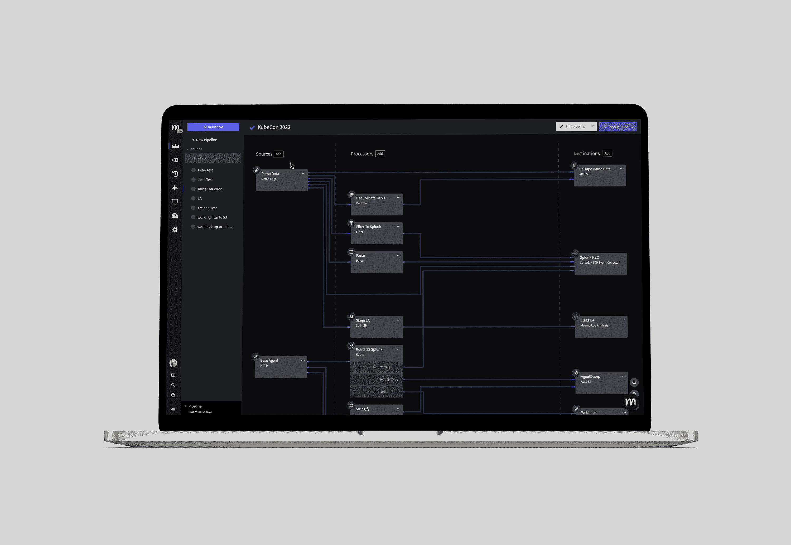

# Mezmo 增加了可观察性管道来分析 DevOps 数据

> 原文：<https://devops.com/mezmo-adds-observability-pipeline-to-analyze-devops-data/>

在本周举行的 [KubeCon + CloudNativeCon 北美](https://events.linuxfoundation.org/cloud-native-wasm-day-north-america/)会议上，Mezmo 推出了一个[可观测性管道](https://www.globenewswire.com/news-release/2022/10/26/2541930/0/en/Mezmo-Unveils-Observability-Pipeline-to-Enhance-the-Value-of-Data.html)平台，该平台有望简化机器数据的管理、丰富和关联。

[以前被称为 LogDNA](https://techstrong.tv/videos/interviews/new-identity-mezmo) ，Mezmo 正在扩大其业务范围，在其核心日志管理平台上增加增强和分析数据的能力。随着时间的推移，该功能将扩展到使用开源的 OpenTelemetry 代理软件添加对度量和跟踪的支持。

Mezmo 首席执行官 Tucker Callaway 表示，目标是提供一个框架，用于集中管理 DevOps 工作流程中广泛来源产生的[可观察性](https://devops.com/?s=observability)数据。很明显，DevOps 团队需要一种方法来丰富和关联大量的运动数据，而不仅仅是简单的预处理，以便能够更加经济高效地存储这些数据，他补充道。

Callaway 指出，Mezmo 可观察性管道通过确保正确的数据以正确的格式流入正确的系统进行分析来实现这一目标。

随着开发运维团队收集的数据量持续大幅增加，采用一套数据运维最佳实践的需求变得越来越明显。最近出现的 DataOps 描述了一组数据工程实践，将许多 DevOps 原则应用于数据管理方式。Mezmo 的可观察性管道旨在简化将 DataOps 最佳实践专门应用于 DevOps 团队收集的数据。

当然，每个 DevOps 团队都需要自己决定他们想要或需要长期存储多少数据。然而，Callaway 指出，随着 IT 环境变得越来越复杂，越来越多的开发运维团队保留数据的时间越来越长。他说，这就需要更有效地分析尽可能多的数据，并以更具成本效益的方式存储这些数据。然而，这两个目标经常会产生一个物理问题，因为它们可能是截然相反的。

从长远来看，还不清楚 DevOps 团队在多大程度上接受了可观测性。大多数开发运维团队利用监控工具来跟踪一组预定义的指标。可观察性平台承诺使开发运维团队更容易查询各种数据类型，以便在潜在问题破坏 it 环境之前发现它们。挑战在于许多 DevOps 团队可能不知道形成什么样的查询来发现这些问题。随着时间的推移，机器学习算法很可能会越来越多地应用于可观察性数据，以使潜在问题更容易浮出水面。

然而，与此同时，DevOps 团队需要找到管理由多种类型的应用程序生成的所有数据的方法，这一需求变得更加重要。事实上，在没有任何有意义的方法来管理所有这些数据的情况下，投资可观测性平台的好处可能是有限的。