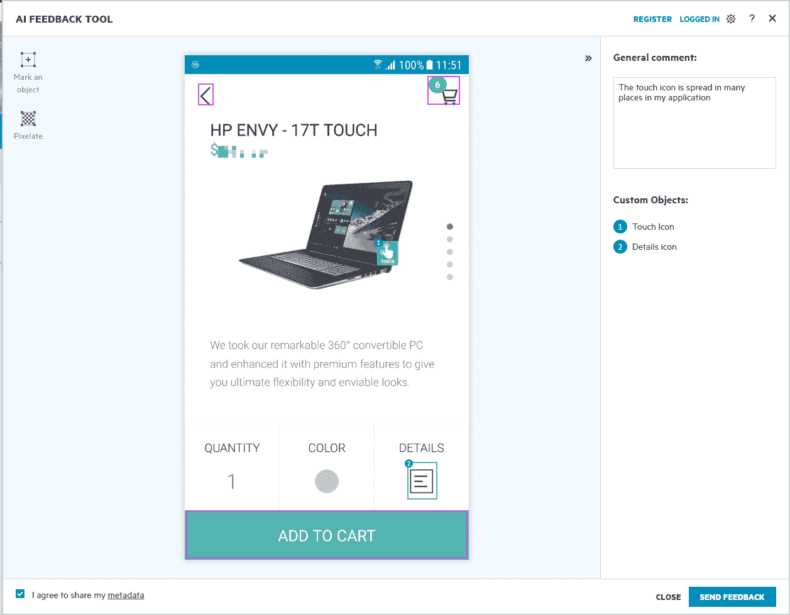

# 微焦点扩展了人工智能测试工具的范围

> 原文：<https://devops.com/micro-focus-extends-ai-testing-tools-reach/>

Micro Focus】扩展了一系列注入人工智能(AI)的统一功能测试(UFT)测试工具的功能，以包括对基于网络和移动应用程序的支持。

此外，UFT 测试工具现在将允许单个脚本在多个平台和浏览器上自动运行，消除了为每个平台创建多个脚本的需要。

还添加了一种众包反馈机制来提高对对象的识别，如新的小部件，以提高嵌入微焦点测试工具的人工智能模型识别独特用户界面范例的能力。

最后，Micro Focus 正在提供一个人工智能软件开发工具包(SDK)和自然语言处理(NLP)引擎，使技术和非技术用户都可以创建测试。

Micro Focus 的产品总监 Archie Roboostoff 表示，自然语言功能将使应用程序的最终用户更容易地参与功能测试过程。

他说，随着测试的责任继续左移，尽可能多地自动化功能测试过程变得越来越重要。开发人员和最终用户通常没有时间或者专业知识来构建这些测试。

组织面临的挑战是，他们构建和部署的应用程序代码越多，他们花在调试应用程序上的时间就越多。Roboostoff 指出，许多组织最终转移了应用程序开发项目的资源，只是为了跟上应用程序构建和部署的速度。

矛盾的是，资源的转移共同制约了任何额外应用程序的构建速度。Roboostoff 说，人工智能可以通过减少更快发现问题所需的时间，在打破僵局方面发挥关键作用。

他补充说，与此同时，微焦点 UFT 工具通过将其为移动应用程序开发的人工智能功能应用于基于网络的应用程序，进一步简化了测试过程。

人工智能不太可能在短期内消除人类测试应用程序的需要。然而，在不同的应用程序开发项目中，经常会出现许多常规问题。随着开发人员在 DevOps 过程的上下文中正式推广之前测试更多自己的代码，开发团队应该有可能依靠人工智能工具来解决他们可以解决的问题，而这些问题甚至在任何人知道它们存在之前很久就已经存在了。

正如每个人工智能工具的情况一样，一个 IT 组织需要获得嵌入在任何测试工具中的人工智能模型的信心。AI 工具接触代码越多，它们就变得越精确。

不管人工智能的舒适程度如何，显然应用程序测试需要变得更加自动化。随着新冠肺炎疫情带来的经济衰退，大多数组织将无法在应用程序测试中投入更多人员。当然，问题是，在大多数个人比以往任何时候都更多地在家工作和购物以帮助遏制新冠肺炎病毒传播的时候，大多数组织从未像现在这样依赖应用程序来推动收入增长。

在这种所谓的“新常态”中，成功与失败的区别往往在于应用于应用程序的测试水平，而许多企业现在几乎完全依赖于这些应用程序。