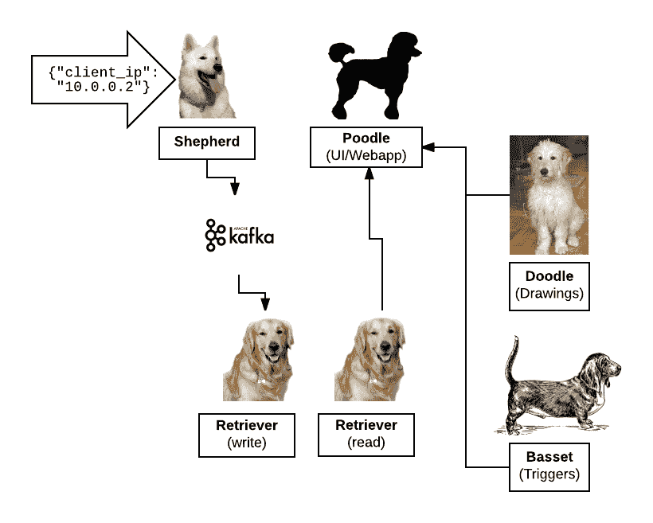

# 蜂巢的微服务使用

> 原文：<https://devops.com/microservice-usage-honeycomb/>

我最近加入了 [Honeycomb](https://honeycomb.io) ，这是一家 [observability](https://honeycomb.io/blog/2017/06/build-observable-systems/) 初创公司，我们在这里致力于帮助多面手软件工程师在一个日益分布式的世界中解决他们应用程序的问题。我们用来交付产品的架构可以被描述为使用微服务，但有趣的是，使用微服务并不是一个特意的设计选择。相反，它是当今世界越来越普遍的各种因素的结果:

1.  软件工程师希望参与基础设施建设，反之亦然
2.  对增加可见性和可调试性的渴望(整体性使得很难查明问题)
3.  DevOps 工具现在已经足够成熟，可以将一些操作负担转移到

在本文中，我们将一窥蜂巢背后的系统。我将在这里重点介绍我们的实施情况，但对于微服务的一般总结，请随意阅读[微服务杂志概述](#)。

**为什么是微服务？**

一些团队从一个“整体”开始，并随着时间的推移将其拆分为独立的服务，但由于各种偶然因素，Honeycomb 的架构从第一天起就倾向于微服务。例如，团队由强大的运营专家组成，因此在我们的案例中，实现他们的基础设施挑战并不那么令人生畏。在以前的角色中经历了 monoliths 的陷阱之后，团队从一开始就强烈倾向于按照功能划分程序。这使得我们能够避免将传统的 SaaS 应用程序逻辑和蜂巢的独特数据层混为一谈。

在我们深入研究架构细节之前，这里有一个对蜂巢基本功能的快速总结:

1.  Honeycomb 接受“事件”，结构为 JSON，描述一些值得跟踪的事件。(例如:用户向我们的应用程序发出了 HTTP 请求)。
2.  Honeycomb 将这些事件存储在后端，供以后查询。
3.  用户可以通过访问我们的 web 应用程序来执行查询，以深入了解他们的(通常是生产)系统。

这种类型的应用程序有几个部分，乍看之下，这些部分并不能清楚地表明它们是应该整合成一个程序还是拆分成几个程序。将这些功能分开有操作上的挑战，但是可以为诸如扩展和调试之类的事情提供很多好处。因为 Honeycomb 的创始人和早期员工是世界一流的运营团队，他们在林登实验室、T2 解析、T4 脸书和其他地方运行系统，所以在分布式系统中运行这些独立组件的运营挑战并不像初级管理员那样令人生畏。

将这些分开的另一个重要考虑是，为了处理预期的大量[事件](https://honeycomb.io/blog/2017/08/event-foo-building-better-events/)流量，我们被迫设计一个严重依赖第三方技术的关键部分的系统:[阿帕奇卡夫卡](https://kafka.apache.org/)。

Kafka 是一个工具，用于更安全地从程序的一个实例向另一个实例发布和接收“消息”。例如，考虑运行在不同计算机上的两个希望通信的程序:如果一个程序发出请求，但无法到达另一台计算机，则另一台计算机无法知道消息是否发送失败，或者根本就没有发送消息。这可能会在实际的生产系统中导致各种各样的问题。一个中间的“代理”程序可以帮助解决这个问题，并对逻辑进行编码，以处理故障并确保消息传递。

由于使用 Kafka 作为中间人，将“发送消息”(摄取事件)和“接收消息”(存储它们供以后查询)分离成不同的组件变得容易得多。让我们看一下 Honeycomb 使用的具体服务来感受一下。

**窥视蜂巢**

蜂巢曾经是一家名为 Hound 的公司，所以蜂巢所有的微服务都以狗为主题命名。(奇怪的是，我们真正的办公室狗是以一部著名电影中的恐龙命名的，这部电影是以另一种动物命名的——“鸭子”)。大多数都是用 Golang 写的，但是至少有一个是用 NodeJS 写的，因为它更适合。这是微服务的一个显著优势:您可以更轻松地将正确的工具用于正确的工作，尽管代价是增加了操作的复杂性。

如上所述，首先有一个接收事件(JSON 有效载荷)的服务。这项服务被称为牧羊人。Shepherd 位于端点`api.honeycomb.io`之后，提供各种功能，这些功能对于前端 API 来说有些独特。例如，速率限制是由 Shepherd 处理的，这样一个客户端向我们发送大量突发事件就不会给其他客户带来问题。Shepherd 还将处理诸如事件模式之类的业务逻辑(例如，如果接收到新的字段，则更新数据集的元数据)，并将接收到的事件交给 Kafka 进行存储。

当事件击中 Kafka 时，它们被称为 Retriever 的进程接收，这是我们的持久存储引擎。Kafka 非常适合作为这个拆分用例中的中介，因为即使 Retriever 离线一段时间(由于部署、恐慌等原因)。)，事件只是在 backlog 中累积，并保持可用于以后的处理。这为蜂窝服务提供了相当大的弹性。

当检索器接收到事件时，它会将它们写入磁盘的适当位置，以便以后查询。检索器既可以作为持久事件信息的写入者，也可以作为其读取者。因此，当我们想要执行用户事件的查询时，我们名为 Poodle 的前端 web 应用程序(这是对`ui.honeycomb.io`的支持)直接调用 Retriever。Retriever 的有状态和分布式特性使得它比其他部分更容易变化，调试起来也更麻烦，因此将它拆分成自己的服务对于调试和维护非常有用。由于 Honeycomb 每天部署多次，识别问题的来源可能会变得很棘手(尽管值得注意的是，我们也有自己单独的[“狗粮”Honeycomb](https://honeycomb.io/blog/2016/08/how-honeycomb-uses-honeycomb-part-1-the-long-tail/) 集群来调试 Honeycomb 与 Honeycomb！).

如果所有东西都混在一个二进制文件中，那么识别性能问题(比如进程由于内存不足而死亡)将是一场噩梦。应用程序的任何部分都可能对应用程序的任何其他部分产生影响。依赖于服务使用适当的 AWS 实例类型(例如，具有更快磁盘的类型)的所有希望都将破灭。但是通过将我们的架构分成几个组成部分，我们可以满足这些需求以及更多的需求。

我们至少还有另外两个服务可以很好地嵌入:一个用 NodeJS 编写的名为 Doodle 的服务，它可以为在 Slack 中发布扁平图像的查询生成非常漂亮的预渲染图片。另一个被称为 Basset，用于监控[触发器和](https://honeycomb.io/docs/guides/triggers/)触发器，当感兴趣的查询返回的值发生变化时，这些触发器会提示用户。

**蜂巢如何利用蜂巢**

关于 Honeycomb 架构的一个有趣的方面是，它恰好是那种从使用面向用户的 Honeycomb 产品进行观察和调试中受益匪浅的系统类型！然而，我们不能将事件从我们的生产网站发送到它本身，因为这可能会导致令人讨厌的反馈循环和无法解决的问题。因此，我们创建了另一个“狗粮”(比如[吃你自己的狗粮](https://en.wikipedia.org/wiki/Eating_your_own_dog_food))集群，我们用它来维护我们生产集群的健康。

例如，在一个案例中，我们被警告说，我们用来确保网站质量的端到端检查失败了。写给 Shepherd 的事件不能被 Retriever/Poodle 成功读取。在我们的 dogfood 集群中使用蜂巢式[分解](https://honeycomb.io/docs/guides/build-queries/#break-down)(类似于 SQL `GROUP BY`)，我们能够根据事件被写入的数据分区以及它们是否成功来对我们试图写入的事件进行分组(如下所示)。

这使我们能够快速识别出我们的数据分区的一个特定实例(有许多)是有问题的，而不必挖掘堆积如山的日志或睡眼惺忪地盯着一堆预聚合的指标，希望我们能够访问更多信息。通过这一发现，我们能够比较其他指标，如 API 延迟和写入延迟，并推断出问题似乎是在 Kafka 本身，而不是在我们围绕它的系统中。我们的 dogfood 集群允许我们获得使用 Honeycomb 调试分布式系统的好处，以调试 Honeycomb 本身，这是一个具有许多移动部件和微服务的复杂应用程序。

如果你对我们狗粮集群的更多细节感兴趣，[我们有一系列博客文章](https://honeycomb.io/blog/categories/dogfooding/)解释我们的设置。

**结论**

我们希望这篇文章能让你一窥微服务世界的样子。当然，任何架构都有权衡，但是到目前为止，我们对自己的选择非常满意。

如有任何问题，请通过 [【邮件保护】](/cdn-cgi/l/email-protection#25565055554a5751654d4a4b405c464a48470b4c4a) 联系我们！Honeycomb 是一个旨在帮助在分布式世界中进行调试的工具，所以我们很乐意提供帮助。如果你[对注册](https://honeycomb.io/signup)感兴趣，我们还有免费试用。

内森·勒克莱尔