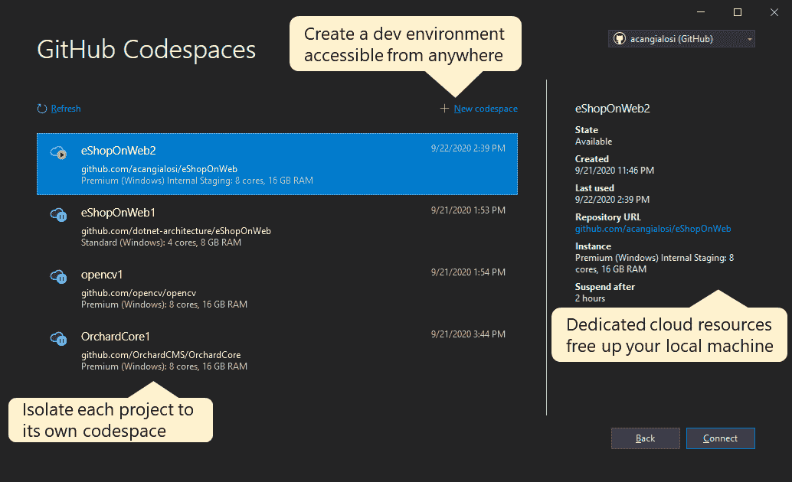

# 微软推进 DevOps 议程

> 原文：<https://devops.com/microsoft-advances-devops-agenda/>

微软在其在线 [Ignite 2020](https://news.microsoft.com/ignite2020/) 会议上，发布了一系列[更新](https://azure.microsoft.com/en-us/blog/achieving-business-resilience-with-cloud-application-development/)，这些更新共同促进了微软云平台上最佳 DevOps 实践的采用，包括首次预览了在 GitHub 上存储使用低代码 Power 应用工具创建的工件的能力。

此外，微软宣布了 Visual Studio 2019 16.8 更新的预览，该更新将添加对 [GitHub Codespaces](https://devops.com/github-extends-scope-and-reach-of-repository/) 的支持，这是一项之前宣布的在 GitHub 上自动创建存储库的功能。GitHub Codespaces 目前有测试版，很快就可以在 Visual Studio 中直接访问。

微软还透露，它已经增强了 Visual Studio 中的 Git 工具体验，以支持更多的异步协作。针对 Visual Studio 代码的 GitHub 扩展使开发人员能够处理 GitHub 问题，并直接在编辑器中提取请求。需要实时工作的开发团队也可以使用 Visual Studio Live Share。

Visual Studio 中的发布体验现在还可以选择使用 GitHub 存储库中配置的部署秘密，为 Azure 资源中的持续集成/持续交付(CI/CD)环境生成 GitHub 操作工作流。GitHub Actions for Azure 现在还可以扫描 Azure 资源，查找容器映像中的策略违规和漏洞，以及涉及 Azure 资源管理(ARM)模板的问题。

微软首席执行官塞特亚·纳德拉告诉与会者，随着各组织在新冠肺炎疫情带来的经济衰退后拥抱数字业务转型，开发和部署应用程序的速度变得更加关键。

他说，GitHub 对 Power 应用程序的支持尤为重要，因为这将使所谓的公民开发者更容易与专业开发者合作，共同开发应用程序。

微软工具组合的其他值得注意的更新包括 Azure Logic Apps 工作流平台实例的预览，该平台可以作为容器化的运行时进行部署。

答。NET 5 候选版本现在也可以使用了，预计下个月正式发布。此更新增加了对更小、更快的单文件应用程序的支持，这些应用程序在微服务和容器化应用程序中使用时使用更少的内存。它还包括显著的性能改进、对 Windows ARM64 的支持以及 C# 9.0 和 F# 5.0 语言的新版本。

微软还宣布了对 App Service 的几项更新，以使迁移和现代化更容易、更具成本效益。Azure 云上的. NET web 应用程序。新的 Premium v3 (Pv3)应用服务计划可以处理大规模的 web 应用，支持每个实例更多的应用和每个实例高达 32GB 的更大的内存密集型应用。微软还在应用服务中提供 Windows 容器支持，并将很快提供应用服务的保留实例(RI)定价以降低成本。

最后，微软进行了几项 Kubernetes 增强，包括将添加到 Azure Kubernetes 服务(AKS)的开始/停止集群功能的预览，并宣布面向 AKS 的 Azure Policy 插件的正式可用性，这使得跨 Kubernetes 集群审计和执行策略成为可能。微软还为 Visual Studio 和 Visual Studio 代码提供了普遍可用的 Bridge to Kubernetes 扩展，允许团队针对正在运行的 AKS 集群中的微服务进行开发，以便在无需重新配置或部署新集群的情况下调试现有服务。

纳德拉说，跟踪一个组织内的开发速度和整体“技术密集度”对成功至关重要。目前还不清楚有多少组织已经制定了衡量标准。然而，很明显，尚未完全采用最佳开发运维实践的组织已经落后了。