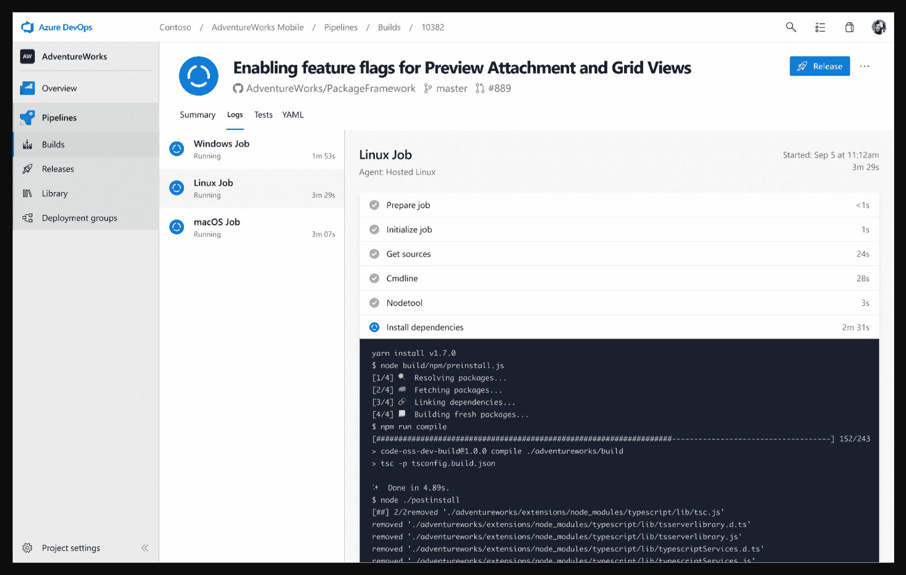

# 微软修改 Azure 上的 DevOps 方法

> 原文：<https://devops.com/microsoft-revamps-approach-to-devops-on-azure/>

微软本周为 Azure 云推出了广泛的 DevOps 服务，旨在使组织更容易接受现代应用程序开发和部署流程。

Azure DevOps 的产品管理总监杰米·库尔(Jaimie Cool)表示，对于组织来说，使用云中托管的工具来采用 DevOps 流程从根本上来说更简单，因为他们不必花时间自己设置底层基础设施。一旦他们在云中掌握了这些流程，组织就可以使用微软提供的工具，并将其扩展到本地数据中心或 Windows 服务器平台上运行的 Azure 实例。

[Azure DevOps](https://azure.microsoft.com/en-in/blog/introducing-azure-devops/) 组合横跨 Azure Pipelines，一个支持任何语言的持续集成/持续开发(CI/CD)平台；Azure Repos，一个基于 Git 的私有仓库；和 Azure 测试计划，各种各样的测试工具。Azure DevOps 还包括 Azure Artifacts，它从公共和私有来源提供 Maven、npm 和 NuGet 包提要，以及 Azure Boards，这是一套协作仪表盘和报告工具。

微软将 Azure DevOps 定位为 Visual Studio Team Services (VSTS)的演进。VSTS 用户将自动升级到 Azure DevOps 项目。使用 VSTS 的内部 Team Foundation Server (TFS)组件的组织将继续接收基于 Azure DevOps 中可用功能的更新。从下一版本开始，TFS 将更名为 Azure DevOps Server。

作为此次发布的一部分，微软还免费提供 Azure Pipelines，每个开源项目的 10 个并行作业都可以无限制地使用。已经将 Azure Pipelines 用于 CI/CD 的主要开源项目包括 Atom、CPython、Pipenv、Tox、Visual Studio Code 和 TypeScript。

Cool 说，当谈到应用程序开发时，太多的组织忽视了 DevOps 过程在使项目成功中的关键作用。有一种倾向是过于关注特性，而不是使组织能够一致地交付那些特性的工具。他说，在提高软件质量和升级速度方面，DevOps 过程至关重要。

但是 DevOps 的最终目标是不要在特定的时间内，比如一周、一个月或一个季度，增加投入生产的发布数量，他补充道。相反，组织应该能够在应用程序准备就绪或需要时对其进行更新。

Cool 注意到 Docker 容器的采用和 DevOps 的价值评估之间有很高的相关性。随着组织采用基于容器的基于微服务的架构，IT 环境的复杂性整体增加。他说，这个问题可能很快会在更多的组织中出现，因为微软现在看到到处都是容器。

Coole 说，从长远来看，微软希望看到机器学习也融入到 DevOps 流程中，并指出就机器学习和 DevOps 而言，这仍处于早期阶段。

显然，微软正试图提供更复杂的 DevOps 体验，作为与亚马逊网络服务(AWS)和其他云服务提供商持续战斗的一部分，以吸引开发者使用其平台。随着这些努力的继续扩展，开发运维流程上的 Microsoft schools 组织的数量应该会相应增加。

— [迈克·维扎德](https://devops.com/author/mike-vizard/)