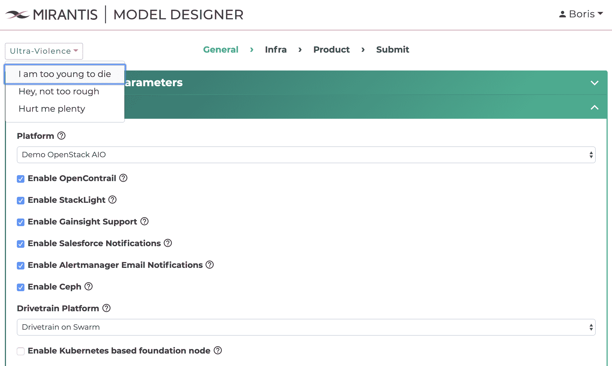

# Mirantis 添加建模工具来配置私有云

> 原文：<https://devops.com/mirantis-adds-modeling-tool-to-configure-private-cloud/>

在[开放基础设施峰会](https://www.openstack.org/summit/denver-2019/)会议上，Mirantis 今天展示了一款软件即服务(SaaS)应用，it 管理员可以通过该应用使用建模工具来配置基于 OpenStack 或 Kubernetes 的私有云。

Mirantis 首席营销官 Boris Renski 表示，Mirantis 私有云的模型设计器使 IT 管理员能够使用他们通过图形界面(GUI)访问的建模工具来配置私有云，而不必使用 YAML 文件为内部 IT 环境手动配置私有云。模型设计器计划于 5 月份正式上市。

Renksi 补充说，这种方法使几乎没有编程专业知识的 it 管理员可以使用一组声明性工具在 DevOps 环境中快速启动私有云。

这些工具还使 IT 管理员能够指定他们需要的可配置程度。基本可配置性级别会自动将大多数集群设置填充为一组默认的预测试值。最先进的“ultraviolence”可配置性设置使 IT 管理员能够调整其内部云的几乎所有方面。生成的配置模型随后被送入 DriveTrain，这是 Mirantis 在 Mirantis 私有云内提供的自动化框架。

Renski 说，要求 IT 管理员掌握与管理 YAML 文件相关的所有细微差别以建立私有云是阻碍内部私有云以及管理私有云应依赖的最佳 DevOps 实践的因素之一。大多数希望过渡到 DevOps 的组织显然希望能够像公共云服务提供商目前所做的那样，将基础架构作为代码进行管理。他说，挑战在于，与实现这一目标相关的学习曲线对于普通 it 管理员来说太高了，添加一个作为 SaaS 应用程序提供的建模工具将使甚至仅仅是 IT 人员也可以在内部 IT 环境中轻松构建私有云。

OpenStack 和 Kubernetes 都在不同程度上因过于复杂而受到普通 IT 组织的困扰。由于这些复杂性问题，两种平台的采用通常仅限于拥有高级 IT 技能的 IT 组织。但是，随着围绕这两个平台的部署过程变得更加自动化，采用其中一个平台的组织数量可能会增加。与此同时，一旦不再需要依赖繁琐的手动流程，采用任一平台的 IT 组织很可能会产生更多的实例。

当然，基于 OpenStack 或 Kubernetes 建立私有云只是 IT 挑战的开始。一旦部署了所有这些私有云，IT 组织就需要获得持续管理它们所需的工具和专业知识。事实上，在私有云时代，IT 组织应该考虑的一件事是他们打算依赖供应商提供的工具的集成水平，以建立和管理私有云。

— [迈克·维扎德](https://devops.com/author/mike-vizard/)