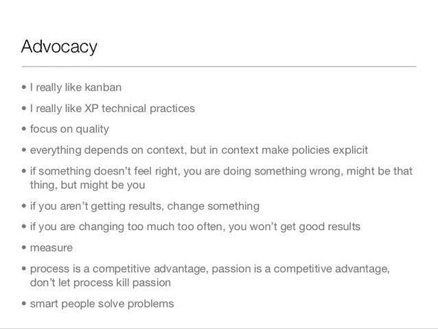

# 混合格斗 devo PS vs . Scrum Master

> 原文：<https://devops.com/mixed-martial-devops-vs-scrum-master/>

罗伊斯·格雷斯在退役前赢得了 UFC 历史上最多的锦标赛。凭借 14 胜 2 负 2 平的战绩，可以理解为什么他被一些人认为是现代 MMA 历史上最有影响力的人物。由于他 100%的完成来自提交，他不可否认是巴西柔术皇室。你很难找到任何熟悉战斗世界的人会反对在学习战斗的同时在 BJJ 建立一个强大的基地。Royce 在 UFC 4 中通过提交比他大得多的对手，如丹·赛文，证明了 BJJ 是 90 年代早期最有效的战斗形式。塞文比格雷西多 100 磅的体重优势，但最终陷入了三角窒息。我记得看视频的时候，我试图弄明白他是如何让他这样轻敲的。所有突然的打斗不再仅仅是拳打脚踢，游戏已经永远地改变了。

快进到 UFC 的 12 年，大师罗伊斯·格雷西将重返八角形球场。马特·休斯把他像纸巾一样揉成一团。罗伊斯继续练习 BJJ，因为他与丹·赛文的战斗是一个成功的策略。他犯的错误是投资单一文化。罗伊斯在他的 BJJ 上保持着锋利的尖端，但像马特·休斯这样的战士足够聪明，可以在他们比赛的所有沉闷的角度上保持优势。休斯是一个很好的装饰提交摔跤手知道他需要工作在他的打击和保持他的力量和耐力。隆达·罗西在上一次胜利后明确表示，她也一直在努力提高自己的打击能力，考虑到她已经是奥运会柔道奖牌获得者，这是有道理的。

归根结底，赢得战斗的是战士，而不是他们练习的纪律。一个全面发展的战士比在某个领域只有 n 级经验的人更能适应逆境。软件方法论也是如此。一个 scrum 大师的团队会被一个采用混合方法的团队持续超越。不是因为 scrum 本身有问题，而是人们完成了工作，而不是过程。一个采用多元化方法的团队更有可能做有用的事情。他们将接受更多的实验，以找出什么是成功的，并确认当前的模式何时不起作用。有时是人们不合作，但是告诉他们有问题是因为他们没有完全接受方法论通常是错误的。这种方法经常被认为是真理，并且被紧紧地拥抱着。

#### 我既喜欢也理解看板，但是觉得 scrum 有太多的惯例需要特别遵守。我查了谷歌，它似乎同意我的观点:

### 公平地说，我查看了谷歌对看板的看法。

### 但是谷歌似乎没有那么严厉地对待看板。

### 如果你不相信我的话，也许你会听别人的？

### 就在前几天[安德鲁·克莱·谢弗](https://twitter.com/littleidea)在推特上发布了这个:

我确实要求 Andrew 提供一个替代方法，如果 scrum 不起作用的话，他指导我放映他在匹兹堡为 Ruby 用户组做的演示的幻灯片 [46](http://www.slideshare.net/littleidea/software-process-the-good-parts/46) (如下所示)。这张幻灯片也提倡混合方法。我同意 Andrew 在那里鼓励的一切，并且可以诚实地承认我自己需要更深入地钻研 XP 技术实践。这不会是放弃目前的方法，完全转向另一个方向，而是评估我是否可以填补我游戏中的一些漏洞。

