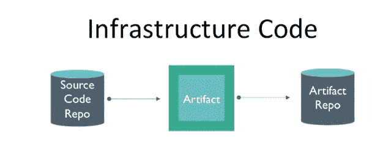
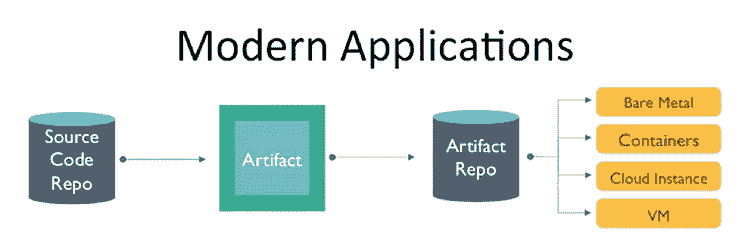
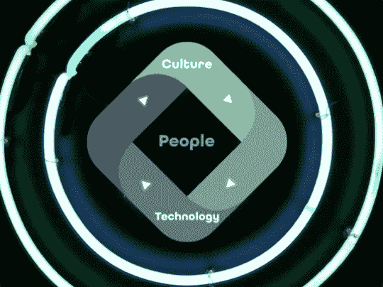

# 全天 DevOps:现代基础设施自动化

> 原文：<https://devops.com/modern-infrastructure-automation/>

“我们不再是一家航空公司。我们是一家有翅膀的软件公司，”阿拉斯加航空公司首席信息官 Veresh Sita 说。当今企业的成功依赖于软件。它是基础设施不可或缺的一部分，因此我们需要经常问自己，“如何才能做得更好？比较靠谱？更有保障？”

纳森·哈维([@纳森·哈维](https://twitter.com/nathenharvey))是[大厨](https://www.chef.io/)的社区发展副总裁，也是[美食战播客](http://foodfightshow.org/)的联合主持人。他也是自动化软件操作的倡导者，这也是他在 2016 年全天 DevOps 大会上介绍的内容。

Nathen 在演讲开始时指出“高速 IT 需要大规模自动化”，并指出在当今的环境下，您不能在部署之间等待数月。企业正在走向持续集成/持续部署，他提倡持续自动化。

要大规模实施自动化，您必须通过以下方式从动态基础架构开始:

*   配置和设置环境
*   实施计算资源的动态扩展
*   将传统工作负载迁移到云
*   在多云和混合云环境中部署
*   支持异构环境

全天 DevOps 的几位演讲者谈到了自动化，他们都表示关键的一步是将基础设施视为代码。根据 Nathen 的说法，这意味着以编程方式提供和配置组件，如服务器、数据库、防火墙等。，您还必须像对待任何其他代码库一样对待它。这包括版本控制和自动化测试，还包括:

*   自动化的全栈应用策略
*   包装和服务安装
*   可版本化、可测试和可重复的工作流
*   可扩展的应用程序策略
*   管理跨节点的相互依赖关系

当您将基础架构视为代码并大规模交付时，您可以跨多个复杂环境从一个托管节点优雅地扩展到数万个托管节点。

为了让软件有效，用户必须相信它会做他们期望它做的事情。从手持计算器到自动驾驶汽车都是如此，当我们自动化开发和运营时也是如此。Nathen 主张我们必须建立一个生产管道，让我们相信我们的代码已经可以生产了。该管道必须:

1.  测试代码/本地验证
2.  通过自动化测试在管道中验证
3.  得到另一个工程师的认可(又名代码审查或 Nathen 的“四眼法则”)
4.  建造一件艺术品
5.  部署到验收环境中，以自动测试工件
6.  问别人，“我们要运送这个吗？”
7.  只需点击一个按钮，即可发送代码
8.  Union(集合依赖项并运行测试)
9.  排练
10.  已交付(发货给客户)

未来会怎样？

基础设施自动化是不够的。为什么？审计员会出现来审计你的基础设施和应用程序。问题是，他们使用不同的工具——Excel 电子表格、笔记本、pdf 等。这使得审计非常困难。Nathen 也提倡将遵从文档作为代码来管理。当我们将法规遵从性转化为代码时，它可以作为管道的一部分来执行，因此我们可以在整个生命周期中测试法规遵从性。

最后，Nathen 强调了应用程序自动化的必要性。现代应用程序看起来像代码一样的基础设施。

开发人员可以开发运营部门可以交付并在生产环境中运行的应用程序。这使得使用、运行和保持应用程序健康变得更加容易。可操作的应用需要:

*   偏远的；孤立的
*   不变的
*   可配置的
*   构建在一个用于监控运行状况的通用界面上
*   可从来源重建
*   存在于普通包装中
*   保持运行时独立性

随着企业实施基础架构、应用程序和法规遵从性自动化，这为人们创造了专注的自由，而人是关键。

Nathen 指出，“DevOps 是一场文化革命和专业运动，专注于我们如何建立和运营高速组织，从其从业者的经验中诞生。”他强调，人是自动化的未来。自动化以人为本，这造就了伟大的公司和伟大的产品。

你可以[在这里](https://youtu.be/zNPsHMuk1v0)在线[观看](https://youtu.be/QvQv5EZEclE)那森的全部演讲，在这里你可以更深入地探讨这个话题。如果你错过了其他任何 30 分钟长的全天 DevOps 演示，它们很容易找到并免费提供[在这里](https://www.sonatype.com/all-day-devops-on-demand?__hstc=160429922.7ed0d7bbaf4fd31550bdbacbb4f69b40.1487782980826.1500920095282.1501256746276.11&__hssc=160429922.15.1501256746276&__hsfp=1674733363)。最后，请务必在此为您和您团队的其他成员注册 2017 年全天 DevOps 会议[。今年的活动将提供 96 场由从业者主导的会议(不允许供应商推介)。10 月 24 日，这一切都是免费在线的。](https://www.alldaydevops.com/)

— [德里克·威克斯](https://devops.com/author/derek-e-weeks/)