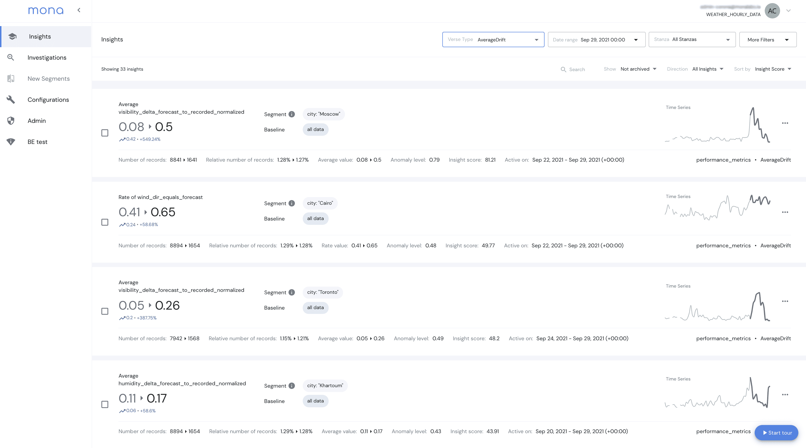

# 梦娜与新遗迹结盟，融合 MLOps 和 DevOps

> 原文：<https://devops.com/mona-allies-with-new-relic-to-converge-mlops-and-devops/>

New Relic 和 Mona(一个用于监控人工智能模型的平台提供商)今天宣布，他们已经成立了一个联盟，以帮助弥合 DevOps 团队和数据科学家之间的分歧。

今天，大多数数据科学团队使用操作平台，基于机器学习算法构建模型，使他们能够管理这些模型的生命周期，也称为 [MLOps](https://devops.com/?s=MLOps) 。Mona 提供了一套用于检测漂移的监控工具，当发现构建模型时所做的一些基本假设不太准确或新的数据源可用时，可能会发生漂移。

与此同时，New Relic 提供了一个可观察性平台，DevOps 团队广泛使用它来监视和观察 IT 环境。有权访问 New Relic One 的 IT 团队现在还可以查看 Mona 提供的仪表板，这些仪表板可以检测涉及数据完整性问题和模型性能问题的异常。

该集成还使用户能够创建自定义的 Mona 警报，并通过新的遗迹警报和应用情报服务进行共享。该功能减少了通过将异常检测与特定 IT 事件相关联而生成的警报数量。

Mona 的首席执行官约塔姆·柳文欢(yotam Schmidt)表示，这种集成水平为开发运维团队与数据科学团队之间提供了一座桥梁，而这两个团队通常具有非常不同的文化。

将人工智能模型整合到应用程序中是 DevOps 的下一个主要挑战。如今，几乎没有一个正在构建的应用程序不包含某种程度的人工智能。挑战在于人工智能模型是由数据科学家构建的，他们采用各种各样的机器学习操作(MLOps)平台来构建这些模型。这些人工智能模型的开发、部署和更新速度千差万别。然而，所有组织最终都需要面对这样一个问题，即如何在应用程序部署到生产环境之前和之后，将人工智能模型插入到应用程序中。

关于如何最好地实现这一目标，有两派观点。第一种是假设 AI 模型只是另一种类型的软件工件，可以作为现有 DevOps 过程的一部分进行管理。在这种情况下，可能不需要单独的 MLOps 平台。相反，MLOps 的支持者认为，人工智能模型是使用数据工程团队与数据科学家合作创建的管道构建的。只有当一个人工智能模型需要被插入到应用环境中时，开发人员才成为这个过程的一部分。人工智能模型最终可能需要整合到应用程序中，但 MLOps 平台的支持者认为，建立模型需要一个独特的平台来管理由训练算法构建的软件工件。

柳文欢指出，合规性问题迫使 DevOps 和 MLOps 团队之间进行某种形式的融合只是时间问题。解决融合开发运维团队和数据科学团队所需的文化和技术问题所需的时间越长，挑战就越大，因为这两个团队都有各自的方式。