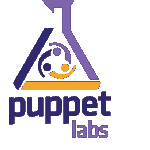

# JFrog、Puppet、Datical & senda chi——资金继续涌入 DevOps

> 原文：<https://devops.com/money-continues-to-pour-into-devops-tools/>

股票市场可能是熊市，油价下跌，但资金继续涌入 DevOps 工具和解决方案市场。就在过去几天，4 家公司宣布了新的重大投资。我不知道这是关门前的最后一搏，还是科技行业对商业世界其他部分嗤之以鼻，还是证明最近的市场下跌趋势是在转移视线。但作为一个经历过多次科技泡沫破裂的人，这值得关注。

不过现在，好日子还在继续！让我们回顾一下新的融资新闻:

******[JFrog 筹得惊人的 5000 万美元](https://devops.com/2016/01/20/jfrog-secures-50-million-disrupt-devops-market/)！那笔钱可不是小数目！我采访了 JFrog 的首席执行官什洛米·本哈姆。他们在以色列的办公室、圣克拉拉和法国的总部有超过 120 名员工。他们的 JFrog Artifactory 和 JFrog Bintray 分别为世界各地大大小小的组织托管软件。本哈姆和他的团队，以及他的蓝筹股投资者认为，现在是 DevOps 成为主流的时候了。他们想确保他们有足够的钱来利用这个机会。祝贺 JFrog 团队，我们很高兴看到这笔钱为他们带来了什么。**

 **傀儡实验室举债融资 2200 万美元**。在 Puppet 继续其惊人增长的同时，它抓住机会从硅谷银行获得了 2200 万美元的债务融资。我与 Puppet 首席执行官 Luke Kanies 就加薪一事进行了交谈，他告诉我，他甚至不确定公司是否会使用这笔资金，因为他们在银行中仍有相当大一部分上次加薪的资金，并且正在接近盈利。但是在今天的低利率下，谁能责怪他利用现有的现金呢？债务融资曾一度不受欢迎。当你可以用股权换现金的时候，为什么要借债呢？但在当今低利率/高估值的世界，当你可以几乎免费获得资金时，为什么要给出有价值的股票呢？除了这些资金，Puppet 还将他们的办公室扩大了约 37，000 平方英尺，并任命了金融资深人士 Lou Lavigne 加入董事会。这是他们继续为下一步上市做准备。当然，鉴于目前的市场状况，他们最好还是保持私有。

** ** ** Datical 融资 800 万美元 B 轮。**作为 DevOps 运动的一部分，数据库将会有自己的一天，Datical 希望成为实现这一目标的公司。为此，他们已经筹集了由 S3 风险投资公司牵头的 B 轮融资。这笔钱将用于继续开发他们的敏捷数据库自动化工具，以及销售和市场营销。我有机会与 Datical 公司的本·盖勒和罗伯特·里维斯交谈。他们想用这笔资金做的一件事是拓展北美市场以外的业务。考虑到经济环境和全球市场的现实，这是一个明智之举。曾经有一段时间，互联网公司可以专注于美国并蓬勃发展，但人口统计数据不再支持这一点。

 最后，t ** oday 标志着[森达智](http://sendachi.com/)的出道。** Sendachi 是一家咨询公司，致力于帮助企业实现 DevOps 转型。它是由总部设在西雅图的离合器公司和总部设在伦敦的康帝诺公司合并而成的。以及来自哥伦比亚资本公司的 3000 万美元。这笔钱将用于扩大公司的营销和业务团队。不过，其中的一部分也可能被用来为进一步的收购提供资金。我有机会与前离合器和现森达奇首席执行官，史蒂文·安德森和前 Contino 创始人和我的朋友本伍滕。他们都对这个跨越大西洋的冒险项目的潜力感到非常兴奋。安德森说，3000 万美元只是一个开始，如果有必要，更多的资本可以用于战略目的。我的感觉是，我们可能会看到森达奇 DevOps 咨询公司的诞生。

在 M&A 关于这个话题的其他新闻中， [Docker 宣布它已经收购了 Unikernel Systems 以及](http://containerjournal.com/wp-admin/post.php?post=867&action=edit) l

祝贺所有筹集资金和买卖的公司。任何不得不筹集资金或买卖过一家公司的人都知道，这不是一件容易的事情。谁会是下一个筹集资金的 DevOps 公司？我们可能不用等很久就能知道了。