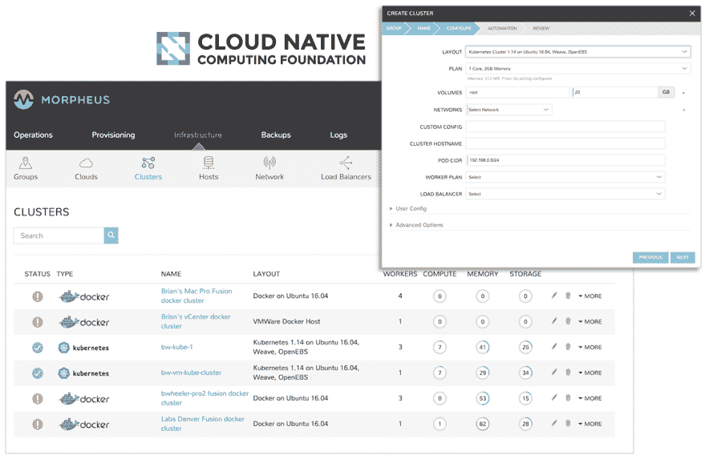

# Morpheus 数据简化了 Ansible 和 Kubernetes 的管理

> 原文：<https://devops.com/morpheus-data-simplifies-management-of-ansible-and-kubernetes/>

Morpheus Data 正在努力使 Ansible 和 Kubernetes 的采用和管理变得更加容易。今天宣布的 Morpheus 4.0 更新包括 Kubernetes 发行版以及与开源 Ansible 自动化框架的紧密集成。

Morpheus Data 营销和业务发展副总裁布拉德·帕克斯(Brad Parks)表示，就 Ansible 而言，Morpheus 4.0 将消除一些组织使用 Ansible Tower 的需求，Ansible Tower 是一种基于网络的控制台和应用程序编程接口(API)，用于管理 ansi ble 的实例。他说，目标是让组织更容易利用声明式 Ansible 自动化框架，而不必掌握当前部署和管理它所需的所有低级细节。

Morpheus 4.0 还可以查看实时作业状态更新和详细的日志输出，并使用多个行动手册执行基于阶段的运营工作流，并将治理、审计和报告工具引入 Ansible。Morpheus 4.0 还使配置 Ansible 在 Morpheus 安全代理通信总线上运行成为可能，允许剧本应用于 SSH/WinRM 访问由于安全限制而不可行的情况。Ansible 在 Linux 和 Windows 平台上都可用，它还可以使用该总线从 Morpheus Cypher 服务中安全地查询机密，以存储应用程序机密。

同样，Morpheus Data 也在转向 Kubernetes 的自动化部署和管理，Kubernetes 是在云本地计算基金会(CNCF)的支持下开发的开源容器编排引擎。

Parks 表示，通过在 Morpheus 4.0 中包含已通过 CNCF 认证的 Kubernetes 发行版，Morpheus Data 现在可以在混合云计算环境中联合管理 Kubernetes 集群。DevOps 团队可以使用 Morpheus Data 提供的 Kubernetes 分发版，也可以使用 Morpheus 提供的公共云服务提供商(如亚马逊网络服务(AWS)、微软和谷歌)提供的 Kubernetes 服务实例。

Morpheus 4.0 还可以使用基于角色的访问控制安全地共享和管理资源，使用分析工具优化资源分配，并审核、监控和管理日志记录。开发运维团队还可以选择使用 CNCF 提供的 Morpheus 或 Helm 模板来配置应用。

随着 Kubernetes 进入企业，Parks 表示，IT 组织将需要一个能够在传统虚拟机、Kubernetes 集群和裸机服务器的任何组合上自动配置应用程序堆栈的管理框架。他说，Morpheus 4.0 提供了一个管理平台，允许单个 DevOps 团队更轻松地管理多个平台，而不是要求为每个平台获取和掌握单独的工具。Parks 补充说，作为一个企业范围的业务流程和自动化平台，Morpheus 的设计从根本上消除了开发团队创建复杂剧本的需要，提供了与各种 IT 平台的现成集成，并指出 Morpheus 4.0 现在还包括 Morpheus Jobs，一种可以使用 Bash、PowerShell、HTTP、Ansible、Chef、Puppet、Groovy、Python、jRuby 或 JavaScript 来调度或临时运行作业的工具。

随着所采用的云平台数量的增加，预计在未来几个月和几年内，试图统一多个平台管理的组织数量将会显著增加。这些组织将面临的挑战不仅包括采用什么工具来实现这一目标，还包括定义能够跨越混合云计算环境的 DevOps 流程。

— [迈克·维扎德](https://devops.com/author/mike-vizard/)