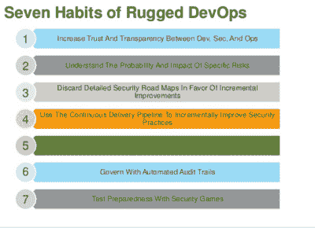
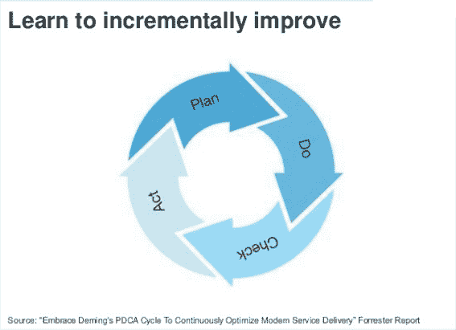

# 墨菲的 DevOps:坚固 DevOps 的 7 个习惯

> 原文：<https://devops.com/murphys-devops-7-habits-rugged-devops/>

2 月 29 日， [Rugged DevOps Connect](http://www.devopsconnect.com/rsa/) 的与会者在 RSA 挤满 Moscone West 的二楼沉浸在安全中。Forrester 分析师 Amy DeMartine 是为期一天的活动的主持人之一，她提供了一个关于安全、开发人员和运营人员如何在新的 DevOps 世界中更好地合作的教程。

通过一个幻灯片，DeMartine 展示了她的七个习惯，其中三个将在本专栏中讨论:

## 1:增加开发、安全和运营部门之间的信任和透明度

在我们生活的世界里，技术的目标越来越多地是自动化一切，减少对人类的依赖——至少，这是许多营销人员希望我们相信的。然而，DeMartine 强调，如果安全和风险小组要在 DevOps 中发挥关键作用，他们需要用他们能够理解的语言与该实践的真正所有者(应用程序开发和基础架构及运营)交流。在这里，最重要的不是自动化。真正的人与人之间的交流是最重要的。

她强调了这些群体之间的真正脱节，AppDev 被视为“无所不能”的部门，基础设施和 Ops 被视为“不”的部门，而安全和风险被视为“持续唠叨”的部门。

想象一分钟，一个由妈妈、爸爸和一个积极向上的青少年组成的家庭。少年速度快，精力充沛，总是扣动扳机；妈妈是务实的，一个总是不得不拉着青少年缰绳的纪律严明者；而爸爸也因为没人听他坚定的警告而不断受挫。家庭的客厅是许多“激烈”辩论的场所，每一方都赢得了胜利，但实际上没有满足每个人需求的共同协议。当青少年赢了，那是因为妈妈根本没有精力再抵抗了。当妈妈赢了，青少年打开 iTunes，插上耳机，退出，甚至可能开始寻找一个新的家庭。爸爸的胜利往往伴随着一连串的摔门声和沉默的对待。

现在想象一下，如果三方找到了共同语言呢？一个不仅让每个人看到其他人的观点，而且还开发了一个系统，在这个系统中，青少年可以在限定的范围内自由行动，他或她甚至可以穿戴足够的安全装备，以将风险降至最低。我们会有一个更加和谐的地方，一个青少年继续成长而不会危及家族事业的地方。

有趣的是，目前真的没有任何技术可以解决这个非常现实的人类交流挑战。不管看起来有多违背直觉，一个有效的、坚固的 DevOps 环境高度依赖于人与人之间的关系。

## 3:放弃详细的安全路线图，支持渐进式改进

美国人事管理办公室(OPM)、索尼、好莱坞长老会、Anthem—这些组织都经历过大规模的安全漏洞。如果这些漏洞都有一个共同的词，那就是恐慌——或者至少头条新闻会让我们相信这一点。OPM 事件是一个终极例子，几乎警钟一响，政府就宣布了一项精心策划的计划，紧接着就是大“冲刺”不过，加强网络钓鱼防御可能更明智(笑脸)。*

事实证明，一个详细的长期计划可能不是数据泄露、赎金和系统关闭的答案。

DeMartine 直截了当地表示，应该放弃应对威胁的全面路线图，转而采用实时测量和增量改进的愿景。下面是德马丁设想的“安全和开发中的生活圈”:

## 7:用安全游戏测试准备情况

谁不喜欢竞争？不多。我认为安全人员和黑客可能是周围最有竞争力的人；参观一个黑帽会议，看着与会者专注地捕捉旗帜，挣脱手铐，砍标牌。

考虑到这一点，这是七个习惯之一是有道理的。毫无疑问，模拟将为人们在现实生活中做更多的准备——毕竟，熟能生巧。

## 沟通是一个坚固的 DevOps 的基本工具

增强开发人员、安全人员和运营人员之间的信任要求有效的沟通，并有可能改善沟通。也许最大的收获之一是，尽管该行业在打击网络犯罪方面投入了大量技术，但归根结底，一项古老的技能——通信——是最有效的安全措施的基础。

**网络钓鱼被认为是 OPM 漏洞最有可能的原因；必须说明的是，我的一个客户 PhishMe 是一家网络钓鱼防御解决方案提供商。*