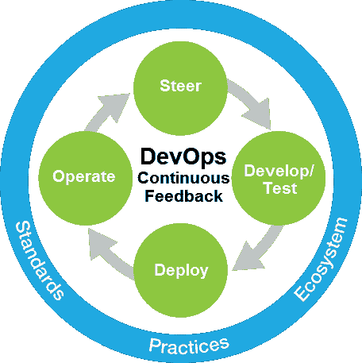

# 开发运营的全国性银行将努力实现持续交付

> 原文：<https://devops.com/nationwide-banks-devops-drive-towards-continuous-delivery/>

金融服务业发展迅速，监管严格，以客户为中心。我们行业的普遍看法是，流程的任何变化都意味着风险和延迟，这两者我们都承担不起。但与此同时，我们面临着巨大的任务，需要不断推出新产品和服务，以保持竞争力，满足客户不断增长的需求。如果没有快速的软件交付生命周期，这是不可想象的，因为我们的业务高度依赖于技术。在像我们这样复杂、快速变化的环境中，加速软件交付的最佳方式是采用 DevOps 方法。

作为许多活动的发言人，我讨论了 Nationwide 正在进行的转型之旅，并与其他希望了解如何效仿的企业分享了我们的方法。最近，我有机会在 Gene Kim 主持的 DevOps 企业峰会(10 月 21 日至 23 日)上与来自 IBM 的 Hayden Lindsey 共同演讲。你可以[在下面的全国观看我们的联合会议*企业成功模式:DevOps 之旅的重播*](https://www.youtube.com/watch?v=lvIWfdLAUZc)。

[https://www.youtube.com/embed/lvIWfdLAUZc?feature=oembed](https://www.youtube.com/embed/lvIWfdLAUZc?feature=oembed)

从服务于农业社区的小型汽车保险公司起步，Nationwide 已经发展成为世界上最大的保险和金融服务公司之一。像今天的许多企业一样，我们发现我们需要一种更好的方法来响应不断变化的市场要求和法规，加快上市速度，并支持与客户互动的新渠道。移动、云和大数据技术进一步加大了我们推动快速数字创新的压力。我们需要的不仅仅是解决方案，而是文化(我们看待事物的方式)、流程(我们做事的方式)和工具(我们使用的技术)的改变。DevOps 让我们有能力实现所有这些，甚至更多。

眼前的挑战是通过利用我们现有的异构工具套件来实现这些变化。我们与 IBM DevOps 合作，这对我们的成功起到了重要作用。我们已经在朝着敏捷转型努力了。在 IBM 的支持下，我们能够在分布式和大型机环境中使用 DevOps 方法进行应用程序开发和交付。虽然 IBM 支持的 DevOps 方法使组织能够根据其特定需求从任何地方开始，但我们在 Nationwide 决定解决软件交付生命周期中的所有四种采用途径:**指导、开发/测试、部署和运营**。

DevOps 使我们的 IT 部门能够在一天内多次执行代码的持续集成和开发环境的持续部署。团队还可以在与开发相同的迭代中执行客户需求的验收测试。IT 经理可以近乎实时地向他们的内部客户展示开发人员正在生产什么。随着我们的业务变得更加敏捷，对客户的响应更加迅速，这种能力成为了游戏规则的改变者。**我们实现了代码质量 50%的提高，系统停机时间减少了 70%,并使 58%的团队进入了关键生产力指标的前四分之一。**我相信，从 IT 的角度来看，我们越敏捷，从想法的开发到面向客户的产品的部署，业务就越敏捷。？

我们 DevOps 之旅的下一步是在整个 SDLC 中采用敏捷和精益实践所产生的收益的基础上再接再厉。这就是 TaskTop 和 UrbanCode 等技术脱颖而出的地方，它们提供了持续交付基础设施所需的集成式连续流和可见性。通过创建这一交付高速公路，我们使业务领域能够根据他们自己对成本、风险和价值的决定，按照他们需要的速度交付。基于过时信息的耗时的手动流程被使用从记录系统同步的实时信息的自动化部署策略所取代。仪表盘和表盘的结合为企业提供了可视性和控制力，使其能够以比目前更快的速度前进。对发展成果缺乏信任历来是发展速度的障碍。我们新的自动化方法让我们有信心更快地为业务提供服务，而不会影响我们的交付质量。

IBM 是我们的一个很好的合作伙伴，因为他们分享了我们对开放标准方法的支持，这使我们能够在整个生命周期中使用一组异构的工具，允许我们全面地确定最佳工具、最佳架构和最佳方法，以满足我们为客户提供高质量、高生产率和更快交付的目标。

通过平衡速度、成本、质量和风险，DevOps 正在帮助我们提高创新能力。这反过来帮助我们更快地进入市场，更具竞争力。我在 DevOps 企业峰会上提到，“时间是新的货币”这句话与我们优化“从概念到客户价值”路径的目标不谋而合。我们需要确保不让它从我们的指缝中溜走。我们长期以来一直依赖手动流程，但在这个新的数字时代，它们只会让我们慢下来。这是敏捷、竞争和务实的时候了。是时候让我们所有人打破古老的枷锁，拥抱 DevOps 所代表的变革机会了。

* * *

### **关于作者**

Carmen DeArdo 是 Nationwide Insurance 的应用开发工具和技术总监。Carmen 负责在移动、分布式和大型机以及其他技术中利用 DevOps、精益和敏捷技术推动持续交付。这包括在开发生命周期中使用的技术的建议和实现(例如，IBM Rational 工具套件，开源技术)。