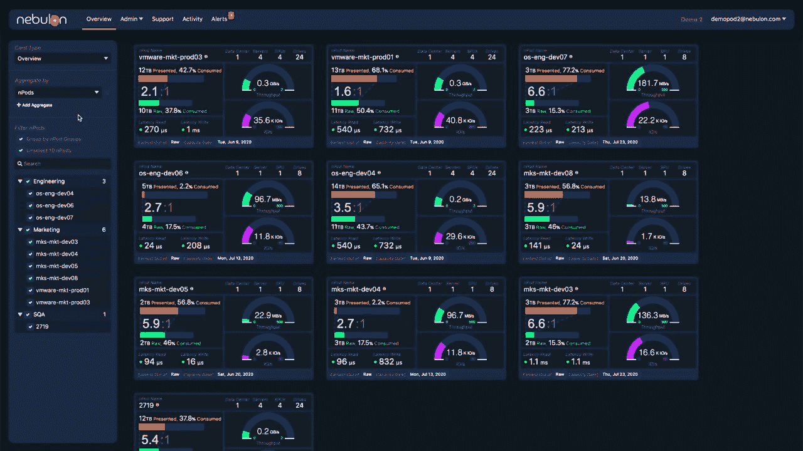

# Nebulon 推出混合云计算平台

> 原文：<https://devops.com/nebulon-unveils-hybrid-cloud-computing-platform/>

Nebulon 已经从秘密行动中脱颖而出，推出了一个混合云计算平台，使工作负载能够在云中处理，而数据继续存储在本地应用服务器上。

首席运营官·克雷格·努内斯公司表示，[云定义存储](https://nebulon.com/news/nebulon-emerges-from-stealth-and-announces-cloud-defined-storage/)平台采用嵌入了基于 ASIC 的 Nebulon 服务处理单元(SPU)的 PCIe 卡，将本地存储系统连接到一个名为 Nebulon 的基于云的控制平面，该控制平面可以跨越亚马逊网络服务(AWS)和谷歌云平台(GCP)服务。

PCIe 卡安装在位于本地数据中心的应用服务器中，并连接到安装在服务器上的固态硬盘(SSD)。Nebulon SPU 卸载了压缩、加密、重复数据删除、擦除编码、快照和数据镜像。

Nebulon SPU 还会将存储、服务器和应用程序指标传输到 Nebulon ON，在 Nebulon ON 中，机器学习算法会应用于 surface 推荐以提高性能。

Nunes 说，惠普企业(HPE)和超微已经同意转售云定义的存储平台。

在其核心，云定义的存储平台将超融合基础架构(HCI)带到了另一个层面。Nunes 说，计算处理被转移到了云中，而不是在本地数据中心结合计算和存储。他指出，这种方法使得利用云中廉价的计算资源而不失去对数据的控制成为可能。

此外，Nunes 指出，云定义的存储平台可确保维持应用程序服务级别，同时通过消除将大量数据传入和传出公共云的需求来降低成本。

他补充说，在高度监管的行业中工作的组织现在可以利用云资源，同时继续满足合规性要求。

最后，无论采用何种类型的虚拟机或容器，Nebulon 云定义的存储平台都可以支持整体式和基于微服务的应用程序。

当许多组织在降低 IT 总成本方面面临越来越大的压力时，人们对利用云计算来降低成本的方法越来越感兴趣。然而，对于许多组织来说，将数据移动到云中会带来一系列性能、安全性和合规性问题。

不需要将数据存储或移入或移出云的混合云计算架构可以为组织提供一种重新评估其整体云计算战略的方式。高度管制行业以外的组织可能会认为他们更愿意保留对其数据的控制权。

当然，云服务提供商寄希望于存储在云中的大量数据。他们一直认为，随着存储在云中的数据量呈指数级增长，在尽可能靠近数据的地方部署应用程序就越有意义。部署在云中的每个新应用程序都会增加云对其他应用程序部署决策的影响。

像 Nebulon 云定义的存储系统这样的混合云平台不太可能完全扭转这一趋势。然而，它确实表明，云中的数据重力可能不像许多云服务提供商长期以来认为的那样是一种不可阻挡的力量。