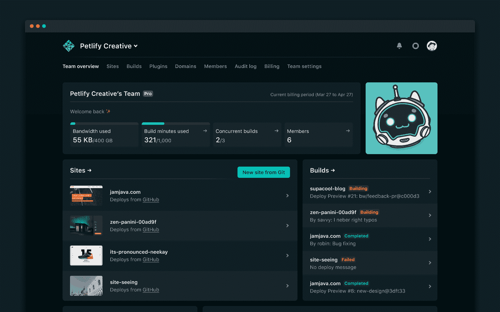

# Netlify 收购 OneGraph 整合 GraphQL APIs

> 原文：<https://devops.com/netlify-acquires-onegraph-to-integrate-graphql-apis/>

Netlify 本周宣布它已经收购了 OneGraph T1，OneGraph T1 是一个平台提供商，该平台简化了基于 GraphQL 查询语言的应用程序编程接口(API)的集成和管理。

与此同时，该公司承诺出资 100 万美元赞助开源项目，并为 Netlify Jamstack 创新基金拨款 1000 万美元，帮助推动新兴技术的发展。这些技术将通过该公司基于 Javascript、API 和一种标记语言(称为 Jamstack)创建的平台来使用，以加速 web 应用程序和网站开发。Netlify 并没有成为这些公司的投资者，而是打算将这些资金用于推动有益于整个社区的技术发展。

Netlify 首席执行官 Matt Biilmann 刚刚筹集了额外的 1.05 亿美元资金，他表示 Netlify 致力于一个生态系统，通过这个生态系统，开发者将能够通过 REST 和基于 GraphQL 的 API 消费更广泛的服务。他指出，OneGraph 将为向 Netlify 平台添加对 GraphQL 的支持提供核心基础。

总的来说，Netlify 正试图减少开发人员在构建网络应用程序和他们运行的网站时遇到的摩擦，Biilmann 补充道。他补充说，随着开发人员越来越多地构建基于微服务的应用程序，这些应用程序调用 API 来消费通过 Netlify 平台提供的后端服务，这变得尤为重要。

今年早些时候，该公司推出了 [Netlify Build 插件](https://devops.com/netlify-makes-build-plugins-available-for-jamstack-platform/)，为 DevOps 团队提供了一套用于构建网站和 web 应用程序的持续集成/持续交付(CI/CD)工作流。这些插件旨在从 Netlify 平台中启动，使得构建可以从 Git 存储库中直接启动的 web 应用程序或网站成为可能。

Jamstack 的整体理念使 DevOps 团队能够将网站和应用程序的前端和后端开发分开。就任何特定的 JavaScript 框架而言，这种方法都是不可知的，但它确实定义了一种方法来自动化 web 应用程序或网站的构建过程。

Netlify 最近发布的一项对 3000 多名 Jamstack 开发人员的调查发现，三分之一的受访者在过去的一年中在为数百万用户提供服务的网站上工作过。近三分之二的受访者(62%)在科技行业以外工作，包括广告和营销(21%)、媒体和出版(14%)、教育(14%)、金融服务(13%)以及商业支持和物流(13%)。超过三分之一(38%)的人在科技公司工作。大约四分之一(26%)的人有超过 10 年的经验。调查发现，所有类型的开发人员提到的 Jamstack 的主要优势是性能、正常运行时间、开发速度、安全性、合规性和避免供应商锁定。

当然，Jamstack 并不是构建 web 应用程序及其运行站点的唯一框架。DevOps 团队越来越多地承担构建更广泛的外部应用程序的任务，以推动通常使用某种类型的 JavaScript 框架构建的数字化转型计划。当然，DevOps 的下一个大挑战是，随着构建的应用程序的数量不断增加，需要维护和不断更新的应用程序的数量也在增加。