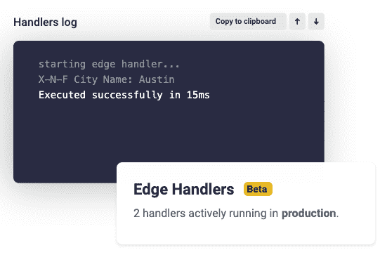

# Netlify 将 JAMstack 扩展到边缘计算

> 原文：<https://devops.com/netlify-extends-jamstack-reach-to-edge-computing/>

Netlify 在今天的 [JAMSTACK CONF 虚拟](https://jamstackconf.com/virtual/)活动上宣布了 [Netlify Edge Handlers](https://www.netlify.com/press/netlify-edge-handlers-make-personalized-web-content-fast-and-easier-to-develop/) ，这使得将基于 Git 的工作流扩展到边缘计算应用成为可能。

公司首席执行官 Matt Biilmann 表示，测试版的 Netlify Edge Handlers 为部署基于 [JAMstack 软件架构](https://devops.com/jamstack-boards-the-enterprise/)的无服务器 web 应用程序提供了原语，该架构采用 JavaScript、应用程序编程接口(API)和标记语言，也称为 JAM，来隔离应用程序的前端和后端组件。

他说，基于 Git 的方法还将使 DevOps 团队能够将工作流扩展到可以部署在任何平台上的边缘计算应用程序。作为以现代 Rust 编程语言编写的 Netlify 平台的扩展，Netlify Edge Handlers 使得在持续集成/持续交付(CI/CD)环境中基于 JAMstack 架构构建和启动 web 应用程序和网站成为可能。

Biilmann 说，在 Netlify Edge Handlers 可用之前，在边缘计算平台上构建和部署 web 应用程序需要跨团队的广泛协调，创建具有许多依赖性的详细边缘逻辑，并偏离标准 web 开发最佳实践。他指出，现在，开发人员可以编写简单的 JavaScript，以简化 A/B 测试、定制认证和 API 聚合的方式构建和部署到网络边缘。

开发人员还可以从预览到生产构建和管理边缘逻辑，包括通过现有的 Netlify 云计算网络部署这些应用。

越来越多的应用程序代码被推到边缘，因为许多组织现在正在更接近数据创建和消费的地方处理和分析数据，作为其数字业务转型计划的一部分。在离用户最近的节点上执行的 Web 应用程序消除或减少了与客户端的往返请求和响应流。

Biilmann 还指出，由于这些应用程序采用的是使用 Rust 开发的平台，它们本身也更安全。

也许有一天，在边缘运行的应用程序工作负载会比在云计算平台上运行的更多。然而，如果要实现这个目标，开发人员需要更容易地构建这些应用程序。鉴于这些应用程序也可能成为网络犯罪分子的目标，确保这些应用程序尽可能安全至关重要。

随着新冠肺炎疫情带来的经济衰退，许多组织加快了数字业务转型计划，其中许多依赖于边缘计算平台。然而，实现这一目标的唯一方法是使用大多数 web 应用程序开发人员已经掌握的 JavaScript 工具来构建这些应用程序。否则，组织将需要投资培训开发人员，以掌握部署边缘计算应用程序的另一个框架。这需要时间，而他们可能没有时间。

无论前进的道路如何，边缘计算应用的巨大浪潮很快将扩展组织目前已有的任何 DevOps 流程的边界和限制。