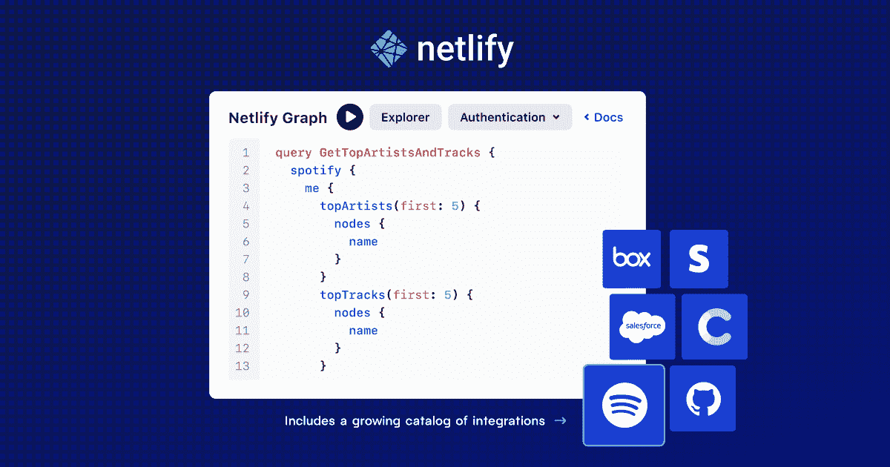

# Netlify 利用 GraphQL 来简化对后端服务的访问

> 原文：<https://devops.com/netlify-leverages-graphql-to-simplify-access-to-backend-services/>

Netlify 本周在其产品组合中增加了一个 [Netlify Graph](https://www.netlify.com/press/new-netlify-graph-dramatically-simplifies-api-first-web-development) 工具，开发者只需点击一下鼠标就可以获得后端服务。该工具旨在简化开发运维团队在构建应用时对这些服务的访问。

Netlify Graph 基于用于应用编程接口(API)的 [GraphQL](https://devops.com/?s=GraphQL) 查询语言，使开发人员能够在前端和 web 应用开发工具中集成 GitHub、Salesforce 和 Stripe 等服务，而无需 DevOps 团队的任何直接干预。

Netlify 提供了一个基于 JavaScript、应用程序编程接口(API)和标记语言的应用程序开发框架，也称为 JAMstack，用于隔离应用程序的前端和后端组件。

Netlify 首席执行官马特·比尔曼表示，Netlify Graph 是基于该公司收购 OneGraph 时获得的 GraphQL 技术。他说，总体目标是让前端开发人员能够简单地调用通过 GraphQL 或 REST APIs 访问的后端服务。Biilmann 补充说，基于 GraphQL 的服务对于开发人员来说可能特别复杂，因为他们需要导航令牌和应用程序秘密的管理。

目前还不清楚 GraphQL APIs 会在多大程度上取代 REST APIs。然而，开发人员往往更喜欢 GraphQL APIs，因为它们对访问哪些数据提供了更细粒度的控制。挑战在于公开 GraphQL APIs 的后端服务的数量仍然相对有限。随着 GraphQL 被越来越广泛地采用，DevOps 团队现在需要花费在公开后端服务上的精力应该会随着前端开发人员使用 Netlify Graph 等工具而减少。

因此，至少在理论上，构建和部署新应用以推动数字业务转型计划的速度应该会提高。大多数 IT 团队不会在一夜之间用基于 GraphQL 的 API 替换 REST APIs，但是依赖 GraphQL APIs 的新应用程序的比例将稳步增长。DevOps 团队正在寻找更简单的方法来为开发人员提供对后端服务的更简单的访问，现在他们有了拥抱 GraphQL 的动力。

Biilmann 说，最终的目标是让开发人员能够构建应用程序，而不必直接与 IT 团队中的任何人打交道。每个后端服务都可以独立于任何应用程序的前端进行管理。尚不清楚实现这一目标需要多长时间，但随着应用程序体验的端到端管理责任继续向开发者转移，将后端系统即服务浮出水面的需求变得更加明显。事实上，鉴于当前对提高开发人员生产力的关注，IT 组织可能很快就会面临更广泛地采用 GraphQL 的要求。毕竟，开发人员花在管道上的每一分钟都是他们没有花在编写实际业务逻辑上的时间。

自然，企业 it 要真正转变为开发人员可以轻松消费的一组服务可能需要时间。但随着不断取得进展，这个梦想可能最终会实现。