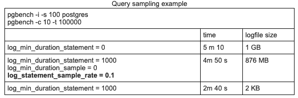
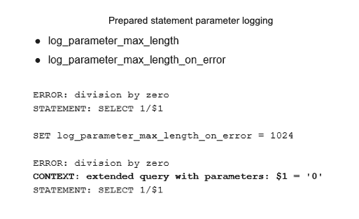
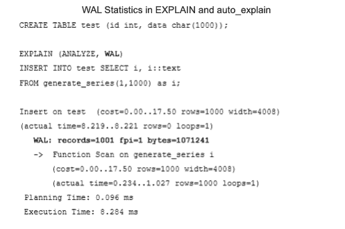
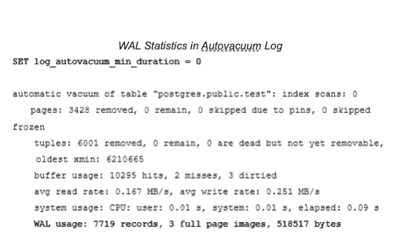
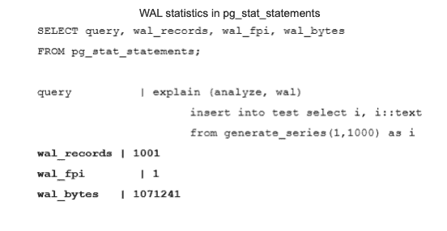
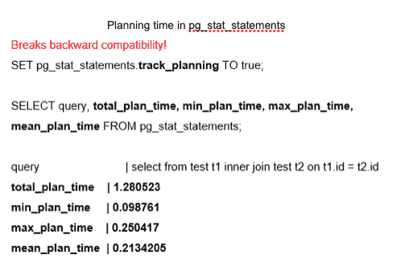
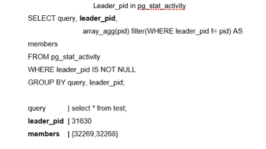

# PostgreSQL 13 中的新监视功能

> 原文：<https://devops.com/new-monitoring-features-in-postgresql-13/>

每个监控解决方案都受到系统允许收集的信息的限制。 [PostgreSQL](https://devops.com/?s=postgreSQL) DBMS 提供了许多反映其内部状态、运行查询和后台进程的指标，每个版本都为社区带来了更多与监控相关的功能。2020 年 9 月发布的 PostgreSQL 13，[增加了关键改进](https://www.postgresql.org/)，包括查询采样、改进的 WAL 使用统计和新的系统视图。让我们来看看这些新功能的好处。

## 查询抽样

经常监控数据库查询的人都熟悉以下参数:

> **log_statement** 控制记录哪些 SQL 语句
> log _ min _ duration _ statement 支持记录至少运行了指定时间的语句。

这些参数帮助用户跟踪应用程序中未优化的查询。但是，认识到过多的日志流量可能会影响性能是很重要的，尤其是在分析包含大量短查询的工作负载时。为了帮助解决这个问题，PostgreSQL 13 引入了两个新的 GUC 参数，允许记录采样语句。

> **log _ statement _ sample _ rate**控制采样率(0.0–1.0)。也就是说，它允许用户控制记录的查询的百分比。
> **log _ min _ duration _ sample**定义了查询到样本所需的最短语句持续时间

只有持续时间超过 **log_min_duration_sample** 的语句才会被考虑进行采样。因此，要启用采样，两个 guc 都需要正确设置。此外，现有的**log _ min _ duration _ statement**GUC 比 **log_min_duration_sample** 具有更高的优先级，因此持续时间超过**log _ min _ duration _ statement**的语句将始终被记录，无论采样是如何配置的。这意味着只有带有**log _ min _ duration _ sample<log _ min _ duration _ statement**的配置实际上对语句进行采样，而不是记录所有内容。请注意，只有超级用户可以更改这些设置。

考虑以下在笔记本电脑上使用 pgbench 的综合查询采样测试。

*   第一行:无采样。记录所有查询
*   第二行:记录所有超过 1 秒的查询，加上所有其他查询的 10%
*   第三行:记录所有超过 1 秒的查询

在这个例子中，采样稍微改善了计时，但是因为测试是在个人笔记本电脑上运行的，所以这个测量没有多大意义。

但是，大小差异很有意思。采样有助于将日志文件的大小缩小大约 10 倍。我们可以算出这个测试中的大多数查询持续时间不到 1 秒。如果我们只记录长查询，日志文件几乎保持为空(第三行)。这里的差异是显著的。即使磁盘空间消耗不是问题，采样也可以帮助加速分析 PostgreSQL 日志的工具。

PostgreSQL 13 还引入了一些设置来改进对预准备语句参数日志记录的控制。

> 如果 **log_parameter_max_length** 被设置，绑定参数值将被调整到这个字节数。
> **log _ parameter _ max _ length _ on _ error**为参数化查询失败添加上下文。

以前，出错时从不记录预处理语句参数。注意，由于这些日志记录功能会影响性能，因此应该小心使用。

## 预写日志使用统计

预写日志(WAL)对于数据库系统的持久性至关重要，也用于物理复制。这使得监控 WAL 变得非常重要。PostgreSQL 13 允许用户使用 EXPLAIN 命令探索每个查询的 WAL 使用情况。以下示例显示，插入一千行会生成 1001 条记录，占用大约 1 Mb 的空间。注意，auto_explain 也显示了这个统计数据。

也可以在 autovacuum 日志消息中找到 WAL 使用统计信息。但是，这仅在使用 log_autovacuum_min_duration 参数启用了自动真空记录时有效。

对于监控插件来说，查看 WAL 统计数据最有用的地方可能是在 **pg_stat_statements** 中。PostgreSQL 13 新增了显示每个查询的 WAL 使用统计的列。

pg_stat_statements 的另一个补充是一组跟踪计划时间的字段。默认情况下，此功能是禁用的，因为它会导致性能明显下降。启用时，它会显示总计划时间、最短计划时间、最长计划时间和平均计划时间。pg _ stat _ statements . track _ planning 参数启用此功能。值得注意的是，这个特性打破了向后兼容性。以前，现有的“时间”字段(最小时间、最大时间、总时间和平均时间)的后缀从“时间”更改为“执行时间”因此，所有依赖于 **pg_stat_statements** 的监控工具都应该进行相应的调整。

下一个特性提供了更多关于并行查询的信息。在过去，并行查询不能揭示哪个后端与并行查询相关，也不能提供对查询中涉及的所有过程的简单洞察。现在可以使用 pg_stat_activity 系统视图中的 leader_pid 在 SQL 级别显示并行组领导信息。

## 新系统视图

PostgreSQL 13 提供了新的系统视图，可用于 PostgreSQL 监控。第一组改进进度报告。

> **pg _ stat _ progress _ base backup**帮助估计 PostgreSQL 集群的基本备份进度。
> **pg _ stat _ progress _ ANALYZE**显示关于运行分析操作的后端的信息，包括 autovacuum workers。它可以帮助管理员了解收集统计数据需要多长时间。

另一组新的系统视图有助于回答以下问题:“Postgres 如何使用分配的内存？”这些视图对于检查瓶颈和优化内存使用的 DBMS 管理员和低级支持工程师非常有用。

> **pg_shmem_allocation** 可以更深入地检查共享内存如何用于内部 DBMS 结构，包括锁表、进程数组、关于各种后台进程的数据等等。
> **pg_stat_slru** 与 slru 缓存的检查相关。SLRU 是一个特殊的缓冲区高速缓存，其中存储了非用户数据，例如每个事务的状态，以及有关子事务的信息。异步通知也使用 SLRU。

## 等待事件更改

PostgreSQL 13 引入了各种等待事件的重命名，以提高一致性。发行说明中对此的简单提及并没有充分体现这一变化的重要性。Postgres 9.6 中添加了等待事件，通常需要这些事件来诊断因进程间锁而出现的瓶颈。以前，等待事件以所有可能的样式命名。现在，命名更加一致了，等待事件得到了更好的记录，并且更容易理解。但是，管理员需要更新任何使用等待事件的监控脚本，包括:

> hash/Batch/allocation→HashBatchAllocate
> control file lock→control file
> clog→xact buffer
> asyncctlock→NotifySLRU

PostgreSQL 13 中还引入了几个新的等待事件，包括:

> vacuum delay
> BackupWaitWalArchive，recovery pause
> RecoveryConflictSnapshot，RecoveryConflictTablespace

## track_activity_query_size 参数的上限

PostgreSQL 13 的最后一个小改进值得注意:更新了参数**track _ activity _ query _ size**的上限。此参数指定为存储命令文本保留的内存量。以前的最大值是 100 KB，在监视生成大型 SQL 查询的应用程序时，这个值可能太小了。

新的上限是 1 MB。但是，请记住，数据库会提前为所有潜在会话分配在**track _ activity _ query _ size**中指定的内存量。因此，较高的值会增加内存消耗。

## 这些功能的重要性

PostgreSQL 13 中的这些重大更新对于运行数据库并希望调优系统、优化应用程序、预测系统增长和进行资源规划的管理员来说至关重要。然而，这些新特性对于 DBMS 开发人员来说也非常重要，他们需要收集更多的信息，并收集关于 PostgreSQL 各个部分的实际生产统计数据，以便找到瓶颈和改进的机会。一如既往，我们期待在 PostgreSQL 的未来版本中有更好的新特性。