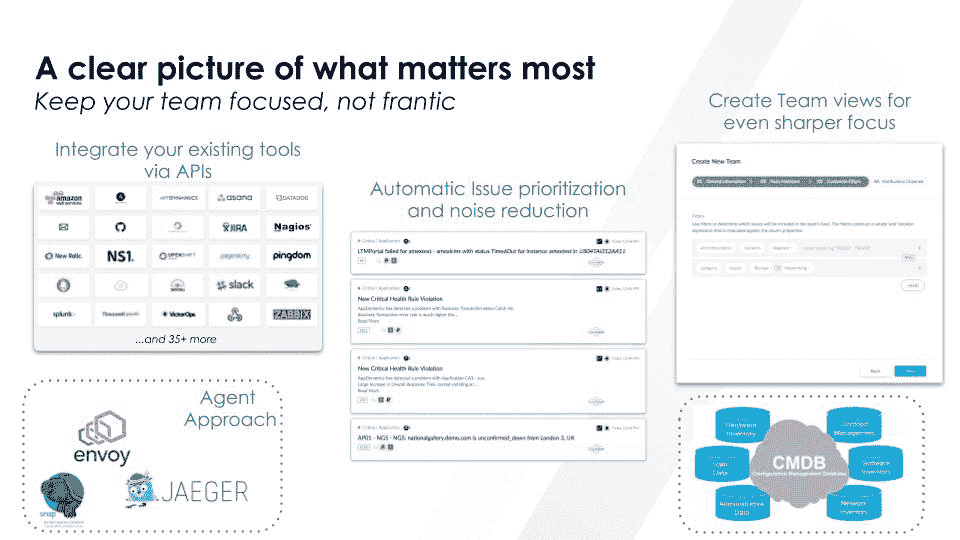

# 新遗迹加速 aiops 与意符收购

> 原文：<https://devops.com/new-relic-accelerates-aiops-with-signifai-acquisition/>

New Relic 在[收购了 significal](https://newrelic.com/press-release/20190206-2)之后，正在加速对机器学习算法和其他形式的人工智能(AI)的投资，作为更容易从 it 环境中所有警报产生的噪音中分离信号的努力的一部分。

New Relic 产品管理高级副总裁亚伦·强森表示，SignifAI 为 New Relic 提供了一个机会，可以创建一个超集平台，将高级分析应用于更广泛的数据源。他指出，SignifAI 已经创建了 60 多个集成，涵盖了广泛用于 DevOps 工具链的开源和商业监控工具，并补充说，随着 New Relic 加入其他数据源，该公司有机会超越提供软件即服务(SaaS)工具来监控应用程序和基础设施。

显然，人工智能在 DevOps 领域还处于早期阶段。但同样清楚的是，随着微服务和容器的兴起，it 组织很快将无法手动管理他们的 it 环境。将需要基于注入了机器和深度学习算法的 AIOps 平台的各种形式的自动化。作为一家总部位于 SaaS 的应用程序和基础设施监控工具提供商，New Relic 已经获得了训练人工智能模型优化特定 IT 环境所需的大量数据。

当然，在 IT 监控领域存在很多竞争，因此哪些厂商拥有推动对 AIOps 持续投资所需的资源仍有待观察。

与此同时，DevOps 团队将需要调整他们的流程以利用 AIOps。AIOps 平台不太可能消除对 DevOps 团队的需求，但任何 DevOps 团队必须有效管理的应用程序和平台的数量将大幅增加。AIOps 平台不是取代人类，而是在具备 DevOps 技能的专业人员已经短缺的情况下，减少雇用额外 IT 人员的压力。AIOps 平台实际上就像一个副驾驶。

IT 组织在这个过程中可能遇到的最大问题是与他们实现的任何 AIOps 平台建立信任。大多数人工智能模型需要一段时间来了解 It 环境，然后该平台才会做出任何可靠的建议。在大多数情况下，随着 IT 环境的变化，DevOps 团队将不得不指派工作人员不断培训和更新 AI 模型。然而，DevOps 团队可能需要几年的时间才能适应超越信任建议，并使 AIOps 平台能够自行自动化流程。毕竟，对于任何 IT 决策来说，唯一比错误更糟糕的事情就是大规模的错误决策。

在这一点上，AI 在 DevOps 环境中几乎是不可避免的。但这并不一定是因为一些东西是基于人工智能的，它就一定会比有经验的开发人员更聪明。

— [迈克·维扎德](https://devops.com/author/mike-vizard/)