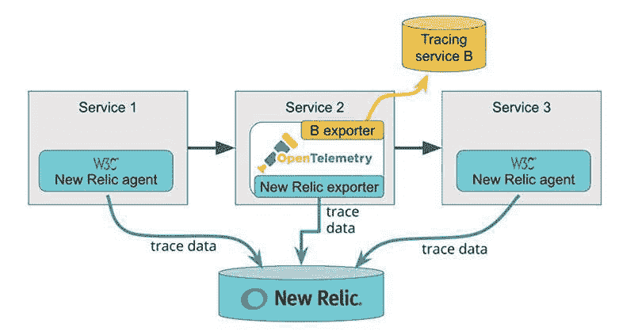

# 新的遗迹增加了对 W3C 跟踪上下文规范的支持

> 原文：<https://devops.com/new-relic-adds-support-for-w3c-trace-context-spec/>

New Relic 已经开始在代理软件中添加对 W3C Trace Context 标准的[支持，该代理软件用于为其应用性能管理(APM)平台收集指标。](https://blog.newrelic.com/product-news/w3c-trace-context-distributed-tracing-standard/)

W3C 跟踪上下文是一个规范，它定义了在服务之间传播分布式跟踪上下文的格式。分布式跟踪使得 DevOps 团队跨多个服务跟踪事件变得更加简单。跟踪的每一步都通过在服务之间传递的 ID 关联，规范定义了上下文传播头的标准。

W3C 分布式跟踪工作组在去年年底将跟踪上下文规范发展到平台供应商可以使用的程度。TraceContext 后来被 [OpenTelemetry](https://opentelemetry.io/) 项目采用，这是一个在云计算原生计算基金会(CNCF)的支持下开发的开源可观测性框架，还有 APM 平台的提供商，如 New Relic、LightStep 和 Dynatrace。新遗迹的产品管理主任维克·苏亚雷斯说，许多从事 TraceContext 和 OpenTelemetry 项目的人来自同一个组织。

跟踪上下文项目的第一阶段主要关注 HTTP。该项目的成员还致力于为其他格式定义跟踪上下文传播，从物联网的 AMQP 和 MQTT 开始。项目团队还致力于提供来自客户端和 web 浏览器的上下文传播。

Soares 说，这种方法解决了使用专有格式时出现的一个问题:随着跟踪上下文头跨越代理、服务网格和消息传递系统等边界，专有头往往会被丢弃，这往往会破坏跟踪。

Soares 表示，DevOps 团队将需要升级他们现有的代理软件，以利用跟踪上下文来提供跨分布式服务的更多上下文。然而，分布式跟踪不会取代采样。相反，分布式跟踪提供了一种机制来识别问题的根本原因，这些问题可能首先使用抽样技术发现。

用于 Java 5.1.0 和更高版本、Python 5.5 和更高版本、Go 3.1.0 和更高版本的新 Relic APM 代理以及新 Relic 开源酏剂代理现在支持该标准。其他新的遗留代理中的跟踪上下文支持，以及新的遗留浏览器代理，预计将很快可用。支持 W3C 跟踪上下文的新 Relic APM 代理可以接受和发出 W3C 跟踪上下文头格式和新 Relic 头格式。新代理也是向后兼容的，以支持跟踪上下文，并将在新旧版本的新遗留代理的服务之间传播。一旦将所有代理升级到 W3C 兼容版本，IT 组织还可以选择禁用新的 Relic 专有跟踪格式。

鉴于基于微服务的应用程序的复杂性，许多部署这些应用程序的组织将成为首批利用分布式跟踪的 DevOps 团队之一，不仅可以对应用程序进行故障排除，还可以主动管理其应用程序环境。展望未来，DevOps 需要更多地关注在潜在问题变成更大的问题之前识别它们。

— [迈克·维扎德](https://devops.com/author/mike-vizard/)