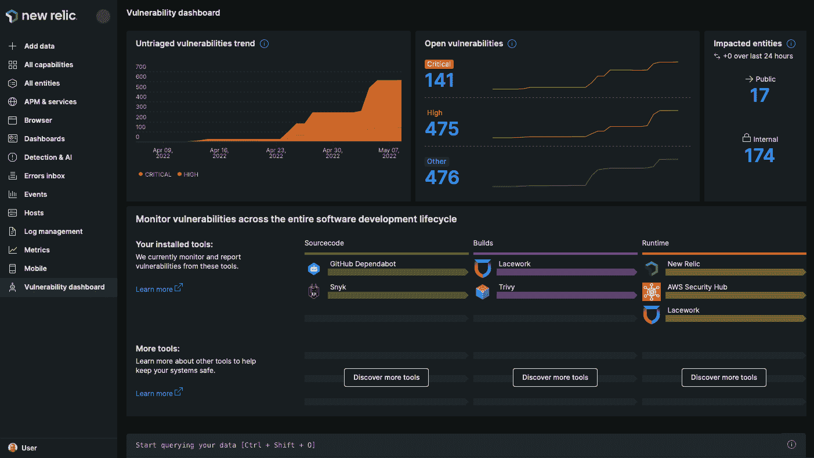

# 新遗迹扩大了可观测范围

> 原文：<https://devops.com/new-relic-expands-scope-of-observability-reach/>

在其 [Futurestack](https://www.futurestack.com/event/1f99f933-2470-47eb-aa4e-5f33690ca251/websitePage:462517a4-874d-40ea-b28a-843fc305e457) 会议上，New Relic 宣布[扩展了其为可观测性平台](https://www.businesswire.com/news/home/20220518005257/en/New-Relic-Expands-Instant-Observability-Ecosystem)提供的集成和工具，并添加了其首个网络安全工具。

该公司现在提供超过 470 个与云服务、开源工具和其他企业技术的集成，支持来自 Akamai、Atlassian、CircleCI、Cloudflare、Netlify、PagerDuty 和 Postman 的产品，现在正在添加到其即时可观测性平台中。该公司还在其应用程序性能监控(APM)产品中添加了收集日志以及指标和跟踪的功能。

最后，New Relic 已经[加深了与微软](https://www.businesswire.com/news/home/20220518005184/en/New-Relic-Announces-Product-Integrations-and-Multi-Year-Commercial-Partnership-with-Microsoft-Azure)的云关系，增加了一个引导用户加入的界面，支持更广泛的工具方法，[与 Kubernetes](https://containerjournal.com/features/new-relic-dives-deeper-into-kubernetes-observability/) 更紧密的集成，并且首次通过 [New Relic 漏洞管理](https://www.businesswire.com/news/home/20220518005185/en/New-Relic-Introduces-Vulnerability-Management)服务扩展到网络安全领域，该服务正被添加到其软件即服务(SaaS)组合中。

New Relic 负责产品上市的集团副总裁 Ishan Mukherjee 表示，New Relic 漏洞管理是一项更大努力的开始，旨在使 IT 团队能够利用他们已经通过 New Relic 平台收集的可观察性数据来推动 DevSecOps 最佳实践的采用。他指出，漏洞管理的传统方法创造了另一个数据孤岛，只会进一步加剧网络安全盲点。Mukherjee 补充说，new Relic Vulnerability Management 通过其代理软件和与各种平台的集成收集数据，以提供 IT 环境整体安全状况的统一视图。

就采用[可观察性](https://devops.com/?s=observability)平台而言，这仍处于早期阶段，但很明显，跨应用程序及其运行的 It 基础架构统一指标、日志和跟踪收集的平台正在改变 it 管理方式。如今，大多数开发运维团队能够使用跟踪一组预定义指标的工具来持续监控 IT 环境；可观察性平台使得聚合数据成为可能，以便开发运维团队可以发起查询，帮助他们发现 it 问题的根本原因。这种能力正变得越来越重要，因为 IT 环境变得过于复杂，IT 团队无法使用传统工具进行管理，这在一定程度上要归功于微服务和云计算环境的兴起。

挑战在于，大多数 IT 团队不太确定他们应该问什么问题，以从可观察性平台的投资中获得最大价值。随着这些平台提供商之间的竞争加剧，不需要 IT 团队太多干预就能准确发现问题的可观察性平台可能会获得最大的吸引力。

与此同时，随着围绕单一数据源进行协作变得越来越简单，组织可能希望开始重新评估其 IT 团队中的角色。IT 团队不得不使用不同的工具对出现冲突数据的问题进行分类的日子可能终于要结束了。因此，it 专业人员团队应该能够在扩展的企业 IT 环境中管理更广泛的流程。

自然，在可观察性平台推动 it 团队的大规模重组之前，可能还需要一段时间，但现在更大的问题是这一天何时到来，而不是是否会到来。