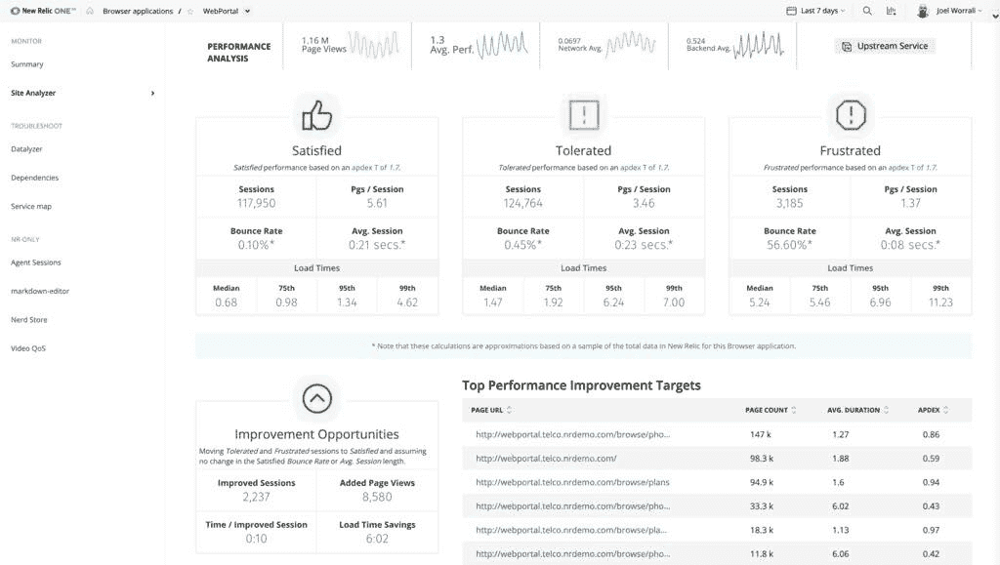

# 新遗迹扩大了可观测的范围

> 原文：<https://devops.com/new-relic-extends-observability-reach-and-scope/>

今天在纽约举行的 [FUTURESTACK 2019](https://newrelic.com/futurestack) 活动上，New Relic 宣布，它已经扩展了 New Relic One Observability 平台，以增加对其新日志、踪迹、指标和人工智能模块产品的支持。

New Relic 总经理兼产品高级副总裁 Ken Gavranovic 表示，他的公司致力于扩展可编程平台的广度，以灵活地满足 DevOps 的需求，而不是迫使 IT 团队将多种工具缝合在一起，以监控他们的应用。

作为努力的一部分，New Relic 还让客户能够使用 New Relic 存储在其云平台上的数据，使用基于 React 和 GraphQL 的框架来构建应用程序。该公司还提供了一系列开源监控应用程序，组织可以使用它提供的模板在不到一个小时的时间内进行定制。

New Relic 还宣布推出新的 Relic 日志，这是一种日志管理服务，旨在使运营团队更容易跨应用程序和基础架构源关联日志数据。该模块将使团队能够运行特别搜索，在几毫秒内返回查询，而不必切换到另一个工具。

与此同时，New Relic 宣布了新的 Relic 跟踪和新的 Relic 指标的可用性，以帮助 DevOps 团队更容易地确定整个 IT 环境中的依赖关系。Gavranovic 说:“我们的目标是让团队能够使用一个单一的平台来理解分布式 it 环境中发生的所有上游和下游事件。”。

例如，除了打开通过应用编程接口(API)集成的功能标记工具之外，DevOps 团队还将能够从 New Relic 内部监控无服务器计算框架。

最后，beta 版的 New Relic AI 将以机器学习算法和预测分析的形式将人工智能(AI)引入平台，以跨多种工具自动关联、聚合和优先化事件数据，从而减少警报疲劳并缩短平均解决时间。Gavranovic 说，New Relic AI 已经与 PagerDuty、Slack 和其他工具集成在一起，使组织能够将这种能力集成到他们现有的工作流程中。

他补充说，通过采用这种方法，组织可以将 New Relic 作为一个开放平台，而不管其当前的 IT 成熟度水平如何。

New Relic 显然是在打赌，一个用于监控整个 IT 环境的集成工具将比集成各种不同的工具更可取。Gavranovic 认为，随着组织采用微服务来构建和部署应用程序，这种方法将会更有吸引力。鉴于所有这些微服务之间存在的所有依赖关系，监控工具将需要跨越应用和基础架构，以使 DevOps 团队能够近乎实时地发现和监控所有这些依赖关系。

自然，New Relic 并不是唯一一家有类似野心的监控工具提供商。然而，在将监控工具转化为实际平台方面，还有很长的路要走。

— [迈克·维扎德](https://devops.com/author/mike-vizard/)