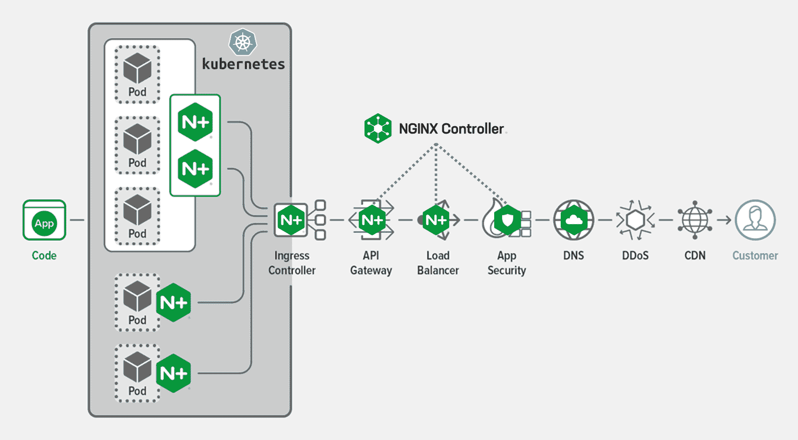

# NGINX 扩展产品组合，纳入服务网格

> 原文：<https://devops.com/nginx-expands-portfolio-to-include-service-mesh/>

NGINX 今天在其在线[Sprint](https://www.nginx.com/events/nginx-sprint-2020/)会议上推出了一系列产品,其中包括一个服务网格，作为在更大的 DevOps 工作流环境中融合网络和安全运营的扩展努力的一部分。

F5 Networks 子公司的首席营销官 Rob Whiteley 表示，NGINX Service Mesh 1.0 提供了一种更简单的替代方案来部署基于开源 NGINX 代理服务器软件的服务网格，该软件已经在企业 IT 环境中广泛使用。他说，轻量级服务网格还与 NGNIX ingress 控制器集成，使其能够在跨传统虚拟机环境和 Kubernetes 集群的微服务中使用。

Whiteley 指出，一般来说，大多数组织不需要服务网格，除非他们希望集成超过 1000 个微服务。如果一个组织只有数百个微服务，一个入口控制器就足够了，任何涉及不到一百个微服务的事情都可以通过代理软件来处理。

Whiteley 指出，NGINX 服务网格 1.0 将由 NGINX 提供，F5 Networks 将继续为 Kubernetes 环境提供基于 Istio 项目的服务网格，该项目依赖于 Envoy 代理软件，不如 NGINX 平台轻量级。开发运维团队必须决定部署哪个服务网格。

与此同时，NGINX 也在更新其 NGINX 控制器，以添加支持更丰富的分析、用于持续集成/持续交付(CI/CD)集成的声明式应用程序编程接口(API)、基于角色的访问控制以及用于 API 管理的开发人员门户增强功能。

NGINX 还推动了 Controller 和 NGINX App Protect 之间更紧密的集成，后者是一种 web 应用防火墙，将继承 Controller 的 API、分析和自助服务功能。NGINIX App Protect 现在也与 Kubernetes 的 NGINX 入口控制器集成在一起。支持这些集成的控制器应用安全工具目前处于私人测试阶段，预计将于 2020 年底全面上市。

最后，NGINX 现在正在利用 F5 Networks 通过软件即服务(SaaS)平台以 NGINX 分析云的形式提供的服务，该平台取代了 NGINX Amplify。该功能将于 2021 年第一季度推出。

总的来说，Whiteley 说 NGINX 正在努力满足传统网络运营团队的需求，这些团队希望向开发团队提供自助服务能力，并通过编程接口向 DevOps 团队提供服务。Whiteley 指出，在许多情况下，企业 IT 组织采用这两种方法来公开网络服务。

当然，最终可能推动 NetOps 和 DevOps 融合的问题是服务网格的兴起。除了集成微服务之外，服务网格还为开发人员提供了一组一致的接口，用于调用跨越令人眼花缭乱的服务器和设备阵列的网络和安全服务。随着这种转变的发生，IT 团队将变得比现在更加敏捷。当然，挑战将是融合网络运营和 DevOps 文化，这两种文化如今没有太多共同点。