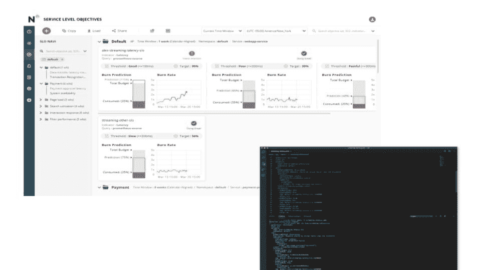

# Nobl9 将业务目标与可观察性数据联系起来

> 原文：<https://devops.com/nobl9-ties-business-goals-to-observability-data/>

Nobl9 今天宣布，它已经通过一个开放的公共测试程序提供了一个软件即服务(SaaS)平台，用于将[业务目标](https://devops.com/?s=business%20goals)与可观察性工具收集的数据相关联。

公司首席执行官 Marcin Kurc 表示， [Nobl9 服务水平目标(SLO)平台](https://www.prweb.com/releases/nobl9_offers_open_beta_access_to_worlds_first_service_level_objective_platform_for_software_reliability/prweb17507295.htm)不同于仅聚合指标的可观测性平台，它将数据应用于业务定义的特定可靠性目标。

Kurc 表示，Nobl9 SLO 平台计算与 Datadog、New Relic 和 Prometheus 等监控平台兼容，使用监控数据来计算每个服务阈值的可接受错误率，并可以配置为在预期中断时触发警报甚至工作流。关键区别在于了解哪些指标真正影响了客户体验。

该平台还使 DevOps 团队能够创建业务规则，并根据所需的应用程序体验定义用户的“方面”。除了跟踪用户组之外，DevOps 团队还可以识别服务不佳的用户。Kurc 表示，他们还将合同服务水平协议(SLA)细化到关键业务期。Nobl9 SLO 平台可以通过命令行界面/图形用户界面/应用编程接口访问一切，像 YAML SLO 代码或 sloctl 命令行 Kubernetes。

Kurc 指出，这种方法对监控成本也有重大影响，因为 Nobl9 SLO 平台使确定哪些数据需要存储而哪些数据需要删除变得更加容易。

Kurc 说，有了这些见解，DevOps 团队就可以更容易地决定如何使系统更加可靠，或者在可能的情况下降低可靠性目标以降低成本。他指出，IT 组织也将减少相互指责的时间，因为任何问题的根本原因都将变得更加明显。他补充说，Nobl9 SLO 平台提供了对实时和历史报告的访问，使 DevOps 团队能够实现这两个目标。

在新冠肺炎疫情之后，人们比以往更加关注可观测性。组织越来越依赖数字业务流程来生存。在这个新时代，生存与繁荣的区别将归结为不仅是 IT 环境的可观察性，还有整个数字业务流程的可观察性。

大多数组织可能还需要一段时间才能将利润和收入与其 It 环境的性能完全等同起来。然而，越来越明显的是，仅仅确保 it 环境可用是不够的。客户根据组织在跨多个应用的数字业务流程环境中推动高质量体验的能力来评判组织。无法满足这些期望的组织很快就会发现自己被那些能够满足的组织所抛弃。

自然，这些需求会给 IT 团队带来很大的压力，因为 IT 团队通常对业务流程缺乏足够的了解。受到密切监视的系统生成的警报没有止境，但是这些警报中的大部分缺乏业务上下文。毫无疑问，很快就会有很多方法来获得这种环境。现在的挑战是在为时已晚之前向商业领袖解释为什么需要它。