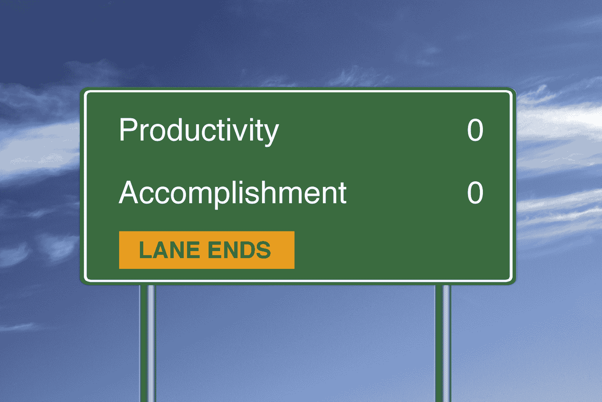

# 无所事事是艰苦的工作！

> 原文：<https://devops.com/nothing-hard-work/>

如果你真的想知道你的软件交付过程有多好，试着什么都不做。是的，你没看错，什么都不做:在没有任何需求、没有新代码、没有测试和没有安装的情况下，完成你的正常发布过程。听起来很简单，对吧？

所以让我们开始吧。当然，这对于每个组织来说是不同的，但是通常一个新的版本是从在某个管理系统中创建一个条目开始的。然后通常会对公司战略的范围、预算和整体契合度进行评估。既然没有新的需求，你应该自动通过任何审查。但是，如果批准需要召开会议或电话会议，您仍然需要安排时间。说“嗨”然后走出房间或者挂掉电话。确保您获得了所有必需的电子邮件批准。

接下来，检查所有其他的强制性检查:安全性、数据隐私、法规遵从性、用户界面设计、基础设施就绪性等等。您可能还需要您的测试团队签署质量。不要忘记预留一个安装窗口，并考虑任何变更冻结期。

如果你幸运的话，你可以跳过这些检查点或者获得自动批准，因为你没有新的需求、软件或者基础设施。如果你运气不好，你就不得不面对每月第二个星期二才开会的审查委员会。无论如何，加上过去的天数，看看你做得怎么样。五天或更少？给你的公司一颗金星！四到六周？不算太坏。花的时间超过三个月了吗？当然很尴尬，但你并不孤单，这让你感到欣慰。

当您有实际的需求要实现时，很多开销都被掩盖了。当真正的编码和测试正在进行时，你可以做你的批准。但是这个练习将向您展示您的局限性，以及为什么优化您的软件交付过程至少与自动化一样重要。

什么都不做不会击中你所有的瓶颈。在本练习中，我们没有考虑复制开发环境、为已经购买的生产服务器获取资金或重复之前通过的测试。我将在另一篇文章中讨论这些任务。

你认为你的组织什么都不做需要多长时间？请在下方留言评论。

## **关于作者/扬·S(巴斯)普鲁伊姆**

巴斯·普鲁伊姆是 IBM 创新实践部门的云/DevOps 解决方案架构师。他与客户在基础设施解决方案、流程再造、自动化工具和改造整体软件交付流程方面进行合作。Bas 还是 IT 专家认证委员会的成员、游戏爱好者和社交媒体工具的倡导者

在 [LinkedIn](https://www.linkedin.com/in/bas-pluim-0a5b594) / [Twitter](https://twitter.com/baspluim) 上与 Bas 联系