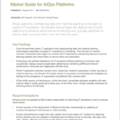

# 现在是全栈操作的时候了

> 原文：<https://devops.com/now-time-full-stack-operations/>

“全栈开发人员”的想法正变得越来越普遍，尽管它仍然广受争议。但是全栈操作呢？

IT 行业存在周期，如果你等待足够长的时间，你会看到同样的想法时好时坏。业务应用程序曾经是相当单一的，因此人们期望它们的程序员不仅要对应用程序的代码和业务逻辑本身有很好的理解，还要对其基础有很好的理解。

随着时间的推移，这些基础的不同部分被分离，在模块化过程中打破了数据孤岛。随着体系结构的日益复杂，期望变成专家将负责每个模块，并简单地确保标准接口对模块需要相互交互的团队可用。

虽然模块化在体系结构层面已经存在，但现在有一些人反对它过于激进地扩展到 hum

负责构建系统的开发人员。这需要寻求“全栈开发人员”，他们能够理解整个应用程序栈的所有细微差别。

公司的 IT 运营部门也有类似的需求。不同的专业支持团队过去能够专注于一个特定的领域(服务器、网络、数据库、中间件等等)，并使用他们自己的特定工具来分析和理解复杂企业架构的一个特定模块的性能。假设如果每个模块都启动了，那么事实上，整个堆栈都启动了，因此应用程序作为一个整体也启动了。

事实证明，没那么简单。

# 让我们做一些根本原因分析

如今，业务服务的失败很少是由某个特定组件的灾难性中断引起的。硬件很便宜，弹性是内置的，来自 web 级环境的经验已经成为常见的最佳实践。真正导致问题的是意想不到的事情——比如让你得到令人尴尬的新闻报道或愤怒的顾客要求退款——许多看似小而孤立的问题突然累积成一个大问题。

当这种连锁故障发生时，模块化运营团队和流程无法应对。为每个受影响的模块打开多个票证，并将其发送到该模块的支持队列。根据定义，这些标签中的每一个都只包含部分信息，甚至可能只描述另一个模块中的故障症状。因此，宝贵的时间被浪费在诊断、重新分配和升级这些票证上，直到最终费力地组合出实际问题的完整画面。

此时，所有受影响的支持团队的代表聚集在一起，或者面对面，或者通过电话会议，试图确定如何尽快恢复服务。很多时候，这些努力会被徒劳的指责和指责进一步拖延，但最终，问题会得到解决。

鉴于现代企业架构的复杂性，任何一个 it 运营专家都不可能深入了解整个体系，包括不同模块化组件之间的所有交互。即使可以及时为快照执行此操作，但目前大多数环境都在或多或少地进行自我修改，根据需求调配或停用容量，在可用资源之间平衡负载，并执行日常维护任务。这种动态对于人类来说是不可能实时精确建模的。

# 如何实现全栈操作？

没有一个人可以成为全栈运营专家，但这并不意味着整个团队不能提供全栈支持。关键是打破支持每个模块的不同孤立团队之间的壁垒，并使构建支持特定业务服务的完整堆栈的整体画面变得更容易。

这种整合必须实时进行，因为这是当今商业的节奏。技术上持续时间只有几分钟的停机可能会造成长达数小时的业务影响。运营团队需要能够将来自不同模块的信号与 IT 环境中正在发生的事情联系起来的工具，主动通知适当的人员，并为他们提供所需的支持，以汇集知识并有效地合作来解决停机问题，并恢复对受影响用户的服务。

这些工具不可能是对某个特定模块监控的简单增量改进，尽管这很重要。组织作为一个整体期望从其 IT 运营中获得的响应能力要求打破孤岛，并汇集信息和专业知识。不同领域的专家之间的实时协作是实现真正全栈操作的唯一途径。

迅速成熟的 AIOps 学科正致力于此。这种方法的美妙之处在于，与过去的“推倒重来”的方法不同，在过去的“推倒重来”的方法中，迁移到新的东西意味着淘汰旧的东西，AIOps 利用了过去所做的事情，只是将以前互不关联的知识孤岛连接在一起，并在需要时提供信息。

 在 Gartner 的 AIOps 市场调查中，我们可以看到一些正在构建这些功能的公司。通常这些文件的价格是 1295 美元，但是你可以通过[这个链接](https://www.moogsoft.com/resources/aiops/guide/gartner-2017-aiops-market-guide)免费获得。

多米尼克·惠灵顿