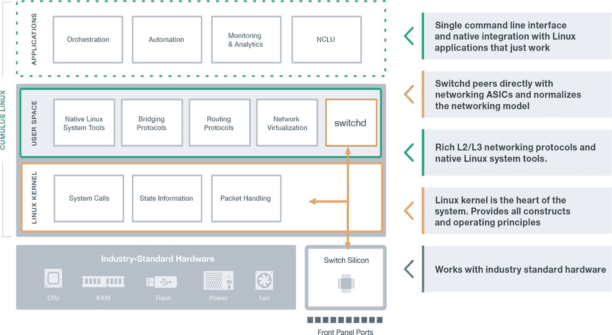

# 英伟达的目标是推动积云网络收购后的分解

> 原文：<https://devops.com/nvidia-aims-to-drive-disaggregation-following-cumulus-networks-buy/>

在 NVIDIA 即将收购 Cumulus Network[之后，开源网络的采用可能会得到推动。](https://blogs.nvidia.com/blog/2020/05/04/nvidia-acquires-cumulus/)

在收购基于 Linux 的网络操作系统(NOS)提供商之前，英伟达(NVIDIA)早些时候收购了网络和存储系统提供商 Mellanox。

NVIDIA 网络业务部门营销高级副总裁 Kevin Deierling 表示，Cumulus Networks 为图形处理器单元(GPU)提供商增加了一个可编程的 NOS，随着越来越多的组织分解网络软件和硬件的采购，它应该会获得更大的采用。他说，这种分解趋势在基于英伟达 GPU 构建人工智能(AI)应用的数据中心和云计算环境中尤为强劲。

Deierling 补充说，随着开发操作系统和网络操作(NetOps)的世界继续融合，NVIDIA 对旨在扩展的可编程 NOS 的兴趣也将增加。

自 2010 年以来，Cumulus Networks 一直试图推动 Cumulus Linux 的采用，并取得了成功。Cumulus Linux 运行在 100 多种硬件平台上，包括 Mellanox 的交换机。虽然云服务提供商和一些高性能计算(HPC)环境拥有[分散的网络软件和硬件](https://devops.com/autonomous-networks-the-future-we-need-now/)，但大多数企业 IT 组织仍继续从思科系统和瞻博网络购买集成了 NOS 的交换机。

Cumulus Networks 首席执行官 Josh Leslie 表示，很明显，越来越多的企业 it 组织将转向网络软件和硬件的分离，特别是随着越来越多的应用程序工作负载迁移到云中。他指出，不依赖于思科或 Juniper Networks 交换机中嵌入的专有 ASIC 技术的 NOS，使 it 组织能够随着每一代新 x86 处理器的增加而受益于摩尔定律。

同时，他补充道，与为专有 NOS 平台设计的工具相比，基于 Linux 的 NOS 编程工具对开发者来说更加熟悉和容易使用。

现在说 DevOps 团队在多大程度上需要对共享网络资源的可编程访问还为时过早。理想情况下，随着应用程序变得比以往更加分散，开发人员会希望对网络资源有更多的编程控制。这种方法将使他们能够通过应用编程接口(API)为应用提供网络资源，而不必等待网络管理员手动提供资源。

然而，网络带宽是许多组织内部的共享资源，令人担忧的是一个应用程序会消耗所有可用的网络带宽，而网络上的所有其他应用程序都会受到影响。因此，网络管理员一直在采用自动化和自助服务门户，以使网络资源更容易被开发人员访问，而不会放弃对网络的完全控制。

不管采用什么方法，网络正变得越来越灵活。NetOps 和 DevOps 团队不一定会融合；然而，随着网络成为另一类可被视为代码的基础设施，网络服务在很大程度上与 it 环境的其余部分隔离管理的日子显然即将结束。