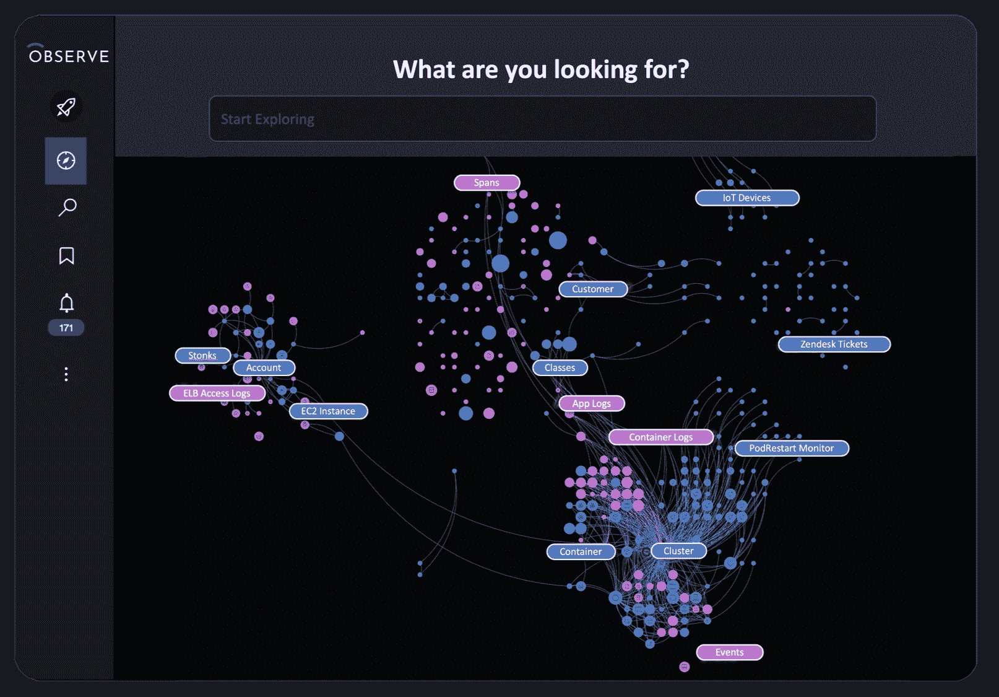

# Observe，Inc .更深入地研究可观察性

> 原文：<https://devops.com/observe-inc-dives-deeper-into-observability/>

刚刚获得额外 7000 万美元资金的 Observe，Inc. [本周宣布，它已经向其可观测性平台添加了多种工具，称为数据宇宙地图](https://www.prnewswire.com/news-releases/observe-inc-secures-70m-in-new-funding-301544607.html)，以可视化所有数据集和表面潜在的事件数据。

该公司还为 Kubernetes、亚马逊网络服务(AWS)和 Jenkins 环境添加了预建的应用程序，并计划在今年晚些时候为谷歌云平台(GCP)和微软 Azure 推出版本。Observe 应用程序旨在使 it 团队能够轻松获取通过预建仪表板呈现的数据，这些仪表板将在出现问题时生成警报。

最后，Observe，Inc .添加了仪表板，为其基于使用的定价模型提供透明度。IT 团队现在可以更轻松地确定用户和特定数据集消耗了多少配额，以帮助控制成本。

Observe，Inc .首席执行官杰里米·伯顿(Jeremy Burton)表示，这些工具至关重要，因为在缺乏控制数据成本的工具的情况下，大多数组织很快就会发现[可观测性](https://devops.com/?s=observability)是不可持续的。

当然，目前还不清楚有多少组织超越了监控指标，开始接受可观察性并发起查询来发现性能问题的根本原因。许多组织不具备构建此类查询所需的专业知识水平。然而，伯顿指出，随着越来越多的组织努力调查和补救影响客户体验的问题，人们对可观察性平台的兴趣正在上升。

伯顿说，到目前为止，作为一家初创公司，Observe，Inc .已经将其客户群扩大了三倍，现已包括 50 家组织，这使得该平台的月活跃用户数量增加了五倍。该平台现在每天接收超过 40TB 的数据，每天有超过 2500 万次查询，涉及近 1 万亿行超过 10pb 的数据。Capital One 是观察公司的投资者之一。

Observe 平台的核心是一个图形引擎，它可以更简单地揭示平台接收到的机器数据之间的关系。

展望未来，Burton 表示，Observe 打算使用 OpenTelemetry 项目创建的开源代理软件添加对分布式跟踪的支持，该项目在云本地计算基金会(CNCF)的支持下运行。

企业 IT 组织内部的变化是缓慢发生的。在未来的几年中，许多人将会在使用可观测性平台的同时使用传统的监控工具。然而，随着可观察性平台的能力继续扩大，有机会使监测工具合理化。

与此同时，随着更多基于微服务和使用容器构建的现代应用程序的部署，IT 环境将继续变得更加复杂。随着时间的推移，这些应用程序通常比单一应用程序更有弹性；鉴于微服务之间的所有依赖关系，确定性能问题的根本原因可能是一项重大挑战。因此，这种新的应用程序类别最终在企业中强制实施可观察性问题可能只是时间问题。