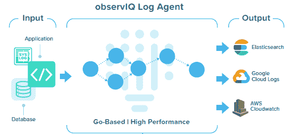

# observiq 启动开源日志代理项目

> 原文：<https://devops.com/observiq-lauches-open-source-log-agent-project/>

Blue Medora 在[将其核心监控集成平台出售给 VMware](https://devops.com/vmwares-blue-medora-buy-advances-aiops/) 后，今天[更名为 observIQ](https://www.globenewswire.com/news-release/2020/07/21/2064739/0/en/Blue-Medora-Launches-observIQ.html) ，并启动了一个开源代理项目，该项目将作为日志管理工具的基础，以软件即服务(SaaS)应用的形式交付。

公司首席技术官迈克·凯利(Mike Kelly)表示，用 Go 编程语言编写的 observIQ 代理将为 IT 团队提供高度可配置的代理软件，而不会对性能产生负面影响。他说，相比之下，现有的开源日志代理软件需要 IT 团队牺牲一个来换取另一个。

Kelly 补充说，因为 observIQ 代理是高度可配置的，它还将使收集各种各样的指标变得更加容易，这些指标可以由各种各样的管理工具使用。

该公司将使用 observIQ 来收集 observIQ Cloud 的指标，这是一个目前处于测试阶段的 SaaS 平台，此外还将继续投资于 BindPlane，这是一个由 Blue Medora 开发的 IT 运营数据管理平台，可提供实时的关系感知指标和日志流。

Kelly 说，IT 团队需要访问高度可配置的代理软件，因为需要收集的指标类型在不断扩展和演变。

与此同时，Kelly 指出，IT 团队需要能够以可承受的价格为更多的应用提供工具，这在依赖商业代理软件时变得难以实现。

最后，随着 IT 环境变得越来越复杂，组织开始采用最佳开发运维实践来管理应用，这要求组织大幅提高对任何应用环境的可观察性。DevOps 团队遇到的问题是他们最终不得不支持多个代理，所以如果开源项目导致需要维护和更新的代理更少，这可能是一个产生共鸣的好处。

与此同时，随着日志管理与大多数其他 it 管理服务一起进入云中，IT 团队从任何地方管理应用程序也变得更加容易。大多数 IT 团队将比新冠肺炎疫情袭击之前更频繁地远程工作。当所依赖的工具驻留在云中时，这种转变更容易实现。

由于存储和收集数据的相关成本，许多 IT 团队也倾向于限制日志分析的使用。为了限制这些成本，许多 it 组织选择只在有限的时间内存储日志数据，或者只收集最关键应用程序的指标。面临的挑战是，被视为关键的应用程序的百分比持续增加。

当然，可以作为服务访问的日志管理工具提供商之间的竞争已经很激烈了，所以 observIQ 将不得不努力建立另一个平台。然而，如果 DevOps 团队采用它的开源代理软件，自然有更大的机会让组织最终采用 observIQ Cloud。