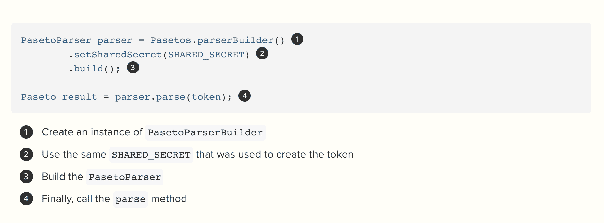

# Okta 提供 PASETO 作为 JSON 令牌的替代

> 原文：<https://devops.com/okta-offers-paseto-as-alternative-to-json-tokens/>

Okta 今天发布了一个[开源库](https://developer.okta.com/blog/2020/07/23/introducing-jpaseto),使用平台无关的安全令牌(PASETO)作为 JSON Web 令牌(JWT)的替代方案来认证终端用户。

Okta 的宣传负责人 Randall Degges 说，PASETO 正在迅速成为 JWT 规范的一个更容易、更安全的实施方案。PASETO 是由 Scott Arciszewski 创建的规范草案，它缩小了 Javascript 对象签名和加密(JOSE)系列规范的范围，使开发人员更容易采用令牌来保护应用程序访问。

他说，Okta 正试图让开发人员更容易使用用 Java 编写的库来使用 PASETO，这个库被称为 JPASETO，它有一半的代码行是用 Java 编写的 JWT 令牌，并由一家供应商提供支持。

虽然 JWT 令牌已被广泛采用，但它们很容易被错误配置，Degges 指出，这导致最近发现了许多 JWT 漏洞。他补充说，这些漏洞的部分原因在于 JWT 规范本身；jwt 支持广泛的加密算法，包括一个完全不使用加密的选项。

相比之下，Degges 说 PASETOs 在加密方面更有弹性，也更容易使用。PASETO 规范定义了两种类型的令牌:本地令牌和公共令牌。本地令牌总是用共享密钥对称加密，这意味着没有人可以查看本地 PASETO 的内容，除非他们有正确的密钥。公共令牌对任何人都是可读的，并且用公钥进行验证。没有“无”的选项；他说，不可能有不加密的安全令牌。

所有 PASETO 格式都是防篡改的。Degges 补充说，整个消息都经过验证，因此如果令牌中的任何内容发生变化，验证都将失败。

他指出，这种方法确保了更高水平的应用程序安全性，同时有助于使用 Okta 的 JPASETO 库采用最佳 DevSecOps 实践，该库可以轻松地集成到应用程序开发过程中。

近年来，软件令牌(如 JWT)作为一种实现双因素身份认证的方式，取代了在服务器中创建会话并返回 cookie 的做法，获得了广泛的关注。当用户使用他们的凭证成功登录时，会返回一个 JSON Web 令牌，并且必须保存在本地。

然而，软件令牌仍然容易受到复制底层加密软件的攻击或诱骗终端用户放弃密码的网络钓鱼攻击。没有十全十美的安全；然而，软件令牌提供了一个关键的安全层，应该得到更广泛的应用。

目前还不清楚 PASETO 将在多大程度上推进这一目标。许多组织甚至可能要求使用 JWT 或 PASETO 作为其发展战略规划总体办法的一部分。无论采用哪种方法，很明显，继续依赖会话和 cookies 来验证终端用户是一种过时的验证方法，不仅更难以实施和管理，而且最终安全性也会降低。