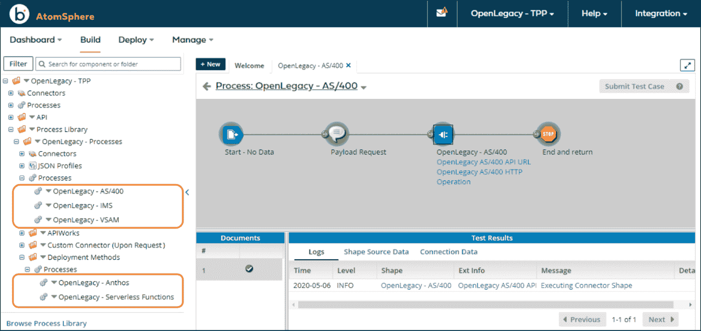

# OpenLegacy，Boomi 简化传统应用集成

> 原文：<https://devops.com/openlegacy-boomi-simplify-legacy-application-integration/>

OpenLegacy 是一家平台提供商，通过该平台，应用程序编程接口(API)被置于传统应用程序流程之上，该公司今天[宣布与 Boomi](https://www.businesswire.com/news/home/20200629005209/en/OpenLegacy-Joins-Boomi’s-Technology-Partner-Program-Helps) 结盟，Boomi 是戴尔技术的一个分支，为组织提供对集成平台即服务(iPaaS)的访问，iPaaS 作为云服务提供。

OpenLegacy 首席产品官 Zeev Avidan 表示，该公司的核心平台使 IT 团队能够将遗留应用程序流程转换为微服务，这些微服务可以由 Boomi 等工具使用 API 来参与。他说，OpenLegacy 不仅仅是提供对应用程序的访问，它还旨在捕获所有业务逻辑、元数据和与特定业务流程相关的中间件，例如在 IMS 或 AS/400 平台上执行的业务流程。

Boomi 联盟扩展了这一功能，将公民集成商或开发者通过 Boomi 云服务创建的流程包括在内。这一点至关重要，因为企业中的大多数任务关键型应用程序仍在传统平台上运行。Avidan 表示，OpenLegacy 通过基于 Java 的软件开发工具包(SDK)使这些应用程序更容易被其他应用程序和平台访问，而不是从头开始重写这些应用程序。

在许多组织寻求加快数字业务转型计划的时候，Avidan 表示，能够以编程方式调用整个业务流程可以加快这些计划的完成速度，因为业务流程不一定需要重新设计。

在 Boomi 的例子中，这种能力现在已经扩展到最终用户，使得使用一套已经被 11，000 多个组织采用的工具来利用现有的业务流程变得可行。

OpenLegacy 为 DevOps 团队提供了一个案例，让他们从遗留业务流程而不是单个应用程序的角度来考虑问题。历史上，许多组织依赖企业服务总线(ESB)平台来集成应用程序。然而，一旦应用程序环境被连接，DevOps 团队仍然必须手动集成组成业务流程的所有软件组件。

Avidan 说，没有 OpenLegacy 的遗留平台集成就变成了考古挖掘的数字等价物，并指出许多组织最终雇佣昂贵的系统集成商来完成这项任务。

在新冠肺炎疫情之后，人们对业务流程的现代化显然有了更多的兴趣。在可预见的未来，许多员工都在家工作。Boomi 等云服务提供了一种让最终用户能够自己设计工作流的方式。挑战总是在于找到一种方法，轻松地将这些工作流连接到业务所依赖的交易处理系统和其他记录系统。

尚不清楚提供这种级别的访问将在多大程度上推动业务流程创新的爆发。然而，花费大量时间将新应用程序与遗留业务流程集成的 DevOps 团队可能会热衷于利用一种承诺将这些业务流程转化为可重用微服务的方法。