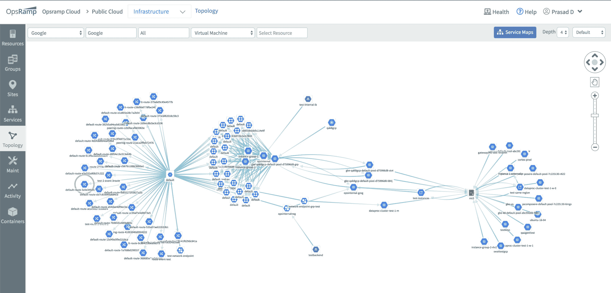

# OpsRamp 向 AIOps 平台添加推荐引擎

> 原文：<https://devops.com/opsramp-adds-recommendation-engine-to-aiops-platform/>

OpsRamp 为其人工智能 IT 运营(AIOps)平台添加了一个建议引擎，该引擎利用预测分析来建议潜在的行动，以提高性能或避免停机。

2020 年冬季发布的 ops ramp 还为亚马逊网络服务(AWS)、微软 Azure 和谷歌云平台(GCP)增加了 19 个云监控集成，以及 Azure 和 GCP 的动态拓扑图。OpsRamp 目前提供与 120 多种不同云服务的集成。

最后，OpsRamp 增加了检测季节性模式的功能，否则会生成警报，这是一个警报统计小部件，使跟踪原始警报、综合监控和无代理发现以及监控 Windows Server 实例变得更加容易。

OpsRamp 的工程和 DevOps 高级副总裁巴努·辛格(Bhanu Singh)表示，随着 IT 员工队伍中对人工智能的抵制越来越复杂。他说，组织意识到信息技术专家是一种昂贵的资源，所以他们需要尽可能最大限度地发挥信息技术通才的能力。辛格说，OpsQ 推荐模式为公司的软件即服务(SaaS)平台添加了一个预测分析模块，用于管理 IT，提供可解释和透明的分析建议，以帮助普通 IT 管理员避免需要专家稍后才能解决的问题。

这种可见性至关重要，因为它仍然让 it 管理员来决定自动化什么。然而，他说，随着 OpsRamp 继续了解 IT 环境的细微差别，IT 管理员对提出的建议就越有信心。

Singh 指出，OpsRamp 平台需要大约 24 到 48 小时来了解足够多的 It 环境，以开始提出建议，并补充说，因为 OpsRamp 是一个 SaaS 平台，所以设置平台需要最少的努力。

在某种程度上，IT 专业人士对人工智能的依赖不可避免。人工智能可能永远不会消除对 IT 人员的需求，但 IT 管理员今天执行的许多令人麻木的机械任务很快将被自动化。然而，随之而来的挑战是 IT 员工需要能够在更高的水平上管理 IT，这意味着 IT 部门的许多入门级工作可能不再需要。接下来的挑战是找到具备适当技能水平的 IT 专业人员，而他们所接受的许多入门级工作已经不复存在。

与此同时，一场为 IT 管理平台注入机器学习算法的竞赛显然正在进行。OpsRamp 等初创公司正在寻求取代为以前的 IT 时代设计的遗留 IT 平台。然而，这些平台的提供商显然正在大力投资人工智能，作为他们正在进行的现代化努力的一部分。每个 IT 组织都需要自己决定人工智能的兴起在多大程度上保证了管理平台的转换。

然而，不管选择什么平台，IT 团队可以指望的一件事是，随着人工智能平台的不断发展，它们只会变得越来越智能。

— [迈克·维扎德](https://devops.com/author/mike-vizard/)