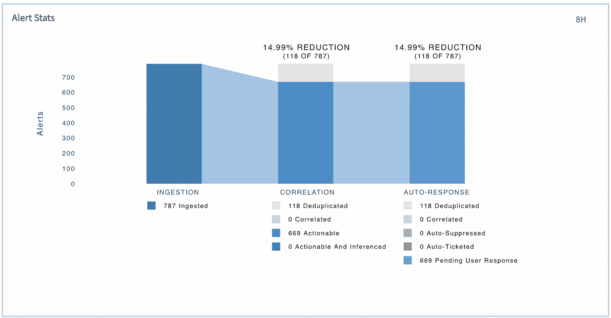

# OpsRamp 为用户提供免费的 IT 管理服务

> 原文：<https://devops.com/opsramp-offers-users-free-it-management-services/>

OpsRamp 今天宣布，订阅其发现和监控工具的 IT 组织现在还将获得对该公司的 AIOps 和远程访问管理服务层为期一年的[免费访问](https://www.globenewswire.com/news-release/2020/05/12/2031704/0/en/OpsRamp-Announces-Free-Access-to-Service-Centric-AIOps-and-Secure-Remote-Consoles-for-Organizations-Dealing-with-Covid-19-Disruptions.html)。

OpsRamp 的产品副总裁 Ciaran Byrne 说，免费提供额外服务等级的决定是对新冠肺炎疫情带来的经济衰退的直接回应。他说，当 IT 团队比以往任何时候都更需要远程访问管理功能时，他们面临着降低 IT 总拥有成本的压力。

他补充说，随着如此多的 it 团队现在在家工作——这可能成为新的常态——ops ramp 正在寻求降低过渡到基于云的平台来管理 IT 运营的成本。

Byrne 说，疫情的副产品之一将是加速 IT 团队自动化过程的速度。许多 IT 领导不确定在经济低迷时期他们能留住多少 IT 团队成员。因此，他们中的许多人已经开始积极地自动化更多的过程，作为努力的一部分，使潜在的较小的 IT 团队保持有效，他说。

当然，挑战在于 IT 环境本身的管理越来越复杂。事实上，随着 IT 团队寻求部署云原生平台以使应用程序更加灵活和有弹性，IT 环境可能会变得更加复杂。事实上，根据最近的 [OpsRamp 调查](https://devops.com/despite-downturn-enterprise-it-budgets-remain-intact/)，在经济衰退开始时，69%的受访者预计他们的组织将在 AIOps 上进行更多投资。

目前还不清楚 OpsRamp 免费提供额外服务的决定在多大程度上代表了 SaaS IT 管理平台提供商之间争夺市场份额的战斗的开始。考虑到当前的经济环境，IT 团队可以预计，这些提供商将更愿意协商条款和条件。

当然，采用基于 SaaS 的平台来管理 IT 的最大障碍是 IT 组织内部的惰性。组织现在决定是否迁移到基于 SaaS 的平台来管理 IT 的速度将对 IT 供应商愿意谈判的程度产生重大影响。当然，部署在内部 IT 环境中的 IT 管理平台的现有提供商也可能做出更积极的回应。

并非每个 IT 组织都能够在经济衰退期间快速过渡到云。然而，当过渡到面向 IT 的 opex 与 capex 财务模式的压力增加时，最容易开始过渡的地方之一就是使用用于管理 IT 系统的软件，而不管这些系统位于何处。