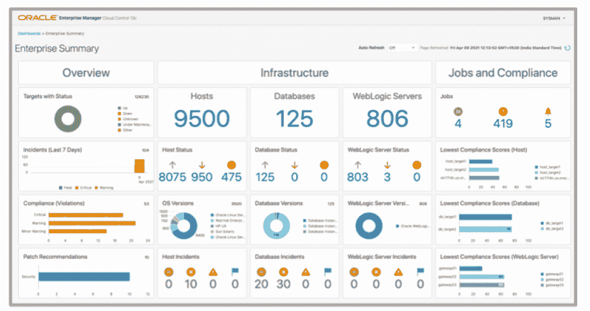

# Oracle 扩展了企业管理器平台的功能

> 原文：<https://devops.com/oracle-extends-capabilities-of-enterprise-manager-platform/>

甲骨文今天宣布，它已经更新了其核心管理平台，以提供更易于管理跨越数百万个终端的混合云计算环境的功能。

最新版本的 Oracle Enterprise Manager (EM) 13c 除了具有更高的可扩展性之外，还支持动态组、动态运行手册、自动化工作负载分析、监控模板、事件压缩和其他功能，从而简化了大规模 it 运营管理。

[Oracle Enterprise Manager(EM)13c Release 5](https://blogs.oracle.com/oem/announcing-oracle-enterprise-manager-13c-release-5)还将管理平台的范围进一步扩展到打包的 Oracle 应用程序和集成的硬件和软件平台领域，例如 Oracle 数据库云服务器、Oracle 数据库机(ODA)、零数据丢失恢复设备(ZDLRA)和私有云设备(PCA)。

Oracle 还更新了其包含在 Oracle Enterprise EM 中的合规性框架，以支持额外的监管要求，并刷新了所提供的车队管理工具的用户界面。

最后，该公司正在添加一个工具，可以更轻松地将存储在 Oracle EM 13c 中的数据复制到 Oracle 云基础架构(OCI)服务。该工具被称为 OCI 桥，它将数据复制到 OCI 对象存储中，由 OCI 服务(如日志分析和运营洞察)进行访问。

甲骨文公司负责企业和云可管理性的产品管理副总裁 Mughees Minhas 表示，随着混合云计算的不断发展，对跨越基础设施、数据库和应用程序的单一管理平台的需求变得越来越明显。

Minhas 表示，Oracle EM 13c 是更大的 [observability](https://devops.com/?s=observability) 计划的一部分，Oracle 已经接受了该计划，以减少 IT 团队需要部署和掌握的工具总数的方式提供跨不同服务的更多上下文。这项工作是对 Oracle 之前推出的一系列自主计算计划的补充，这些计划消除了数据库管理员(DBA)管理低级系统管理任务(如性能调优)的需要。总的来说，Oracle 正在为一个 IT 世界做准备，在这个世界中，平台由 Oracle 和专注于更高级任务的内部 IT 团队共同管理。

随着 it 环境变得越来越分散，IT 管理显然变得越来越复杂。it 团队需要解决的问题是，他们能够在多大程度上自动化管理任务，这些任务如今共同限制了任何给定 IT 团队能够有效管理的 IT 环境的规模。当然，DevOps 团队多年来一直在无情地自动化应用开发和部署任务。这一理念现在正在扩展，包括由供应商自己自动化的更广泛的 IT 操作任务。

每个 IT 团队最终都需要决定需要多少自动化平台。在许多情况下，IT 团队现在正努力联合他们组织中出现的各种自动化孤岛。然而，不管采用哪种方法，以前需要几个小时，有时几天才能完成的死记硬背的任务现在都不再需要了，这至少在理论上应该可以腾出更多的时间来关注日益棘手的更复杂的挑战。