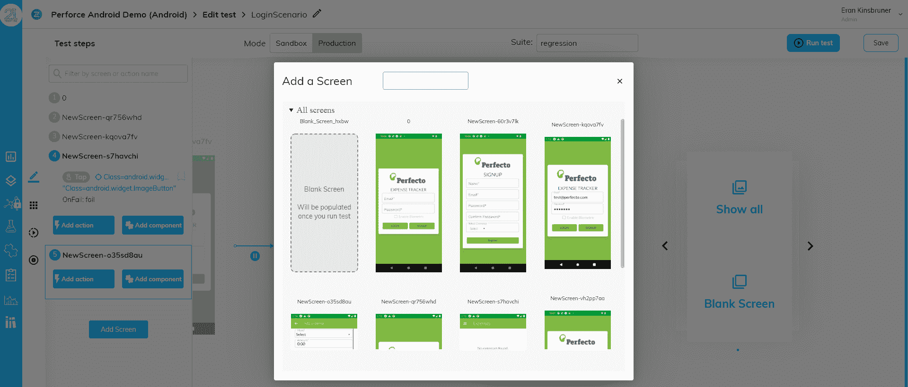

# Perforce 收购 21 个实验室以推进移动应用测试

> 原文：<https://devops.com/perforce-acquires-21-labs-to-advance-mobile-app-testing/>

Perforce Software 今天宣布已经[收购了 21 Labs](https://www.prnewswire.com/news-releases/perforce-acquires-21-labs-an-ai-based-scriptless-mobile-testing-provider-301292005.html) ，这是一家利用人工智能(AI)提供无代码方法来测试移动应用的工具套件提供商。交易条款没有披露。

Perforce Software 的首席产品官 Tim Russell 说，21 Labs 工具补充了一套类似的基于人工智能的工具，用于测试该公司通过其 Perfecto 产品组合提供的 web 应用程序。该公司还提供虚拟设备，这项服务使得使用苹果 iOS 和谷歌 Android 仿真软件大规模测试移动计算设备变得可行。Perforce 在 2018 年收购了 Perfecto。

21 Labs 开发了一个测试自动化平台，该平台使用算法来观察移动应用程序中的交互，然后用于生成测试。Russell 说，这种方法大大减少了开发人员或专业应用程序开发人员使用脚本来生成这些测试的需求。

Russell 补充说，下一步将是将 21 Labs 与 Perforce 已经通过其 Perfecto 测试平台提供的测试推荐引擎集成在一起。

Russell 指出，随着应用程序开发速度的加快，应用程序测试已经成为一个主要的瓶颈。向无脚本应用程序测试方法的转变将使组织能够快速审查应用程序以确保质量，而不必减慢应用程序的部署速度。在移动应用通常是任何数字业务转型计划的核心的时代，这一点尤为重要。

目前还不清楚应用程序测试将自动化到什么程度，但很明显，随着人工智能变得更加先进，今天由专业开发人员进行的许多例行测试将不再需要。理论上，这应该为专业开发人员提供更多的时间来进行复杂的测试，同时更多的例行测试作为 DevOps 工作流的扩展自动运行。

当然，每当开发人员在交付截止日期前时间紧迫时，应用程序测试总是首先受到影响。然而，问题发现得越早，解决问题的成本通常就越低。与此同时，当移动应用程序不像宣传的那样工作时，终端用户通常没有耐心。尤其是面向外部的移动应用程序，需要在第一次启动时提供引人注目的体验。同时，最终用户和业务合作伙伴访问的内部数字业务流程现在需要能够从任何地方访问。

可以说，在移动计算设备上提供出色的应用程序体验比在桌面平台上更难，这意味着在将移动应用程序部署到生产环境之前，应该对它们进行更多的测试。随着最终用户期望的不断提高，开发人员通过推出最低限度可行的应用程序对最终用户进行试验的日子即将结束。不适应新现实的 DevOps 团队可能很快就会发现测试对他们自己的工作安全有多重要。