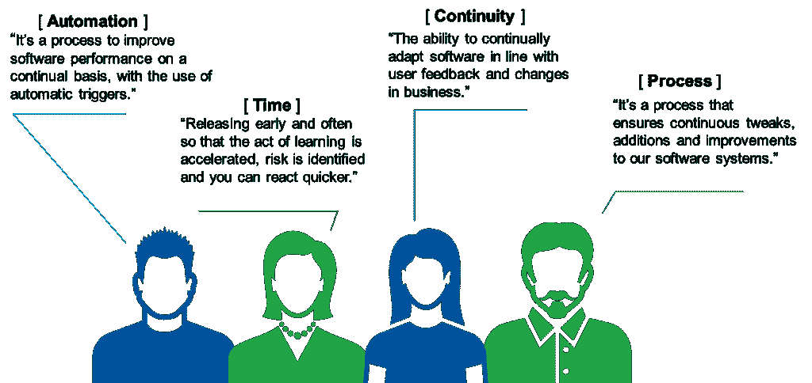
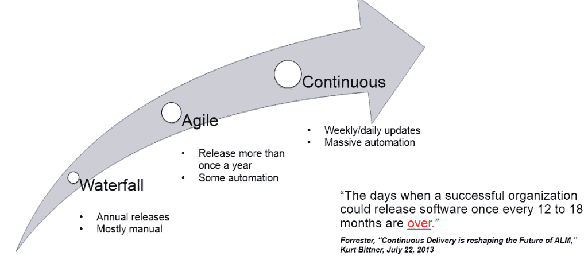

# perforce:devo PS 最大的小秘密

> 原文：<https://devops.com/perforce-the-biggest-little-secret-in-devops/>

你能说出一家成立 15 年、从未接受过一分钱风险投资、拥有 250 多名员工、10，000 多名客户、从第一天起就广泛盈利的公司吗？直到上周我也没有。当时，我听取了 Perforce 产品营销总监 Dhruv Gupta 和企业营销总监 Bob Dever 的简报。

 必然是 DevOps 的生力军。看一看右侧的客户云，了解他们拥有的 10，000 多名客户中的一些人。Perforce 是关于版本控制的。他们这样做，而且做得很好。无论您是在谈论代码、文档或分析的版本控制，Perforce 都能为您提供解决方案。

当你想一想，你就会明白为什么 Perforce 是这样一部开发剧。DevOps 是关于持续交付或者至少是快速发布的。如何在不跟踪不同版本的情况下加速发布？如果没有版本控制，你很快就会陷入混乱。Perforce 在某些方面支持连续交付和快速迭代。他们真的是 DevOps 最大的小秘密。

多年来，Perforce 确实是版本控制的唯一选择(还有其他版本，但它很快成为了该领域的领导者)，但分布式版本控制系统 GIT(DVCS)的出现给了一些人一个选择。但是 GIT 缺乏大型组织需要的企业特性(安全性和团队管理)。它在独狼和较小的开发团队中的受欢迎程度是毋庸置疑的。这很容易。

Perforce 已经认识到这一点，并刚刚发布了他们解决方案的新混合版本。这个混合版本允许开发人员和开发团队经理在一个混合版本控制平台中使用 GIT 和 Perforce 的 P4。一个两全其美的解决方案让 DevOps 团队能够快速使用 GIT，并拥有 P4 所允许的安全性和企业功能。

当你开始考虑像网飞或 Salesforce 这样的 DevOps 独角兽时，Perforce 所管理的事情的规模就变得清晰了。例如，在 Salesforce 中，有 3，000 名工程师每天进行 4，000 到 9，000 次代码更改，每小时进行 550，000 次测试。保持版本一致不是你在电子表格中要做的事情。

在持续交付的环境中，Perforce 大放异彩。他们在采用连续交付模式的企业上下了很大的赌注。然而，首先要回答一些基本问题。根据 Perforce，尽管你需要定义持续交付对你意味着什么？他们进行了一项调查:

根据 Perforce，他们认为连续交货是这样的:

*   **尽快将工作产品交付给用户**
*   **每次变更(签入)都会导致潜在的发布**
*   **让企业选择发布什么、何时发布、向谁发布**
*   **流程和文化的改变**

然而最重要的是，持续交付不仅仅是 Perforce 认为至关重要的事情。瀑布发布模型已经过时了，甚至敏捷也只是通向持续的一个中途站。

根据 Perforce 自己的调查，他们看到持续交付达到临界质量:

这是一个当你是一把锤子时一切都是钉子的情况，还是我们正处于持续交付时代的黎明？Perforce 是打赌它是。他们已经非常成功了，他们可能会失去作为 DevOps 最大的小秘密的地位。