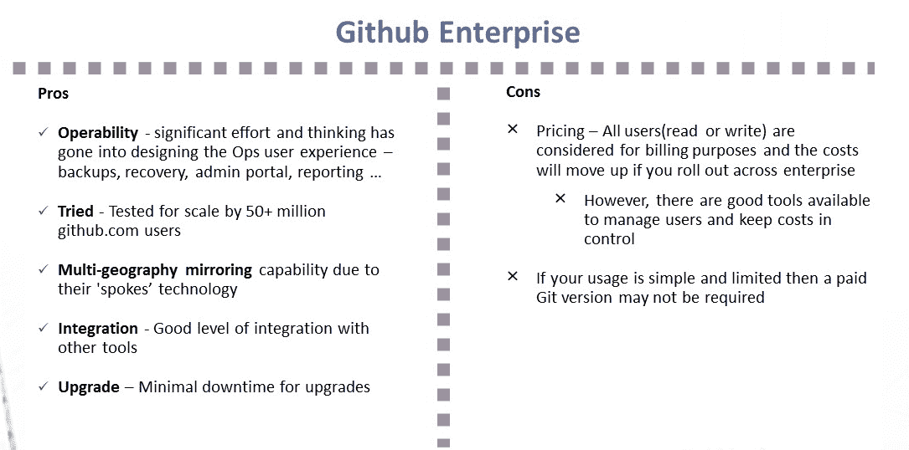
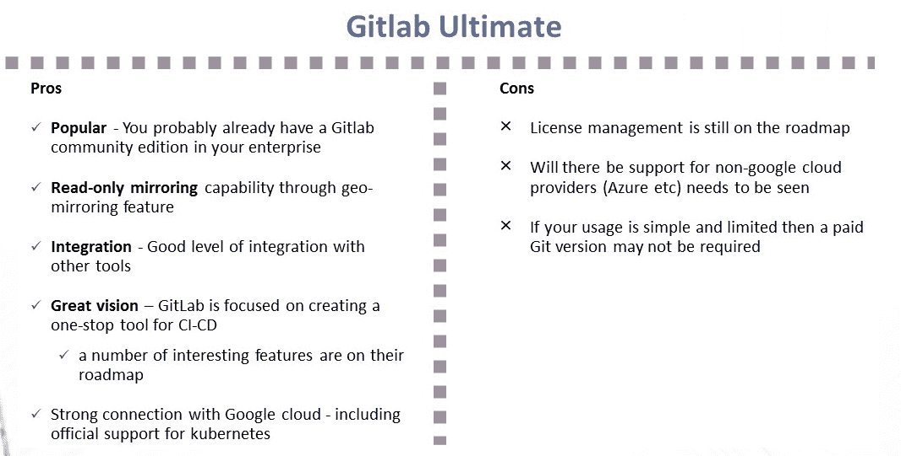

# 为企业挑选一个饭桶

> 原文：<https://devops.com/picking-a-git-for-the-enterprise/>

**Choosing a Git for the enterprise**

毫不奇怪，我的一些敏捷和 DevOps 转换工作涉及到帮助客户采用工具——在整个组织中设置、扩展和操作。这篇博客文章讲述了最近在一个客户组织中设置 Git 的经历。

正如大多数人所知，Git 是许多与敏捷和开发运维相关的现代工程实践的基础构件。简单地说，Git 等软件配置管理工具允许您以最有效、高效和分布式的方式跟踪和管理您的软件代码和配置变更。作为源代码控制的选择，Git 多年来一直保持不变，而其他各种 DevOps 工具的命运随着 DevOps 工具不断变化的技术环境而起伏不定。事实上，一个新的流行词是 GitOps——有些人甚至称之为 DevOps 进化的下一个[阶段。](https://dzone.com/articles/devops-the-next-evolution-gitops)

# Git 的起源

十多年前，Linux 社区面临一个挑战，因为现有的修订控制工具都不能满足他们对分布式版本控制工具的需求。从这种需要出发，Git 诞生了。用 Git 创始人 Linus Torvalds 的话说，“SCMs 的主要问题是围绕谁能做出改变的政治。”自从创建以来，Git 已经从根本上改变了软件配置管理(SCM)的概念，使工程师能够远程和自主地工作。(如果你是 Git 新手，并且对探索更多关于 Git 及其特性感兴趣，Atlassian [有一个教程](https://www.atlassian.com/git/tutorials/what-is-version-control)，GitHub 有一个[资源列表](https://try.github.io/)。)

## Git 和更多

尽管作为核心产品的 Git 在本质上与您喜欢的任何风格(GitHub、GitLab 或 Bitbucket)都是一样的，但围绕它的包装决定了重要的非功能性特征，如可操作性、安全性、可用性和可维护性。我们对企业级 Git 的追求集中在包装上，而不是核心产品本身，因为已经有很多关于 Git 核心产品本身的文章、辩论和文档。这些产品平台提供的包装中包含了对企业的价值和相关性。

我们看了核心产品和相关产品；可以想象，这三家工具供应商对于各自工具的未来路线图有着不同的定位和不同的方向。Bitbucket 的优势在于，Atlassian 将该产品与无处不在的吉拉软件和 Confluence 捆绑在一起。GitLab 的路线图似乎是超越 Git 的产品，进入整个流水线自动化的单一产品的概念，从概念到现金。被微软收购的 GitHub 越来越依赖于与其他工具的集成能力以及公司与之捆绑的工作流程能力。

(我避免在这篇博客中过分强调商业方面；不过，我也不是完全无视。部分原因是由于企业定价不是完全透明的，并且可能根据组织的谈判能力、使用规模、未来潜力和工具供应商所认为的可销售的跟踪记录而变化很大。这个博客也不意味着是一个功能的比较，因为这是你可以谷歌和找到自己很容易。)

### 判决

Image1; Github Enterprise – Pros and Cons

Image 2:  Gitlab Ultimate – Pros and Cons

## 我的推荐: ***看情况***

1.  我喜欢 GitLab 作为持续集成/持续交付(CI/CD)的一站式工具平台的愿景，它超越了源代码控制。我认为该工具使用起来简单直观，非常适合中小型企业，甚至是专注于小型自治团队的大型企业。
2.  GitHub 似乎非常适合拥有大量外包和离岸技术团队的大型复杂企业。

我很想听听您对为您的企业或团队选择基于 Git 的产品的看法。同时，这里有一些链接可能对你的决策有用:

1.  GitLab 为何以及如何放弃微软 Azure 转投谷歌云—[https://venturebeat . com/2018/04/06/why-and-how-git lab-abused-Microsoft-Azure-for-Google-Cloud/](https://venturebeat.com/2018/04/06/why-and-how-gitlab-abandoned-microsoft-azure-for-google-cloud/)
2.  GitLab 的工具集成-[https://docs . git lab . com/ee/integration/readme . html # doc-nav % 20 for % 20 list % 20 of % 20 integrations](https://docs.gitlab.com/ee/integration/README.html#doc-nav%20for%20list%20of%20integrations)
3.  GitHub 附加组件在 https://github.com/marketplace 列出
4.  GitHub 的安全性和可扩展性信息位于[https://GitHub . com/jonico/GitHub _ security _ and _ scalability _ overview](https://github.com/jonico/github_security_and_scalability_overview)
5.  集成 GitHub 平台的产品—[https://github.com/works-with](https://github.com/works-with)
6.  GitLab 的定价—[https://about.gitlab.com/pricing/](https://about.gitlab.com/pricing/)

——aditya vada ganda dam