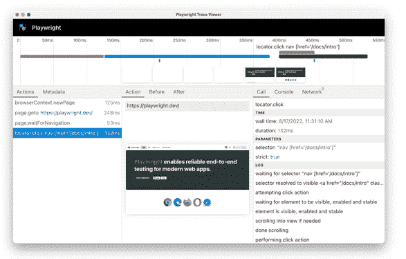

# 剧作家:端到端测试的现代开源方法

> 原文：<https://devops.com/playwright-a-modern-open-source-approach-to-end-to-end-testing/>

几年前，当我开始编写我的第一个端到端测试时，我非常兴奋。这个想法很有希望；创建一个自动化测试套件，它可以启动浏览器并模拟用户的行为。端到端测试你的网站。前端、后端、数据库，应有尽有。所有这些自动化测试将涵盖一切！不幸的是，事情并不总是一帆风顺。实现比预期的要复杂，结果也不像我希望的那样稳定。一方面，我认为学习一个新的测试框架需要时间。但是另一方面，投入时间和金钱只是为了以不可靠的测试和无数的假阳性警报而告终是不可接受的。

幸运的是，测试框架得到了发展，新的库使得端到端测试变得更加容易，最重要的是，不那么古怪。最近的解决方案之一是剧作家。让我告诉你更多关于它的情况！

### 用四种不同的语言编写测试代码

虽然剧作家的默认选择是 Node.js，但它也支持其他三种语言:Java、.NET 和 Python。如果您的团队使用这些语言中的一种，您就有把握了，因为没有人想仅仅为了编写一些测试而学习一种新的语言，对吗？

### Chrome DevTools 协议背面的跨浏览器测试

与其他解决方案相反，剧作家不使用 WebDriver 协议。它利用 [Chrome DevTools 协议](https://chromedevtools.github.io/devtools-protocol/)与 Chrome 浏览器(Chrome/Edge)直接通信。这种方法允许更直接和更快速的交流。你的测试将会更强大，更可靠。

但是剧作家并没有止步于 Chromium 浏览器。项目背后的团队明白，跨浏览器测试对于端到端测试解决方案至关重要。他们投入巨资为 Safari 和 Firefox 提供无缝体验，甚至 Android WebView 兼容性也在进行中。

在 Chrome、Edge、Firefox 和 Safari 中测试你的网站只是一个配置问题。这样既省时又省事！

### 自动等待带来的快速测试

然而，这不仅仅是关于多种浏览器的自动化。如果您的测试很难编写，因为您必须到处放置无数的“睡眠”语句，那么您的测试套件将需要几个小时才能完成，并成为一种负担。

为了避免不必要的等待，剧作家自带了“[自动等待](https://playwright.dev/docs/actionability)”这个想法很简单:剧作家为你执行可操作性测试，而不是自己去判断一个按钮何时可以点击。

让我们看一个例子:

" `
await page . click('[data-test = CTA]')
" ` 1

点击一个按钮没什么稀奇的，对吧？除了在《剧作家》中。这种无害的“点击”呼叫包括额外的便利功能。当您调用“click”时，框架检查并等待匹配的 DOM 元素:

–附加到 DOM
–可见
–稳定(它没有活动或移动)
–能够接收事件(没有被其他元素隐藏或遮挡)
–启用

所有这些检查保证了当您想要与目标元素交互时，它已经准备好滚动，更重要的是，它被尽可能快地点击。不用担心 DOM 元素。只需与他们互动，让剧作家解决剩下的问题——不再需要等待声明！

自动等待内置于所有的剧作家的交互方法，这样你就不会减慢你的测试套件。您的测试将更容易编写，并尽可能快地运行。

但这还不是全部！虽然我通过命令行使用剧作家，但它也附带了方便的工具来简化端到端测试。

### 创建、调试和分析的宝贵工具

剧作家提供了额外的命令和可视化工具，使得端到端测试的编写尽可能的容易。

### 用 Codegen 记录脚本

为了让您在第一次测试中领先一步，请使用剧作家的[测试生成器](https://playwright.dev/docs/codegen-intro)。

" `
npx 剧作家 codegen 剧作家. dev
" `

只需要一个 CLI 命令就可以启动两个新窗口:一个交互式浏览器和一个剧作家检查器。有趣的是，浏览器窗口中的每个交互都会被记录下来，并显示在检查器中。

如果您想创建一个剧作家测试，导航到某个地方，点击一个按钮并填写一个表单，这些工具非常适合创建初始设置。

重放生成的脚本，调整您的选择器和断言，您就可以开始了！

恭喜你！您刚刚创建了您的第一个端到端测试，我敢打赌，您只需要几分钟就可以完成。

### 运行脚本时调试它们

当您的测试套件增长时，您会发现自己处于必须调试复杂脚本的情况中。对于这些情况，剧作家提供了一个方便的调试视图。

通过显式调用“test–debug”或定义环境变量“PWDEBUG=1”来启用调试模式。

" `
npx 剧作家测试–调试
PWDEBUG=1 npm 运行测试
" `

剧作家然后打开一个浏览器，检查员带你通过你的测试用例，类似于你的编辑器的调试器。此外，它用一个小红圈突出显示被触摸的元素，这样您就可以看到被点击或填充的内容。

这种方法非常适合在本地开发期间调试测试。但是调试在 CI 中或者在不同机器上运行的失败测试呢？对此也有解决方案！

### 分析和调试以前失败的测试

在理想的场景中，您将在 CI/CD 管道中提交或部署时自动运行您的测试。但是从不同的环境中调试失败的测试可能是一个巨大的挑战。

幸运的是，剧作家框架允许您启用跟踪模式。跟踪模式记录所有的脚本动作，同时截屏和保持网站的状态。

然后，如果您的测试在您的远程服务器上失败，使用提供的剧作家工具加载一个生成的“trace.zip”文件，并检查测试以找出失败的原因。方法调用、时间表和屏幕截图都将可用——这是为您服务的时间旅行调试！

### 一种全新的综合监控和测试方法

这些仅仅是使剧作家成为我今天选择的测试框架的几件事情，它背后的团队发展很快，每个月都会发布新的版本。

如果你想了解更多关于剧作家框架的知识或者和维护者聊天，有一个非常活跃的社区 Slack 频道，里面有很多友好的人。

那么，你还会因为端到端测试速度慢且不可靠而回避它们吗？我希望我能说服你再试一次。因为没有什么比知道你在开发和运输软件时没有弄坏东西更好的了。