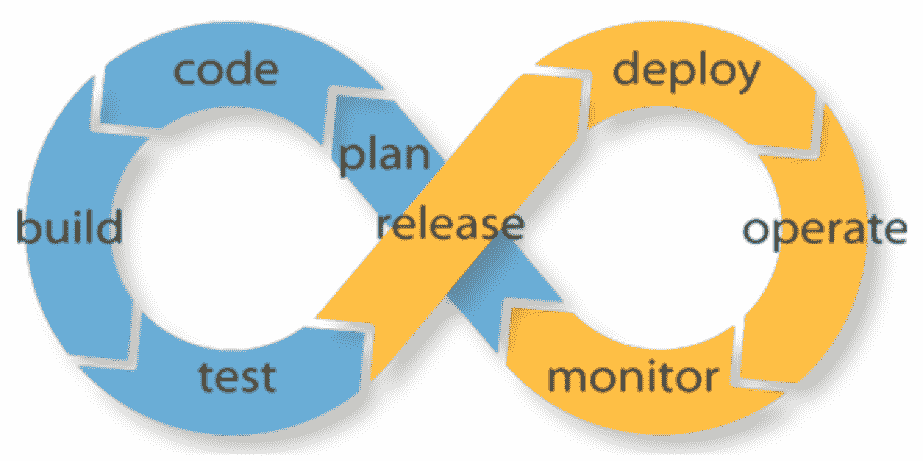

# 开发运维 IT 从业者指南

> 原文：<https://devops.com/practitioners-guide-devops/>

过去十年的两项技术创新从根本上改变了它的工作方式，并导致了“DevOps”现象。在我们深入了解什么是 DevOps 以及 IT 组织应该如何采用这种文化之前，让我们回顾一下最初是什么导致了这种文化。

## 来自敏捷开发的拉动

在过去的十年中，许多组织放弃了传统的“瀑布式”软件开发过程，转而支持“敏捷”开发。敏捷是关于小的、特定的以用户为中心的故事，由产品所有者描述，由小的、专注的开发团队在两到四周的短时间内交付。

敏捷开发导致软件工程师更频繁地放弃代码，这需要更快地部署。花几天或几周的时间来部署一个新的软件版本不再可行；在两周 sprint 周期中工作的开发人员希望部署在几分钟内完成，并具有高度的可预测性。

## 由云实现

在云出现之前，访问基础架构需要人工交互和手动操作。流程通常不能有效地自动化。这意味着操作缓慢且容易出错，并在软件开发生命周期中产生了巨大的摩擦点。

大约在开发人员采用敏捷开发的同时，云成为现实，基础设施可以使用 API 有效地进行编排，以提供从机器和网络到存储、路由策略和防火墙的一切。

## DevOps:开发和 IT 之间的闭环自动化

敏捷开发和云计算创造了 DevOps 诞生的完美风暴:这种新的方式完全是为了确保闭环，100%自动化。

*图 1: DevOps 是关于确保软件开发和部署之间的闭环、完全自动化的工作流程。*

用最简单的话来说，这意味着图 1 中概述的每个步骤都需要完全自动化，并与前面和后面的步骤集成在一起。这样做可以确保软件开发更快，部署更快，迭代更快。

## 利益

如果做得好，DevOps 会带来一个良性循环，提高开发和 IT 部门的工作效率，提高将新体验推向市场的灵活性，并对业务产生更大的影响。

## 采用 DevOps:您可以逐步采用

希望采用 DevOps 的组织应该分阶段进行，并为每个阶段定义指标。这里有一个典型的分阶段方法，您可以将其用作基线，并根据您组织的独特需求进行定制。

### 阶段 1:采用敏捷开发和云计算

敏捷开发和云计算是深刻的技术变革，并创造了 DevOps 可以茁壮成长的基础文化。因此，第一步是确保组织对这两种趋势的认同:

1.  敏捷开发可以分阶段采用。最重要的是同意软件将在短时间内，两到四周的冲刺周期内构建和发布，并关注用户故事。
2.  无论您的 IT 基础架构目前是什么样子，都可以采用云计算。使用 OpenStack 等混合云平台来提供对 VMware 或 Linux 环境的编程访问，或者使用 Amazon Web Services 等公共云平台。

### 阶段 2:提交 CI/CD 工作流

Jenkins 或 TeamCity 等持续集成(CI)系统提供了一种管道化和集成 DevOps 工作流中各个步骤的方法。系统的选择并不重要，重要的是确保工作流的所有步骤都将(最终)集成到这个工作流中。

### 阶段 3:可重复的自动化软件部署

许多组织倾向于在他们的软件的打包和部署中有一些手动的步骤，特别是为了将它投入生产。这通常反映了关于人工监督和干预的基本假设，并且打破了 DevOps 的闭环哲学。

要成功使用 DevOps，您需要完全自动化软件打包和部署流程。此外，确保使用完全相同的环境，以与开发人员构建完全相同的方式部署生产构建。

诸如 orchestration (OpenStack HEAT 或 AWS CloudFormations)等云技术和 Ansible、Puppet 或 Chef 等配置管理工具可用于实施这一阶段。

### 阶段 4:自动化软件测试(连续交付)

一旦软件部署实现了自动化，下一个阶段就是自动化新软件版本的验证过程。如果您像大多数组织一样，测试涉及 QA 团队和产品经理的几轮来回，并且通常需要几周时间来解决每个版本中的最后几个 bug。为了达到 DevOps 自动化的下一个级别，该流程必须完全无人值守和自动化。

这需要一个完全自动化的软件测试套件，跨越后端和前端，以便产品经理对发布的软件质量有信心。一旦实现，DevOps 生命周期的关键元素之间就有了一个闭环。虽然发布到生产可能仍然需要有人批准或“按下按钮”，但这是 DevOps 之旅中非常值得尊敬的状态。

### 阶段 5:持续部署

为了进入最高级的 DevOps 阶段，您需要自动化软件发布的“上线”过程。这反过来将允许您进行更小、更频繁的代码删除，并将它们推向生产。

世界上最先进的软件团队现在以这种方式运作，组织的影响可能是变革性的:开发人员开始工作时觉得他们可以实现一个功能并立即投入使用，产品经理可以满怀信心地对业务做出承诺，因为他们有这个极其高效的软件交付机器做后盾。对您来说最重要的是，IT 不再被视为成本中心；它被视为企业生产力和价值实现时间的基本推动因素。

## 结束语

进入第 5 阶段代表了当今行业的最高水平。然而，另一项重大突破有望将标准提高到更高。

在前面的每个阶段中，DevOps 工作流将软件开发与 IT 运营相集成；但是没有什么会影响软件架构去考虑操作。

换句话说，我们仍然将 IT 运营自动化与软件开发捆绑在一起。

这种情况即将改变。我们正处在一个软件新时代的尖端:一个新的框架承诺通过设计将开发和运营结合在一起，而不是将运营作为事后想法栓在软件开发过程上。Kubernetes 用声明性的、与基础设施无关的结构来描述应用程序是如何组成、交互和管理的，它承诺将现代软件系统的可操作性提高一个数量级。

每个对 DevOps 之旅感兴趣的人都应该了解 Kubernetes，并评估它将如何改进您的软件开发和操作工作流。

## 关于作者/ Sirish Raghuram

Sirish Raghuram 是 Platform9 的联合创始人兼首席执行官。作为首席执行官，Sirish 带领 Platform9 的团队实现公司的愿景，在某一天，这一愿景可以从战略和路线图到发布代码和运行测试。在共同创建 Platform9 之前，Sirish 是 VMware 的早期工程师，他在 VMware 担任技术和管理领导职务，并帮助发布了多种 vSphere 产品。Sirish 的工作体现在几项专利、VMworld 会谈和 VMware 工程部门的内部产品创新中。Sirish 拥有印度浦那大学的计算机科学学士学位。在 [LinkedIn](https://www.linkedin.com/in/sirishraghuram) 上与他联系。